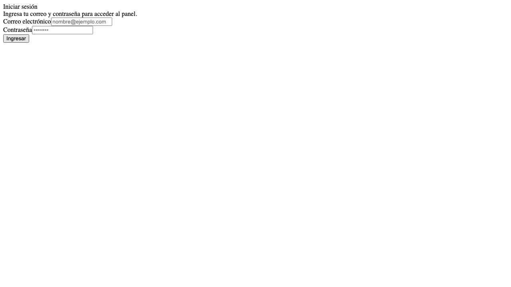
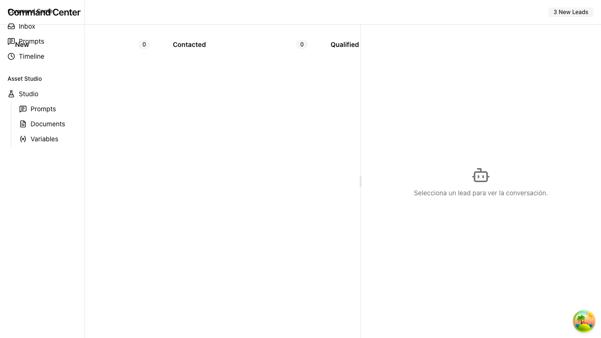
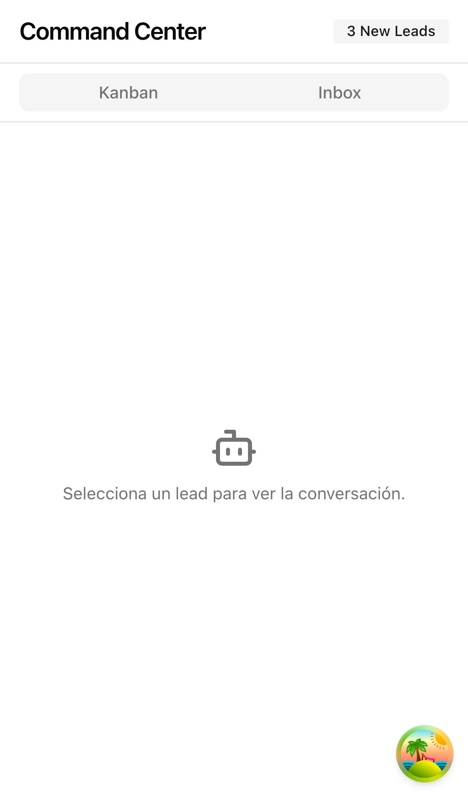

<div align="center">
  
  <h1>Teseo AI CRM Panel (Mission Control)</h1>
  <p><strong>El Centro de Comando Omnicanal impulsado por Agentes Cognitivos</strong></p>

  <p>
    
    
    
    
  </p>
</div>

<br/>

## 🌌 Visión General
**Teseo AI CRM** es una plataforma multitenant de vanguardia que unifica canales de comunicación (WhatsApp, Telegram, etc.) bajo una sola interfaz reactiva (**Command Center**). No es solo un agregador de mensajes; es una plataforma de **Inteligencia Artificial Activa** donde agentes basados en grafos (SDR, Gatekeeper) operan en tiempo real para pre-cualificar leads, agendar reuniones y enrutar conversaciones críticas al equipo humano.

---

## 📸 Escaparate Visual (Showcase)

<div align="center">
  <h3>Command Center & Omnichannel Inbox</h3>
  
  <p><em>Interfaz principal del Command Center con la Ribbon superior y panel de información de prospectos (Canvas).</em></p>

  <h3>Kanban Prospect Board</h3>
  
  <p><em>Gestión visual de leads cualificados por el agente cognitivo y transferidos al equipo humano.</em></p>

  <h3>Responsive Mobile Inbox</h3>
  
  <p><em>Soporte nativo responsivo para operaciones en campo.</em></p>
</div>

---

## 🏗️ Topología del Ecosistema

El ecosistema de Teseo CRM está compuesto por 3 microservicios principales (Ver `ADR-110`). Este repositorio contiene el **Frontend (Mission Control)**.

```mermaid
graph TD
    %% Estilos
    classDef frontend fill:#1e293b,stroke:#3b82f6,stroke-width:2px,color:#fff
    classDef agent fill:#0f172a,stroke:#10b981,stroke-width:2px,color:#fff
    classDef db fill:#020617,stroke:#6366f1,stroke-width:2px,color:#fff
    classDef ext fill:#333,stroke:#999,stroke-dasharray: 5 5,color:#fff

    User[Usuario Humano / Staff] ::: ext
    Lead[Lead / Cliente] ::: ext
    
    UI(teseo-ai-crm-panel<br/>Next.js + Tailwind) ::: frontend
    Orchestrator(crm-agentico-orchestrator<br/>LangGraph + Python) ::: agent
    Compiler(crm-agentico-compiler<br/>RAG + Embeddings) ::: agent
    
    DB[(Supabase DB<br/>RLS + Tenants)] ::: db
    
    User -->|Opera Command Center| UI
    UI <-->|API/Webhooks| DB
    Lead -->|WhatsApp/Telegram| Orchestrator
    Orchestrator <-->|Pre-cualificación| DB
    Orchestrator -->|Consulta Vectorial| Compiler
```

---

## ✨ Características Principales

*   🏢 **Arquitectura Multitenant Aislada (RLS):** Seguridad de datos estricta a nivel de fila (Row Level Security) en Supabase. Los datos de un Tenant jamás se cruzan con otro.
*   ⚡ **Command Center Reactivo:** Construido con componentes robustos de Radix UI (`@base-ui/react`), Zustand para estado global y animaciones fluidas con GSAP (`@gsap/react`).
*   🤖 **Integración "Concierge" y Agentes:** Co-pilotos integrados directamente en el Composer de mensajes para asistencia humana.
*   📱 **Mobile-First Inbox:** Vistas dedicadas y optimizadas para seguimiento de ventas on-the-go.
*   📊 **FinOps & Token Traceability:** Trazabilidad completa de uso de tokens y costos por Tenant (ADR-109).

---

## 📂 Estructura del Repositorio

```text
Teseo-AI-CRM/
├── app/                  # Next.js 14 App Router (Rutas de UI y APIs)
│   ├── (dashboard)/      # Layout principal autenticado (Tenants, Admin, FinOps)
│   └── api/              # Endpoints (Webhooks, Config, Sync)
├── components/           # Componentes UI reutilizables (shadcn/ui + custom)
│   └── command-center/   # Componentes de Alta Complejidad (Ribbon, Canvas, Composer)
├── docs/                 # La "Bóveda" de Conocimiento (ADRs, RFCs, PRDs)
├── lib/                  # Utilidades core, validadores Zod, Resolvers de Tenants
├── supabase/             # Migraciones SQL y esquemas de BD
└── scripts/              # Herramientas CI/CD y utilidades de DB
```

---

## 🚀 Inicio Rápido (Desarrollo Local)

### 1. Pre-requisitos
*   Node.js 20+ (o nvm usando `.nvmrc`)
*   `pnpm` instalado globalmente (`npm install -g pnpm`)
*   CLI de Supabase (opcional, para migraciones locales)

### 2. Instalación

```bash
# 1. Clonar el repositorio
git clone git@github.com:teseo-bot/teseo-ai-crm-panel.git
cd teseo-ai-crm-panel

# 2. Instalar dependencias
pnpm install

# 3. Configurar variables de entorno
cp .env.local.example .env.local
# (Solicitar los secretos de Supabase y OpenClaw al administrador)

# 4. Iniciar el entorno de desarrollo
pnpm run dev
```
La aplicación estará corriendo en `http://localhost:3000` (o el puerto configurado en el ecosistema).

---

## 🔒 Seguridad y Compliance
Todo el código en este repositorio está sujeto a la política de **Zero-Trust RLS Guard**. Ningún componente de UI asume seguridad por ocultación; todas las transacciones son validadas en el backend contra la tabla `tenant_id` y perfiles de usuario. Ver `docs/ADR-068-Frontend-RBAC.md` para detalles.

<br/>
<div align="center">
  <p>Construido con disciplina por el Escuadrón Táctico de <b>Teseo</b> 🧶</p>
</div>
<!-- GitOps Test: Sat Apr 25 14:01:27 CST 2026 -->
