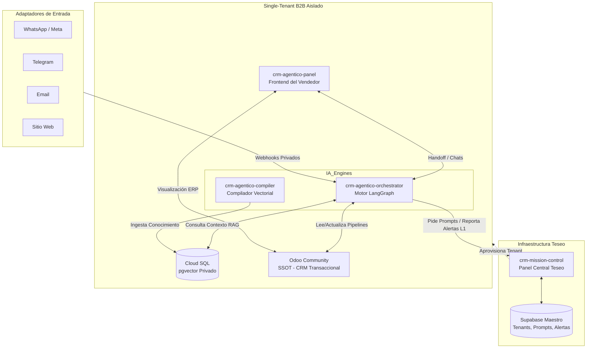

# ADR-001: Arquitectura Base para el CRM Agéntico (Plataforma Comercial Agnóstica)

## 1. Estado
Aceptado

## 2. Contexto
Se requiere diseñar la arquitectura fundacional para una plataforma comercial autónoma ("CRM Agéntico"). El sistema debe ser capaz de operar en cualquier industria (agnóstico) y automatizar el ciclo completo de ventas, marketing e investigación competitiva mediante un enjambre de agentes de IA.

Las principales necesidades son:
- Mantener un estado determinista y observable para los flujos de trabajo de los agentes.
- Centralizar los datos transaccionales en un ERP open-source sin depender de licencias SaaS cerradas.
- Soportar memoria semántica, ingesta multimodal y pipelines de datos complejos.
- Permitir la inyección dinámica de conocimiento de negocio específico de cada industria sin modificar el código base.
- Orquestar un equipo de agentes especializados con roles claramente definidos.

## 3. Decisión
Se establece la siguiente arquitectura tecnológica base para el CRM Agéntico:

### 3.1 Motor de Estado y Orquestación
- **LangGraph:** Se utilizará como motor de estado para orquestar los flujos de los agentes. Esto garantiza la persistencia, observabilidad y manejo de ciclos complejos (bucles de reflexión, delegaciones, interrupciones y aprobaciones humanas).

### 3.2 Single Source of Truth (SSOT)
- **Odoo Community Edition:** Actuará como el ERP y CRM central (fuente de la verdad para datos estructurados).
- **Integración:** La comunicación entre los agentes y Odoo se realizará exclusivamente mediante el `odoo-mcp-server` utilizando el protocolo XML-RPC. Esto abstrae la complejidad de la API de Odoo hacia un estándar Model Context Protocol (MCP).

### 3.3 Base de Datos y Memoria Semántica
- **PostgreSQL + pgvector:** Se implementará como la capa de persistencia principal para embeddings y memoria de largo plazo. Esta base de datos soportará:
  - Ingesta multimodal.
  - Pipelines avanzados como ICP (Ideal Customer Profile) Scoring y Enriquecimiento de Leads.
  - Inteligencia Competitiva mediante recolección de web scraping y análisis de diffs históricos.
  - Automatización de contenido, alimentando plataformas como Remotion.

### 3.4 Inyección de Contexto de Negocio
- **Obsidian CMS:** El motor de IA es agnóstico a la industria por diseño. Las reglas de negocio, manuales de marca, perfiles de clientes y estrategias se inyectarán como contexto usando bóvedas de Obsidian (archivos Markdown locales) como base de conocimiento. Esto permite a los operadores actualizar las directrices operativas sin tocar código.

### 3.5 Topología de Nodos Autónomos
El sistema se estructurará en 7 nodos autónomos (agentes especializados):
1. **Gatekeeper:** Triaje inicial, clasificación de intenciones, enrutamiento y protección.
2. **SDR (Sales Development Representative):** Cualificación de leads e interacciones de seguimiento inicial.
3. **Hunter:** Búsqueda activa de prospectos y prospección outbound (contacto en frío).
4. **Investigador:** Análisis profundo de cuentas objetivo, minería de datos y perfilado de stakeholders.
5. **Content Creator:** Redacción, diseño y orquestación de contenido dinámico (conectado a pipelines como Remotion).
6. **Trafficker:** Optimización y análisis de distribución de paid media y flujos de tráfico.
7. **Admin:** Supervisión de operaciones, monitoreo de métricas, auditoría del enjambre y manejo de excepciones.

## 4. Consecuencias
### Positivas
- **Flexibilidad Extrema:** El uso de Obsidian permite adaptar todo el sistema a diferentes industrias (B2B SaaS, Inmobiliaria, Servicios) con solo cambiar la bóveda de conocimiento.
- **Soberanía y Costos:** Al usar Odoo CE y PostgreSQL, el sistema puede hostearse in-house (modelo soberano) sin costos recurrentes por licencias transaccionales por usuario.
- **Especialización:** La topología de 7 nodos separa los *prompts* y responsabilidades, evitando un único agente monolítico propenso a alucinaciones.

### Negativas / Riesgos
- **Complejidad Sincronizada:** Mantener coherencia de estado entre los grafos de LangGraph, la memoria en pgvector y los registros estructurados en Odoo requerirá una sólida estrategia de manejo de errores e idempotencia.
- **Latencia:** Coordinar flujos que atraviesen múltiples nodos antes de emitir una respuesta final puede generar latencia en interacciones síncronas.

