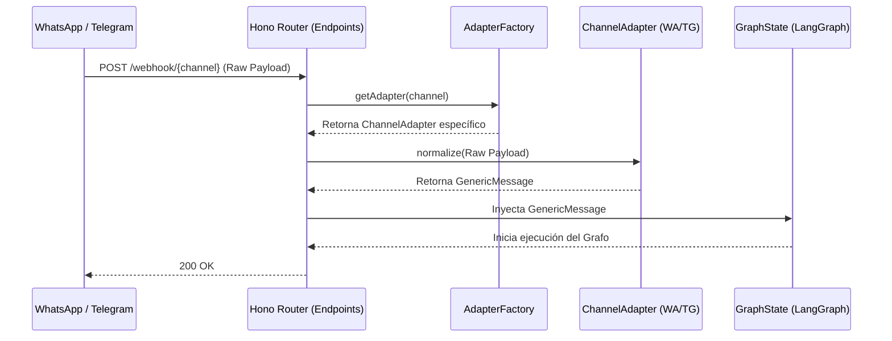

# ADR 094: Adaptador Omnicanal para LangGraph (Orquestador)

## 1. Contexto y Problema

Actualmente, el proyecto `crm-agentico-orchestrator` utiliza endpoints en Hono que reciben webhooks directamente acoplados a las plataformas de mensajería (Meta/WhatsApp y Telegram). Esta información se inyecta directamente en el `GraphState` de LangGraph sin normalización previa.

Este acoplamiento estricto genera los siguientes problemas:
- La lógica del grafo de IA se ensucia con detalles específicos de la plataforma.
- Agregar un nuevo canal (como Slack o Web Chat) requiere modificar el grafo y múltiples partes del orquestador.
- Dificulta la creación de pruebas unitarias agnósticas.

## 2. Solución Propuesta

Implementar el **Patrón Adapter** combinado con un **Factory Method**. 
El objetivo es abstraer la capa de entrada creando una interfaz agnóstica (`GenericMessage`). Los webhooks entrantes pasarán por un adaptador específico para el canal de origen, el cual normalizará el payload a `GenericMessage` antes de inyectarlo en el `GraphState` del LangGraph.

### Ventajas:
- **Desacoplamiento:** LangGraph solo entiende `GenericMessage`, aislando la lógica de negocio de los detalles de red y plataforma.
- **Escalabilidad:** Agregar un canal nuevo solo implica crear un nuevo adaptador y registrarlo en el factory, cumpliendo el principio Open/Closed.
- **Testabilidad:** Facilita el mocking de mensajes entrantes para pruebas.

## 3. Definición Estricta de Interfaces (TypeScript)

A continuación se definen los contratos para los adaptadores y las entidades de datos:

```typescript
// Entidad agnóstica de dominio para el GraphState
export interface GenericMessage {
  id: string;              // Identificador único del mensaje normalizado
  channel: 'whatsapp' | 'telegram' | 'web' | 'email'; // Origen del mensaje
  senderId: string;        // Teléfono o ID del remitente
  text: string;            // Contenido en texto plano del mensaje
  timestamp: Date;         // Fecha y hora de recepción
  metadata?: Record<string, any>; // Datos adicionales (ej. subject y threadId para emails)
}

// Interfaz base que todo adaptador debe implementar
export interface ChannelAdapter {
  /**
   * Transforma el payload crudo del webhook de un canal específico
   * a un objeto GenericMessage estandarizado.
   */
  normalize(rawPayload: any): GenericMessage;
}

// Adaptadores Específicos
export class WhatsAppAdapter implements ChannelAdapter {
  normalize(rawPayload: any): GenericMessage {
    // Implementación de extracción de WABA payload
    throw new Error("Not implemented");
  }
}

export class TelegramAdapter implements ChannelAdapter {
  normalize(rawPayload: any): GenericMessage {
    // Implementación de extracción de Telegram Webhook payload
    throw new Error("Not implemented");
  }
}

export class EmailAdapter implements ChannelAdapter {
  normalize(rawPayload: any): GenericMessage {
    // Implementación de extracción para Email (SendGrid/PubSub) extrayendo texto plano y asignando subject/threadId a metadata
    throw new Error("Not implemented");
  }
}

// Factory para obtener el adaptador correcto según el endpoint / canal
export class AdapterFactory {
  static getAdapter(channel: 'whatsapp' | 'telegram' | 'email'): ChannelAdapter {
    switch (channel) {
      case 'whatsapp':
        return new WhatsAppAdapter();
      case 'telegram':
        return new TelegramAdapter();
      case 'email':
        return new EmailAdapter();
      default:
        throw new Error(`Channel ${channel} not supported`);
    }
  }
}
```

## 4. Diagrama de Flujo de Datos

El siguiente diagrama Mermaid ilustra el flujo desde la petición HTTP hasta la ejecución del grafo:



## 5. Work Breakdown Structure (WBS)

Pasos granulares para el agente Ejecutor:

1. **Setup de Directorios:**
   - Crear el directorio `src/adapters/` en el proyecto `crm-agentico-orchestrator`.
   - Crear el archivo `src/adapters/types.ts` para las interfaces.

2. **Definición de Tipos (`src/adapters/types.ts`):**
   - Implementar las interfaces `GenericMessage` y `ChannelAdapter` tal como se definen en este ADR.

3. **Implementación de Adaptadores (`src/adapters/`):**
   - Crear `whatsapp.adapter.ts`: Implementar la clase `WhatsAppAdapter` que parsee el JSON de Meta.
   - Crear `telegram.adapter.ts`: Implementar la clase `TelegramAdapter` que parsee el JSON de Telegram.
   - Crear `email.adapter.ts`: Implementar la clase `EmailAdapter` que parsee el payload del correo (extrayendo asunto/hilo a metadata).
   - Crear `factory.ts`: Implementar `AdapterFactory`.

4. **Refactorización del GraphState (`src/graph/state.ts` o equivalente):**
   - Modificar el estado del LangGraph para que acepte `GenericMessage` en lugar de payloads crudos.

5. **Refactorización de Controladores Hono (`src/routes/` o `src/controllers/`):**
   - Importar `AdapterFactory`.
   - Modificar los endpoints de webhooks existentes para instanciar el adaptador correspondiente, llamar a `normalize()`, y pasar el `GenericMessage` al grafo.
   
6. **Testing Unitario:**
   - Escribir tests unitarios para `WhatsAppAdapter` pasándole un mock de webhook de Meta.
   - Escribir tests unitarios para `TelegramAdapter` pasándole un mock de webhook de Telegram.

7. **Limpieza y Depuración:**
   - Eliminar cualquier parser o lógica de acoplamiento de canal que haya quedado dispersa en los nodos del grafo original.
