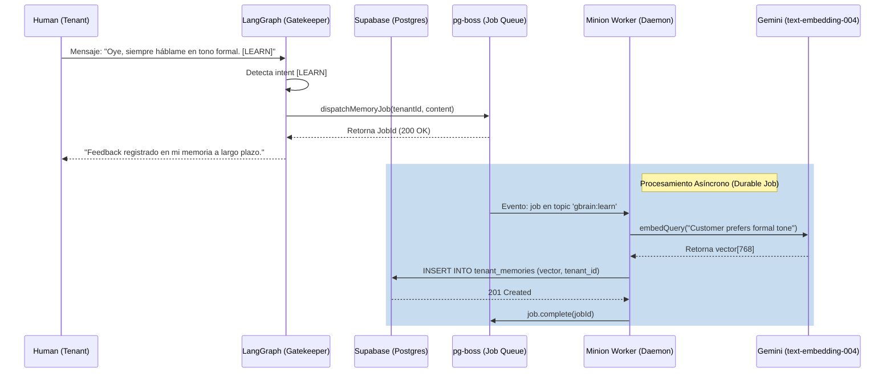

# ADR-106: Continuous Learning & Durable Jobs (GBrain Minions)

| Campo | Valor |
|---|---|
| **ID** | ADR-106 |
| **Estado** | Aprobado / Implementado |
| **Fecha** | 2026-04-19 |
| **Autor** | Teseo AIDevops |
| **Aprobador** | Jorge García (CEO) |
| **Dominio** | Orquestador LangGraph B2B (Agency-in-a-Box) |

## 1. Contexto y Problema (Post-Mortem del Sprint)
Durante el desarrollo del Track 2 (Agency-in-a-Box, referenciado en PRD-000), se identificó que la ingesta asíncrona masiva (Slack, Odoo, Zoom) y la memoria histórica de los inquilinos requerían garantías que los sub-agentes tradicionales (`sessions_spawn`) no podían cumplir (fallos por timeout de 10s del Gateway, consumo alto de memoria). Además, la falta de una memoria auto-correctiva impedía que los agentes retuvieran retroalimentación del cliente a largo plazo (Continuous Learning Layer).

## 2. Decisiones Arquitectónicas Tomadas
1. **Durable Jobs (Minions):** Se implementó una migración SQL en Supabase (`20260419100000_gbrain_minions_queue.sql`) basada en `pg-boss` para habilitar una cola de trabajo asíncrona nativa en Postgres, eludiendo la latencia del Gateway para operaciones RAG pesadas.
2. **Motor de Memoria (Pro-Workflow):** Se extrajo el patrón de aprendizaje continuo del framework `pro-workflow` y se adaptó a `pgvector` (`20260419110000_tenant_memories.sql`) en Supabase para almacenamiento de embeddings de 768 dimensiones (`text-embedding-004`).
3. **Rediseño del Grafo (LangGraph):** Se refactoriza el Orquestador introduciendo una ruta asíncrona de publicación:
   - El nodo **gatekeeper** intercepta directivas humanas explícitas (`[LEARN]`) y las despacha al Minion mediante `dispatchMemoryJob()`.
   - El daemon `src/worker/daemon.ts` consume la cola `gbrain:learn`, genera los vectores y persiste la memoria a largo plazo en `tenant_memories`.

## 3. Topología del Continuous Learning Layer

## 4. Consecuencias
- **Pros:** 
  - El orquestador ya no es amnésico; evoluciona con el feedback del cliente, logrando la visión del *Knowledge Layer* descrita en el PRD.
  - El sistema está preparado para cargas masivas asíncronas sin asfixiar a LangGraph (0 latencia en UI).
  - Resiliencia inherente contra caídas (pg-boss reintenta automáticamente si el API de Gemini o Supabase fallan).
- **Cons:** Se requiere correr un proceso independiente en producción (`npm run worker`) junto al servidor Hono principal.
