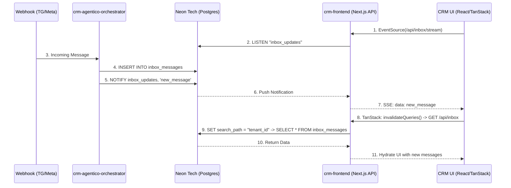

# ADR-113: Arquitectura de Base de Datos Híbrida/Federada y Resolución de Inbox Congelado

## Contexto y Problema
El sistema CRM y de Orquestación presentaba dos problemas críticos de lectura y escritura:
1.  **Orquestador Amnésico:** El Orquestador (`crm-agentico-orchestrator`) no encontraba las configuraciones del Tenant B2B (Prompts, Modelos) porque buscaba en la base de datos de Neon Tech (esquemas de Postgres), mientras que el CRM Frontend (`teseo-mission-control`) guardaba esas configuraciones en Supabase.
2.  **Inbox Congelado:** El Orquestador insertaba los leads y mensajes en Neon Tech, aislando la data por Tenant usando esquemas dinámicos de Postgres (`SET search_path = "tenant_xxx"`). Sin embargo, el CRM Frontend (`crm-frontend` / Mission Control) intentaba leer la tabla de mensajes utilizando el SDK de Supabase, el cual por defecto solo lee del esquema `public`.

## Discusión y Decisión (Brainstorming Bottom-Up)
Se contempló unificar toda la persistencia en Supabase. Sin embargo, por dirección del CEO y alineación estratégica de negocio, se decidió preservar un modelo **Federado / Híbrido**:

*   **Supabase (Multi-Tenant Operativo):** Responsable del Top Funnel B2B, autenticación, facturación y configuraciones globales (ej. `tenant_configs` con los prompts de IA).
*   **Neon Tech / Postgres Nativo (Single-Tenant Data Lake):** Responsable del almacenamiento masivo interactivo (3ra velocidad de ingesta). Aquí reside el Checkpointer de LangGraph, RAG (pgvector), Leads y los `inbox_messages` crudos divididos en esquemas. Esto prepara el terreno tecnológico para la futura *Content Factory*, *Asset Studio*, LMS y R&D sin afectar el rendimiento de la UI operativa (Supabase) con data no estructurada o de "cazadores" (Scrapping).

## Resolución Táctica
Para resolver la discrepancia de lectura del Inbox sin abandonar la arquitectura híbrida, se ejecutará el siguiente parche estructural:

1.  **Deprecación de Supabase en el Inbox Frontend:** El componente de Inbox/Kanban en el repositorio `crm-frontend` abandonará el uso del SDK web de Supabase para consultar mensajes.
2.  **API Bridge Interno:** Se construirá un `API Route` en Next.js (`/api/inbox`) dentro del Frontend. Este puente usará una conexión de servidor nativa (`pg` o Drizzle).
3.  **Buceo de Esquemas:** La API Route inyectará dinámicamente el comando `SET search_path = "tenant_{id}"` para recuperar los mensajes interactivos del esquema de Neon Tech correspondiente y servirlos a la UI del usuario humano.

Esta decisión protege la infraestructura para cargas masivas futuras (R&D) y devuelve la visibilidad operativa al equipo de ventas.

## Actualización: Tiempo Real con LISTEN/NOTIFY y Server-Sent Events (FinOps)
Para lograr la reactividad en tiempo real de los mensajes entrantes sin incurrir en los altos costos financieros y computacionales de hacer **polling continuo** hacia la base de datos Serverless (Neon Tech), se implementó un patrón basado en Server-Sent Events (SSE) asistido por Postgres.

### Flujo Implementado
1. **Orquestador (Trigger Postgres):** Cuando el orquestador inserta un nuevo mensaje en `inbox_messages`, ejecuta un comando de Postgres explícito: `NOTIFY inbox_updates, 'new_message'`. Esto permite que Neon Tech envíe una señal push a los clientes TCP conectados.
2. **API Bridge (Stream):** Se introdujo el endpoint `/api/inbox/stream` dentro del CRM. Dicho endpoint establece una conexión persistente a Neon Tech, entra en modo de escucha con `LISTEN "inbox_updates"`, y traslada cada notificación como un evento hacia el navegador web usando Server-Sent Events (Text/Event-Stream).
3. **Frontend (TanStack Query + SSE):** La UI del Inbox en el Frontend consume los leads y mensajes inicialmente vía `/api/inbox` hidratando su caché en **TanStack Query**. Simultáneamente, un `useEffect` mantiene abierta una conexión `EventSource` a la API Stream. Cuando la UI recibe el evento, ejecuta `queryClient.invalidateQueries(["inbox"])`, forzando la recarga en background sin intervención manual y manteniendo el gasto Serverless en lo absoluto mínimo indispensable.
### Diagrama de Secuencia y Persistencia (SSE)

