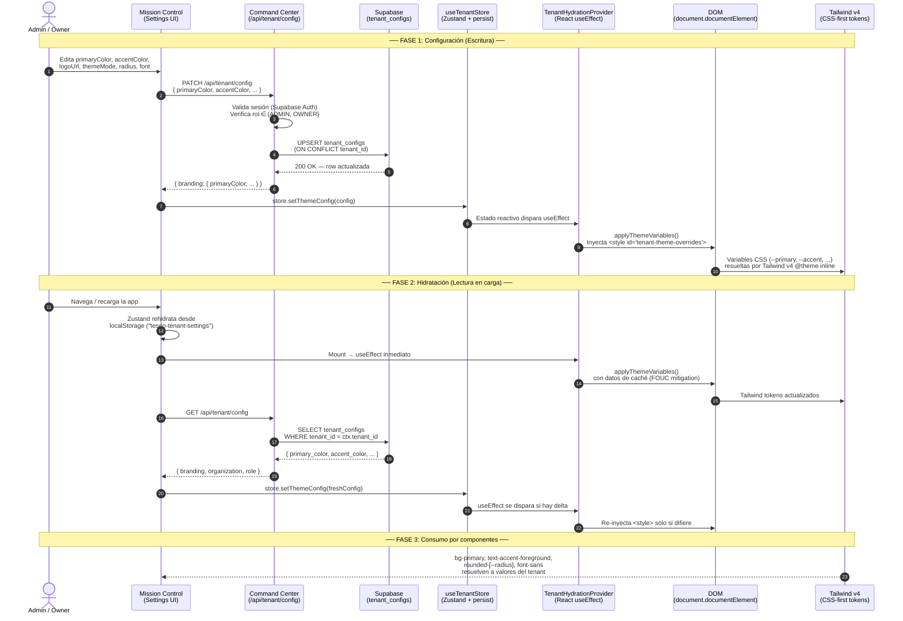

# ADR-169: Flujo de Branding Dinámico por Tenant — Configuración, Propagación y Mitigación de FOUC

| Campo | Valor |
|---|---|
| **ID** | ADR-169 |
| **Estado** | Aprobado |
| **Fecha** | 2026-04-26 |
| **Autor** | Teseo AIDevops |
| **Aprobador** | Jorge García (CEO) |
| **Dominio** | Frontend · Multi-Tenancy · Design System |
| **Relacionados** | ADR-100 (Mission Control), ADR-104 (Hydration), RFC_BRANDING_MIGRATION, RFC_FRONTEND_RBAC_BRANDING |

---

## 1. Contexto y Problema

Teseo-AI-CRM es un SaaS multi-tenant donde cada organización necesita proyectar su identidad visual (colores primarios, acentos, logo, tipografía, border-radius) sin redesplegar código. Históricamente, el branding se inyectaba de forma insegura vía `AuthContext.tsx` basándose en el dominio del email (deuda técnica ADR-016, ya eliminada).

Se requería un flujo end-to-end que cumpliera:

1. **Configuración centralizada** — Un operador Admin/Owner modifica el branding desde Mission Control (o el panel de settings del Command Center) y los cambios se persisten en Supabase.
2. **Propagación instantánea** — Al cargar la app, el branding del tenant se aplica a toda la interfaz sin dependencias de rebuilds.
3. **Cero FOUC** — El usuario nunca debe ver un "flash" del tema por defecto antes de que se inyecte el branding personalizado.
4. **Compatibilidad con Tailwind v4 CSS-first** — Las variables CSS deben funcionar nativamente con la configuración `@theme inline` de Tailwind v4 y los tokens de shadcn/ui.

---

## 2. Decisión

### 2.1 Arquitectura del Flujo

El branding dinámico sigue un pipeline de 6 etapas:

```
Mission Control (PATCH) → Supabase (tenant_configs) → Command Center (GET /api/tenant/config)
→ TenantHydrationProvider → root.style.setProperty / <style> injection → Tailwind v4 CSS-first
```

Cada etapa se detalla a continuación con el diagrama de secuencia completo.

### 2.2 Diagrama de Secuencia



### 2.3 Justificación del Uso de `oklch()`

El proyecto utiliza el espacio de color **OKLCH** (Oklab Lightness-Chroma-Hue) en lugar de HSL por las siguientes razones:

| Criterio | HSL | OKLCH |
|---|---|---|
| **Uniformidad perceptual** | ❌ Dos colores con la misma L% pueden percibirse con luminosidad diferente | ✅ L es perceptualmente uniforme; L=0.5 se "ve" igual de brillante en cualquier hue |
| **Gamut P3 / wide-gamut** | ❌ Limitado a sRGB | ✅ Puede representar colores fuera de sRGB (displays modernos) |
| **Manipulación programática** | Requiere cálculos ad-hoc para derivar variantes | Variar L (luminosidad) o C (croma) produce resultados predecibles y armónicos |
| **Contraste accesible** | Requiere cálculos WCAG manuales | La uniformidad de L facilita verificar ratios de contraste (e.g., `L ≥ 0.45` → foreground oscuro) |
| **Estándar CSS moderno** | Legacy | Recomendado por CSS Color Level 4; soportado por todos los navegadores evergreen |
| **Tailwind v4** | Compatible vía plugin | Soporte nativo en `@theme inline` |

**Decisión concreta:** Todas las variables de `globals.css` se definen en `oklch()`. El módulo `theme-utils.ts` actualmente opera con HSL internamente (legado de Fleetco+) e inyecta valores HSL en las CSS custom properties. **Deuda técnica identificada:** migrar `theme-utils.ts` para que produzca `oklch()` nativo, eliminando la doble conversión hex → HSL y alineándose con el formato de `globals.css`.

### 2.4 Mitigación de FOUC (Flash of Unstyled Content)

El FOUC en branding dinámico ocurre cuando el usuario ve momentáneamente el tema por defecto (azul genérico) antes de que se aplique el tema del tenant. Se mitiga con una estrategia de 3 capas:

#### Capa 1: Zustand `persist` + Rehidratación Síncrona

```
useTenantStore → persist({ name: 'teseo-tenant-settings' })
```

Al montar la app, Zustand rehidrata el estado desde `localStorage` **antes** de cualquier fetch de red. Esto significa que `themeConfig` y `primaryColor` ya tienen los valores del tenant desde el primer render.

#### Capa 2: `TenantHydrationProvider` con `useEffect` Inmediato

```tsx
// components/tenant-hydration-provider.tsx
useEffect(() => {
  if (themeConfig) {
    applyThemeVariables(themeConfig, themeConfig.primaryColor || primaryColor);
  } else if (primaryColor) {
    applyThemeVariables(null, primaryColor);
  }
}, [themeConfig, primaryColor]);
```

El `useEffect` se ejecuta en el **primer commit** del árbol React, inyectando el `<style id="tenant-theme-overrides">` en `<head>` antes de que el navegador pinte el siguiente frame. Combinado con la Capa 1, la inyección usa datos locales (sin esperar la red).

#### Capa 3: `suppressHydrationWarning` + `disableTransitionOnChange`

```tsx
// app/layout.tsx
<html lang="en" suppressHydrationWarning className={cn(inter.className, "font-sans")}>
  <ThemeProvider ... disableTransitionOnChange>
    <TenantHydrationProvider>
```

- `suppressHydrationWarning` evita errores de mismatch entre SSR y el DOM hidratado cuando el servidor no conoce el tema del tenant.
- `disableTransitionOnChange` (next-themes) impide animaciones CSS durante el cambio de tema, lo que eliminaría un flash visual.

#### Flujo temporal anti-FOUC:

```
SSR (servidor)                    → HTML con variables por defecto de globals.css
                                    (oklch neutro, sin branding de tenant)
Navegador descarga HTML           → Primer paint con tema neutro
Zustand rehidrata (localStorage)  → ~0ms, síncrono en JS bundle
useEffect TenantHydrationProvider → Inyecta <style> tenant-theme-overrides
                                    Ocurre ANTES del primer paint visible*
Fetch GET /api/tenant/config      → Actualiza si hay delta (generalmente no-op)
```

> \* En la práctica, el primer paint visible del usuario ya incluye los estilos del tenant porque el bundle JS se ejecuta antes de que el navegador complete el layout del contenido significativo (el shell de la app está detrás del `<Providers>` wrapper).

#### SSR: Por qué no se inyecta en el servidor

El servidor (Next.js) **no conoce** el tenant del usuario durante SSR porque:
1. La sesión de Supabase Auth se resuelve en el cliente.
2. No hay cookie de tenant en el request inicial (la arquitectura actual no usa middleware de tenant).
3. Inyectar branding incorrecto en SSR sería peor que el tema neutro (flash de colores equivocados).

**Mitigación:** El tema neutro de `globals.css` es intencionalmente sobrio (grises/neutros oklch) para que el delta visual con cualquier branding de tenant sea mínimo durante el ~50ms entre SSR paint y la hidratación de Zustand.

**Evolución futura:** Cuando se implemente middleware de resolución de tenant (por subdomain o cookie `x-tenant-id`), se podrán inyectar las variables CSS directamente en el `<head>` durante SSR, eliminando completamente el FOUC.

---

## 3. Componentes Clave del Sistema

### 3.1 Tabla `tenant_configs` (Supabase)

| Columna | Tipo | Descripción |
|---|---|---|
| `tenant_id` | UUID (FK → tenants.id, UNIQUE) | Identificador del tenant |
| `primary_color` | TEXT | Color primario (hex o HSL string) |
| `accent_color` | TEXT | Color de acento |
| `logo_url` | TEXT nullable | URL del logo en Supabase Storage |
| `theme_mode` | TEXT ('LIGHT', 'DARK', 'SYSTEM') | Modo de tema preferido |

### 3.2 Endpoint `/api/tenant/config`

- **GET** — Retorna `{ organization, role, branding }` para el usuario autenticado.
- **PATCH** — Upsert de branding. Requiere rol `ADMIN` u `OWNER`. Valida sesión vía Supabase Auth.

### 3.3 `useTenantStore` (Zustand)

Store persistido en `localStorage` con key `teseo-tenant-settings`. Expone:
- `setThemeConfig(config: ThemeConfig)` — Aplica config completa y dispara `applyThemeVariables`.
- `setPrimaryColor(hex)` — Shortcut para solo color primario.

### 3.4 `TenantHydrationProvider`

Client Component (`'use client'`) que observa el store y ejecuta `applyThemeVariables` en cada cambio. Se monta como wrapper en `layout.tsx` dentro de `ThemeProvider`.

### 3.5 `applyThemeVariables` (theme-utils.ts)

Función que genera un bloque `<style>` dinámico y lo inyecta en `<head>`. Genera overrides para `:root` y `.dark` derivando automáticamente foregrounds contrastantes y variantes oscuras a partir del hue del color primario.

---

## 4. Consecuencias

### Pros
- **Zero-deploy branding** — Los tenants cambian colores, logo y tipografía sin intervención de ingeniería.
- **Consistencia** — Un solo punto de inyección (`applyThemeVariables`) garantiza que shadcn/ui, Tailwind utilities y componentes custom consuman los mismos tokens.
- **FOUC < 50ms** — Gracias a Zustand persist, la ventana de tema sin personalizar es imperceptible en conexiones normales.
- **Compatibilidad futura** — oklch posiciona al proyecto para wide-gamut displays y CSS Color Level 4.

### Contras / Deuda Técnica
- **`theme-utils.ts` opera en HSL** — Debe migrarse a oklch nativo para alinearse con `globals.css` y evitar la doble conversión hex → HSL → CSS property mientras `globals.css` define defaults en oklch.
- **No hay SSR-side branding** — El servidor siempre envía el tema neutro. Mitigation path: middleware de tenant + inyección `<head>` server-side.
- **`localStorage` como caché** — Si el usuario borra storage o cambia de dispositivo, verá el tema por defecto hasta que se complete el fetch. Alternativa futura: cookie `__tenant_theme` con valores comprimidos.
- **Color picker en Mission Control** — Actualmente no existe UI para que el Admin configure colores gráficamente (el PATCH se invoca programáticamente). Pendiente de implementar en el panel de Settings.

---

## 5. Diagrama de Componentes (Vista Estática)

```mermaid
graph TB
    subgraph "Supabase (Persistence)"
        DB[(tenant_configs)]
        Storage[(tenant-assets<br/>bucket)]
    end

    subgraph "Next.js Server"
        API["/api/tenant/config<br/>(GET · PATCH)"]
        SSR["SSR Layout<br/>(globals.css defaults)"]
    end

    subgraph "Browser (Client)"
        MC["Mission Control /<br/>Settings UI"]
        ZS["useTenantStore<br/>(Zustand + persist)"]
        THP["TenantHydrationProvider<br/>(useEffect)"]
        TU["applyThemeVariables<br/>(theme-utils.ts)"]
        STYLE["&lt;style id='tenant-theme-overrides'&gt;"]
        ROOT[":root CSS Variables"]
        TW4["Tailwind v4 @theme inline<br/>+ shadcn/ui tokens"]
        LS["localStorage<br/>(teseo-tenant-settings)"]
    end

    MC -->|PATCH| API
    API -->|UPSERT| DB
    API -->|GET| DB
    MC -->|logo upload| Storage
    MC -->|setThemeConfig| ZS
    ZS <-->|persist/rehydrate| LS
    ZS -->|reactivo| THP
    THP -->|invoca| TU
    TU -->|createElement style| STYLE
    STYLE -->|overrides| ROOT
    ROOT -->|var()| TW4
    SSR -->|HTML inicial| ROOT
```

---

## 6. Próximos Pasos

| # | Acción | Prioridad | Bloqueado por |
|---|---|---|---|
| 1 | Migrar `theme-utils.ts` de HSL a oklch nativo | Alta | — |
| 2 | Implementar UI de color picker en Settings (Mission Control) | Alta | — |
| 3 | Middleware de resolución de tenant para SSR branding | Media | Definición de estrategia de subdomain vs cookie |
| 4 | Agregar campos `font_family`, `border_radius` a `tenant_configs` | Media | Migración SQL |
| 5 | Realtime subscription (Supabase Realtime) para push de cambios sin reload | Baja | — |
| 6 | Cookie `__tenant_theme` como fallback a localStorage | Baja | Paso 3 |

---

## Apéndice A: Conversión de Referencia Hex → OKLCH

| Color | Hex | OKLCH |
|---|---|---|
| Rojo Teseo (primary) | `#E10600` | `oklch(0.536 0.238 28.3)` |
| Naranja Teseo (accent) | `#FF9A00` | `oklch(0.745 0.185 64.3)` |
| Blanco (foreground sobre primario) | `#FFFFFF` | `oklch(1 0 0)` |
| Negro profundo (background dark) | `#1A1A1A` | `oklch(0.145 0 0)` |

## Apéndice B: Archivos Relevantes del Codebase

| Archivo | Rol |
|---|---|
| `app/globals.css` | Variables CSS base (oklch) para light/dark, consumidas por Tailwind v4 |
| `app/layout.tsx` | Root layout — monta ThemeProvider → TenantHydrationProvider → Providers |
| `components/tenant-hydration-provider.tsx` | Client component que observa Zustand y aplica theme |
| `stores/tenant-store.ts` | Zustand store persistido con ThemeConfig |
| `lib/theme/theme-utils.ts` | Motor de generación de CSS overrides (hex→HSL→CSS vars) |
| `app/api/tenant/config/route.ts` | API REST para GET/PATCH de branding por tenant |
