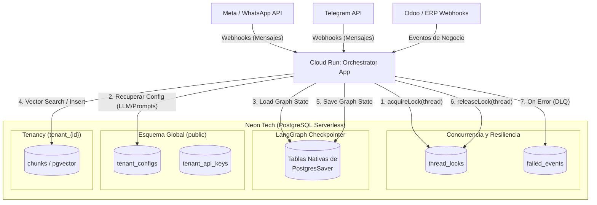

# Database Architecture: crm-agentico-orchestrator

Este documento detalla la arquitectura de persistencia, concurrencia y base de datos del orquestador, diseñada para integrarse con **Neon Tech (PostgreSQL Serverless)** y **LangGraph**.

## Diagrama de Flujo y Componentes



## Flujo Textual de Ejecución (Ciclo de Vida de un Mensaje)

1. **Recepción:** Un webhook (ej. de Meta) ingresa a la aplicación alojada en GCP (Cloud Run). Contiene un mensaje de un usuario final, lo que se traduce a un `thread_id` (conversación) y un `tenant_id` (cliente B2B).
2. **Concurrencia (Locking):** Antes de iniciar el procesamiento, el servicio de base de datos ejecuta `acquireLock(thread_id)` sobre la tabla `thread_locks`. Esto evita condiciones de carrera (ej. que dos mensajes rápidos del mismo usuario creen ramificaciones inconsistentes en el estado del grafo).
3. **Configuración del Inquilino:** Se consulta la tabla `tenant_configs` y `tenant_api_keys` para inyectar en el agente la configuración dinámica del LLM, features activos y prompts semánticos específicos del negocio.
4. **Restauración de Estado (Checkpointer):** LangGraph, utilizando el paquete `@langchain/langgraph-checkpoint-postgres`, consulta de forma automática sus tablas internas usando nuestro `pool` de conexiones de Postgres. Extrae la historia completa del hilo y el estado de la memoria del agente.
5. **Ejecución del Agente y Vector Search:** Durante la ejecución del LangGraph, si el agente requiere memoria semántica o RAG, el orquestador usa `pgvector` para buscar en la tabla `chunks`. La aplicación altera la ruta de búsqueda usando `SET search_path = "tenant_{id}", public` para aislar los vectores por inquilino.
6. **Persistencia de Estado:** Una vez completados los nodos del agente, el Checkpointer guarda el nuevo estado y el mensaje resultante de vuelta a la base de datos a través de `PostgresSaver`.
7. **Liberación del Bloqueo:** Se ejecuta `releaseLock(thread_id)` para permitir que la misma conversación procese el siguiente mensaje en cola.
8. **Dead Letter Queue (DLQ):** En caso de fallas en webhooks salientes o errores críticos no recuperables en flujos de terceros, la transacción fallida se guarda en `failed_events` para que un worker secundario reintente la operación más tarde.

## Tenancy y Aislamiento de Datos
La aplicación aprovecha las características nativas de los **Schemas de PostgreSQL** para separar lógicamente la memoria a largo plazo (vectores). Mediante la función `withTenantContext`, la conexión temporalmente altera su `search_path`:
```typescript
await client.query(`SET search_path = "tenant_${safeTenantId}", public`);
```
Esto permite que los queries a la tabla `chunks` operen de manera aislada sobre los datos del inquilino, pero sigan teniendo visibilidad de configuraciones globales en `public`.

## ¿Por qué NO usamos Drizzle ORM?

En una sesión anterior de arquitectura se evaluó incorporar **Drizzle ORM**, pero se tomó la decisión técnica de descartarlo y utilizar la librería nativa **`pg` (node-postgres)** por las siguientes razones:

1. **Compatibilidad con LangGraph Checkpointer:** El `PostgresSaver` proporcionado por LangChain (`@langchain/langgraph-checkpoint-postgres`) espera y consume nativamente un objeto `Pool` de la librería `pg`. Introducir Drizzle agregaba una capa que no se integraba de forma natural con el manejador de estados subyacente.
2. **Aislamiento Dinámico de Tenancy:** Cambiar el `search_path` de forma dinámica por petición en queries transaccionales (para aislar inquilinos) es mucho más explícito, transparente y predecible escribiendo SQL crudo (ej. `SET search_path`). En Drizzle, manejar esquemas dinámicos no está diseñado de primer nivel de forma ágil y requeriría instanciar el cliente múltiples veces o hacer overrides más complejos.
3. **Manejo de Extensiones (pgvector):** Las operaciones de cálculo de similitud vectorial del tipo `1 - (embedding <=> $1::vector) AS similarity` son sumamente específicas al dialecto de la extensión `pgvector` en PostgreSQL. Escribirlas en crudo garantiza optimización directa en la capa de base de datos sin fricción ni adaptadores de ORM incompletos.
4. **Simplicidad:** La arquitectura actual se beneficia de migraciones `.sql` nativas (ej. `001_init.sql`, ejecutadas por `run_migrations.ts`). Mantener el orquestador ligero y sin la abstracción del ORM previene la sobrecarga de dependencias innecesarias en un servicio cuyo rol de datos es muy enfocado (Checkpointer y Vectores).
