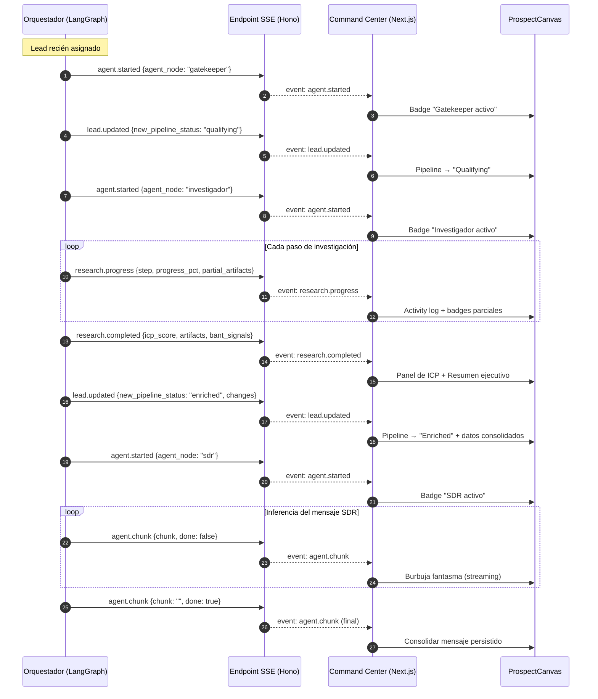

# CONTRACTS_SSE_BL33 — Contratos SSE: Orquestador Agéntico ↔ Command Center

**Bloque:** 33 — Pruebas E2E y Eventos en Tiempo Real (SSE)  
**Autor:** Builder (Planificador)  
**Fecha:** 25 de Abril de 2026  
**Dependencias:** PRD-BLOQUE33, RFC-033, RFC-036, ADR-136, ADR-117  

---

## 1. Resumen

Este documento define la estructura JSON estricta de los payloads Server-Sent Events (SSE) que fluyen desde el **Orquestador Agéntico** (Hono / LangGraph en Cloud Run) hacia el **Command Center** (Next.js / `ProspectCanvas`).

El objetivo es lograr **Zero-F5**: toda actualización agentica se refleja en la UI sin recarga manual.

---

## 2. Endpoint SSE

| Campo | Valor |
|-------|-------|
| **URL** | `GET /api/events/prospects/:prospectId` |
| **Content-Type** | `text/event-stream` |
| **Cache-Control** | `no-cache` |
| **Connection** | `keep-alive` |
| **Auth** | Bearer Token (session JWT del operador) |
| **Query Params** | `?tenant_id=<uuid>` (obligatorio, validado contra JWT) |

### 2.1 Formato de Frame SSE (wire format)

Cada frame sigue el estándar SSE con campo `event` tipado y `data` como JSON serializado en una sola línea:

```
event: <event_type>
data: <json_payload>\n\n
```

El campo `event` permite al `EventSource` del cliente discriminar con `addEventListener(eventType, handler)` sin parsear el JSON primero.

### 2.2 Heartbeat / Keep-Alive

Cada **30 segundos** se emite un comentario SSE para mantener la conexión TCP viva a través de proxies y load balancers:

```
:ping\n\n
```

---

## 3. Envelope Común (Base del Payload)

Todos los eventos comparten una estructura envolvente (`envelope`) idéntica. El campo `data` varía por tipo de evento.

```typescript
interface SSEEnvelope<T extends string, D> {
  /** Tipo de evento discriminante. Coincide con el campo `event:` del frame SSE. */
  event: T;

  /** UUID v4 único por evento. Permite deduplicación en el cliente. */
  event_id: string;

  /** ISO 8601 UTC. Momento de emisión en el Orquestador. */
  timestamp: string;

  /** UUID del tenant. Validado server-side contra el JWT. */
  tenant_id: string;

  /** UUID del prospecto / lead al que pertenece el evento. */
  prospect_id: string;

  /** UUID del thread de LangGraph (configurable.thread_id). */
  thread_id: string;

  /** Payload específico del tipo de evento. */
  data: D;
}
```

**Regla de serialización:** El JSON se emite en una sola línea (sin saltos) dentro del campo `data:` del frame SSE. El cliente parsea `event.data` con `JSON.parse()`.

---

## 4. Catálogo de Eventos

### 4.1 `agent.started` — Inicio de Agente

Se emite cuando LangGraph asigna un nodo agente (Gatekeeper, SDR, Hunter, Investigador) a un prospecto y comienza la ejecución del subgrafo.

```typescript
interface AgentStartedData {
  /** Nodo agente que inicia ejecución. */
  agent_node: 'gatekeeper' | 'sdr' | 'hunter' | 'investigador' | 'l1_support';

  /** UUID del run de LangGraph. */
  run_id: string;

  /** Estado del pipeline del prospecto al momento del inicio. */
  pipeline_status: 'new' | 'qualifying' | 'researching' | 'enriched' | 'contacted' | 'nurturing';

  /** Mensaje legible para mostrar en la UI (ej. indicador de actividad). */
  display_message: string;
}
```

**Ejemplo de frame completo:**
```
event: agent.started
data: {"event":"agent.started","event_id":"a1b2c3d4-e5f6-7890-abcd-ef1234567890","timestamp":"2026-04-25T21:00:00.000Z","tenant_id":"t-uuid","prospect_id":"p-uuid","thread_id":"th-uuid","data":{"agent_node":"investigador","run_id":"run-uuid","pipeline_status":"researching","display_message":"Investigador iniciando análisis de prospecto"}}

```

---

### 4.2 `research.progress` — Progreso de Búsqueda (Investigador)

Se emite durante la ejecución del nodo Investigador para reflejar en tiempo real las acciones de búsqueda/OSINT. Múltiples eventos de este tipo se emiten por run.

```typescript
interface ResearchProgressData {
  /** UUID del run de LangGraph. */
  run_id: string;

  /** Nodo agente que emite (siempre 'investigador' para este evento). */
  agent_node: 'investigador';

  /** Paso actual dentro del flujo de investigación. */
  step: 'linkedin_lookup' | 'company_analysis' | 'tech_stack_scan' | 'news_scan' | 'icp_scoring' | 'custom';

  /** Etiqueta legible del paso (para mostrar en el activity log). */
  step_label: string;

  /** Progreso normalizado 0–100. -1 si indeterminado. */
  progress_pct: number;

  /** Fragmento de texto descriptivo de la acción en curso. */
  detail: string;

  /** Fuente de datos consultada (URL, API, etc.). Puede ser null. */
  source: string | null;

  /** Artefactos parciales extraídos hasta el momento. */
  partial_artifacts: PartialArtifact[];
}

interface PartialArtifact {
  /** Tipo de dato extraído. */
  kind: 'job_title' | 'company_size' | 'industry' | 'tech_stack' | 'funding' | 'news_headline' | 'social_profile' | 'custom';

  /** Etiqueta corta para badge en la UI. */
  label: string;

  /** Valor extraído. */
  value: string;

  /** Nivel de confianza del dato: 0.0 – 1.0 */
  confidence: number;
}
```

**Ejemplo de frame:**
```
event: research.progress
data: {"event":"research.progress","event_id":"b2c3d4e5-f6a7-8901-bcde-f12345678901","timestamp":"2026-04-25T21:00:05.000Z","tenant_id":"t-uuid","prospect_id":"p-uuid","thread_id":"th-uuid","data":{"run_id":"run-uuid","agent_node":"investigador","step":"linkedin_lookup","step_label":"Buscando perfil LinkedIn","progress_pct":25,"detail":"Navegando a linkedin.com/in/johndoe — extrayendo cargo y empresa","source":"https://linkedin.com/in/johndoe","partial_artifacts":[{"kind":"job_title","label":"Cargo","value":"VP of Engineering","confidence":0.95}]}}

```

---

### 4.3 `research.completed` — Finalización de Investigación

Se emite una vez al completar el nodo Investigador. Contiene el resumen consolidado de la investigación y el ICP score calculado.

```typescript
interface ResearchCompletedData {
  /** UUID del run de LangGraph. */
  run_id: string;

  /** Nodo agente que finalizó. */
  agent_node: 'investigador';

  /** Duración total de la investigación en milisegundos. */
  duration_ms: number;

  /** Score ICP calculado: 0 – 100. */
  icp_score: number;

  /** Resumen ejecutivo generado por el agente. */
  executive_summary: string;

  /** Artefactos finales consolidados (superset de los parciales). */
  artifacts: FinalArtifact[];

  /** Siguiente nodo sugerido por el grafo. */
  next_node: 'sdr' | 'hunter' | 'gatekeeper' | 'human_review' | null;

  /** Señales BANT detectadas (si aplica). */
  bant_signals: BANTSignals;
}

interface FinalArtifact {
  kind: 'job_title' | 'company_size' | 'industry' | 'tech_stack' | 'funding' | 'news_headline' | 'social_profile' | 'decision_maker' | 'pain_point' | 'custom';
  label: string;
  value: string;
  confidence: number;
  /** URL fuente de donde se extrajo. Null si fue inferido. */
  source_url: string | null;
}

interface BANTSignals {
  budget: string | null;
  authority: string | null;
  need: string | null;
  timeline: string | null;
}
```

**Ejemplo de frame:**
```
event: research.completed
data: {"event":"research.completed","event_id":"c3d4e5f6-a7b8-9012-cdef-123456789012","timestamp":"2026-04-25T21:00:30.000Z","tenant_id":"t-uuid","prospect_id":"p-uuid","thread_id":"th-uuid","data":{"run_id":"run-uuid","agent_node":"investigador","duration_ms":25000,"icp_score":82,"executive_summary":"VP of Engineering en TechCorp (Serie B, 200 empleados). Stack: React/Node. Pain point detectado: migración de monolito.","artifacts":[{"kind":"job_title","label":"Cargo","value":"VP of Engineering","confidence":0.95,"source_url":"https://linkedin.com/in/johndoe"},{"kind":"company_size","label":"Empleados","value":"200","confidence":0.88,"source_url":"https://techcorp.com/about"},{"kind":"tech_stack","label":"Stack","value":"React, Node.js, PostgreSQL","confidence":0.75,"source_url":null}],"next_node":"sdr","bant_signals":{"budget":null,"authority":"VP-level, decision maker","need":"Migración de monolito a microservicios","timeline":null}}}

```

---

### 4.4 `lead.updated` — Actualización de Lead

Se emite cuando cualquier nodo agente (o el reverse callback del Orquestador) muta datos del Lead en la BD. Cubre cambios de estado del pipeline, asignación de nodos, y enriquecimiento de campos.

```typescript
interface LeadUpdatedData {
  /** Nodo agente que causó la mutación (o 'system' si fue automático). */
  agent_node: 'gatekeeper' | 'sdr' | 'hunter' | 'investigador' | 'l1_support' | 'system';

  /** Campos del Lead que fueron actualizados (delta, no snapshot completo). */
  changes: LeadFieldChange[];

  /** Estado anterior del pipeline. */
  previous_pipeline_status: string;

  /** Estado nuevo del pipeline. */
  new_pipeline_status: string;

  /** Si el cambio requiere atención humana (ej. handoff pendiente). */
  requires_attention: boolean;

  /** Mensaje legible para el activity feed de la UI. */
  display_message: string;
}

interface LeadFieldChange {
  /** Nombre del campo actualizado (snake_case, coincide con columna de BD). */
  field: string;

  /** Valor anterior (serializado a string). Null si es campo nuevo. */
  old_value: string | null;

  /** Valor nuevo. */
  new_value: string;
}
```

**Ejemplo de frame:**
```
event: lead.updated
data: {"event":"lead.updated","event_id":"d4e5f6a7-b8c9-0123-defa-234567890123","timestamp":"2026-04-25T21:00:32.000Z","tenant_id":"t-uuid","prospect_id":"p-uuid","thread_id":"th-uuid","data":{"agent_node":"investigador","changes":[{"field":"icp_score","old_value":null,"new_value":"82"},{"field":"company_size","old_value":null,"new_value":"200"},{"field":"pipeline_status","old_value":"researching","new_value":"enriched"}],"previous_pipeline_status":"researching","new_pipeline_status":"enriched","requires_attention":false,"display_message":"Investigación completada. Lead enriquecido con ICP score 82."}}

```

---

### 4.5 `agent.error` — Error de Agente (Andon Cord)

Se emite cuando un nodo agente falla de forma no recuperable o dispara una safety valve. Permite al operador intervenir vía HITL.

```typescript
interface AgentErrorData {
  /** Nodo agente que falló. */
  agent_node: string;

  /** UUID del run de LangGraph. */
  run_id: string;

  /** Código de error estructurado. */
  error_code: 'LLM_TIMEOUT' | 'RATE_LIMIT' | 'TOOL_FAILURE' | 'SAFETY_VALVE' | 'GRAPH_ERROR' | 'UNKNOWN';

  /** Mensaje de error legible (sin PII). */
  error_message: string;

  /** Si el run puede ser reintentado automáticamente. */
  retryable: boolean;

  /** Número de reintentos ya ejecutados. */
  retry_count: number;

  /** Severidad para controlar el tipo de notificación en UI. */
  severity: 'warning' | 'critical';
}
```

---

### 4.6 `agent.chunk` — Token Streaming del LLM (Inferencia en Vivo)

Se emite cuando LangGraph transmite chunks de inferencia del LLM. Permite renderizar la burbuja fantasma en el Inbox (per RFC-036).

```typescript
interface AgentChunkData {
  /** UUID del run de LangGraph. */
  run_id: string;

  /** Nodo agente que emite la inferencia. */
  agent_node: string;

  /** UUID temporal del mensaje (será la PK al consolidar en BD). */
  message_id: string;

  /** Fragmento de texto de la inferencia. */
  chunk: string;

  /** true si este es el último chunk del mensaje. */
  done: boolean;
}
```

---

## 5. Esquema Zod de Validación (Orquestador)

Para ser implementado en `src/schemas/sse-events.ts` del Orquestador:

```typescript
import { z } from 'zod';

// -- Envelope Base --
const SSEEnvelopeBase = z.object({
  event_id:    z.string().uuid(),
  timestamp:   z.string().datetime(),
  tenant_id:   z.string().uuid(),
  prospect_id: z.string().uuid(),
  thread_id:   z.string().uuid(),
});

// -- 4.1 agent.started --
export const AgentStartedSchema = SSEEnvelopeBase.extend({
  event: z.literal('agent.started'),
  data: z.object({
    agent_node:      z.enum(['gatekeeper', 'sdr', 'hunter', 'investigador', 'l1_support']),
    run_id:          z.string().uuid(),
    pipeline_status: z.enum(['new', 'qualifying', 'researching', 'enriched', 'contacted', 'nurturing']),
    display_message: z.string().max(256),
  }).strict(),
}).strict();

// -- 4.2 research.progress --
const PartialArtifactSchema = z.object({
  kind:       z.enum(['job_title', 'company_size', 'industry', 'tech_stack', 'funding', 'news_headline', 'social_profile', 'custom']),
  label:      z.string().max(64),
  value:      z.string().max(512),
  confidence: z.number().min(0).max(1),
}).strict();

export const ResearchProgressSchema = SSEEnvelopeBase.extend({
  event: z.literal('research.progress'),
  data: z.object({
    run_id:            z.string().uuid(),
    agent_node:        z.literal('investigador'),
    step:              z.enum(['linkedin_lookup', 'company_analysis', 'tech_stack_scan', 'news_scan', 'icp_scoring', 'custom']),
    step_label:        z.string().max(128),
    progress_pct:      z.number().min(-1).max(100),
    detail:            z.string().max(1024),
    source:            z.string().url().nullable(),
    partial_artifacts: z.array(PartialArtifactSchema).max(20),
  }).strict(),
}).strict();

// -- 4.3 research.completed --
const FinalArtifactSchema = z.object({
  kind:       z.enum(['job_title', 'company_size', 'industry', 'tech_stack', 'funding', 'news_headline', 'social_profile', 'decision_maker', 'pain_point', 'custom']),
  label:      z.string().max(64),
  value:      z.string().max(512),
  confidence: z.number().min(0).max(1),
  source_url: z.string().url().nullable(),
}).strict();

const BANTSignalsSchema = z.object({
  budget:    z.string().max(256).nullable(),
  authority: z.string().max(256).nullable(),
  need:      z.string().max(256).nullable(),
  timeline:  z.string().max(256).nullable(),
}).strict();

export const ResearchCompletedSchema = SSEEnvelopeBase.extend({
  event: z.literal('research.completed'),
  data: z.object({
    run_id:            z.string().uuid(),
    agent_node:        z.literal('investigador'),
    duration_ms:       z.number().int().nonnegative(),
    icp_score:         z.number().min(0).max(100),
    executive_summary: z.string().max(2048),
    artifacts:         z.array(FinalArtifactSchema).max(50),
    next_node:         z.enum(['sdr', 'hunter', 'gatekeeper', 'human_review']).nullable(),
    bant_signals:      BANTSignalsSchema,
  }).strict(),
}).strict();

// -- 4.4 lead.updated --
const LeadFieldChangeSchema = z.object({
  field:     z.string().max(64),
  old_value: z.string().max(1024).nullable(),
  new_value: z.string().max(1024),
}).strict();

export const LeadUpdatedSchema = SSEEnvelopeBase.extend({
  event: z.literal('lead.updated'),
  data: z.object({
    agent_node:               z.enum(['gatekeeper', 'sdr', 'hunter', 'investigador', 'l1_support', 'system']),
    changes:                  z.array(LeadFieldChangeSchema).min(1).max(30),
    previous_pipeline_status: z.string().max(32),
    new_pipeline_status:      z.string().max(32),
    requires_attention:       z.boolean(),
    display_message:          z.string().max(512),
  }).strict(),
}).strict();

// -- 4.5 agent.error --
export const AgentErrorSchema = SSEEnvelopeBase.extend({
  event: z.literal('agent.error'),
  data: z.object({
    agent_node:    z.string().max(32),
    run_id:        z.string().uuid(),
    error_code:    z.enum(['LLM_TIMEOUT', 'RATE_LIMIT', 'TOOL_FAILURE', 'SAFETY_VALVE', 'GRAPH_ERROR', 'UNKNOWN']),
    error_message: z.string().max(512),
    retryable:     z.boolean(),
    retry_count:   z.number().int().nonnegative(),
    severity:      z.enum(['warning', 'critical']),
  }).strict(),
}).strict();

// -- 4.6 agent.chunk --
export const AgentChunkSchema = SSEEnvelopeBase.extend({
  event: z.literal('agent.chunk'),
  data: z.object({
    run_id:     z.string().uuid(),
    agent_node: z.string().max(32),
    message_id: z.string().uuid(),
    chunk:      z.string().max(4096),
    done:       z.boolean(),
  }).strict(),
}).strict();

// -- Discriminated Union --
export const SSEEventSchema = z.discriminatedUnion('event', [
  AgentStartedSchema,
  ResearchProgressSchema,
  ResearchCompletedSchema,
  LeadUpdatedSchema,
  AgentErrorSchema,
  AgentChunkSchema,
]);

export type SSEEventType = z.infer<typeof SSEEventSchema>;
```

---

## 6. Secuencia Típica de Eventos (Flujo Happy-Path)



---

## 7. Integración con Hooks Existentes del Command Center

| Hook Existente | Evento SSE que consume | Acción en el cliente |
|---|---|---|
| `useSSESync()` | `lead.updated` | `queryClient.setQueryData` para actualizar thread list / kanban |
| `useLeadSSE(leadId)` | `agent.chunk` | `appendChunk()` en Zustand `AgentStreamStore` |
| `useLeadSSE(leadId)` | `research.progress`, `research.completed` | Nuevo: `queryClient.setQueryData` para inyectar artefactos en cache |
| `useSystemAlertsSSE()` | `agent.error` (severity: critical) | Toast destructivo vía Sonner |
| **Nuevo: `useProspectSSE(prospectId)`** | `agent.started`, `research.progress`, `research.completed`, `lead.updated` | Orquesta todos los eventos del ProspectCanvas |

---

## 8. Consideraciones de Seguridad y Resiliencia

### 8.1 Seguridad
- **Aislamiento Multi-Tenant:** El endpoint valida `tenant_id` contra el JWT del operador antes de suscribir el stream. Un tenant nunca recibe eventos de otro.
- **Enmascaramiento PII:** Los campos `detail` y `source` del Investigador **nunca** contienen emails, teléfonos ni datos personales en crudo. El Orquestador aplica PII masking antes de emitir (per ADR-116).
- **Rate Limiting:** Máximo 50 eventos/segundo por conexión SSE. Si se excede, el Orquestador emite un evento `agent.error` con `error_code: 'RATE_LIMIT'`.

### 8.2 Resiliencia del Cliente
- **Reconexión Exponencial:** `EventSource` nativo reconecta automáticamente. El hook `useProspectSSE` implementa backoff manual: 1s → 2s → 4s → 8s → 16s (cap).
- **Deduplicación por `event_id`:** El cliente mantiene un `Set<string>` (LRU, cap 500) de `event_id` recientes. Eventos duplicados (por reconexión) se descartan.
- **Last-Event-ID:** El endpoint respeta el header `Last-Event-ID` de SSE para reenviar eventos perdidos desde un buffer en memoria (últimos 100 eventos por prospect, TTL 5 min).

### 8.3 Límites de Payload
- Máximo **8 KB** por evento individual (alineado con límite de `pg_notify`).
- Si un `executive_summary` o lista de `artifacts` excede el límite, se trunca server-side y se marca con `"[truncated]"`.

---

## 9. Versionado

El contrato se versiona implícitamente por el campo `event`. Si un tipo de evento cambia su estructura de forma incompatible:
1. Se crea un nuevo tipo de evento (ej. `research.progress.v2`).
2. El tipo anterior se mantiene por al menos 2 sprints.
3. El cliente ignora tipos desconocidos (`default` en el `switch`).

---

*Documento generado bajo Ley Marcial Documental (Bloque 33). Toda implementación debe respetar los contratos aquí definidos. Cambios requieren actualización de este archivo.*
