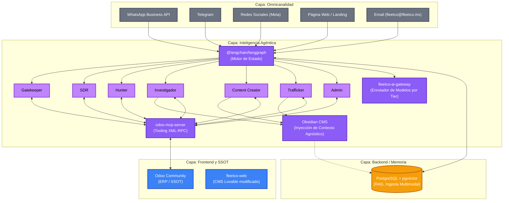

# Arquitectura Conceptual: CRM-agéntico (Plataforma Comercial Agnóstica)

```mermaid
graph TD
    %% CANALES
    subgraph "Capa: Omnicanalidad"
        WA["WhatsApp Business API"]:::channel
        TEL["Telegram"]:::channel
        RRSS["Redes Sociales (Meta)"]:::channel
        WEB["Página Web / Landing"]:::channel
        MAIL["Email (fleetco@fleetco.mx)"]:::channel
    end

    %% FRONTEND
    subgraph "Capa: Frontend y SSOT"
        ODOO["Odoo Community<br/>(ERP / SSOT)"]:::frontend
        FWEB["fleetco-web<br/>(CMS Lovable modificado)"]:::frontend
    end

    %% BACKEND
    subgraph "Capa: Backend / Memoria"
        DB[("PostgreSQL + pgvector<br/>(RAG, Ingesta Multimodal)")]:::database
    end

    %% CAPA AGÉNTICA (MOTOR Y NODOS)
    subgraph "Capa: Inteligencia Agéntica"
        LANG["@langchain/langgraph<br/>(Motor de Estado)"]:::core
        MCP["odoo-mcp-server<br/>(Tooling XML-RPC)"]:::core
        OBS["Obsidian CMS<br/>(Inyección de Contexto Agnóstico)"]:::core
        AIGW["fleetco-ai-gateway<br/>(Enrutador de Modelos por Tier)"]:::core

        %% Los 7 Nodos
        N1["Gatekeeper"]:::node
        N2["SDR"]:::node
        N3["Hunter"]:::node
        N4["Investigador"]:::node
        N5["Content Creator"]:::node
        N6["Trafficker"]:::node
        N7["Admin"]:::node
    end

    %% Relaciones
    WA & TEL & RRSS & WEB & MAIL --> LANG
    
    LANG --> N1 & N2 & N3 & N4 & N5 & N6 & N7
    LANG --> AIGW
    
    N4 & N5 & N6 --> OBS
    N1 & N2 & N3 & N4 & N5 & N6 & N7 <--> MCP
    
    MCP <--> ODOO
    LANG <--> DB
    OBS -.-> DB

    classDef channel fill:#6b7280,stroke:#374151,stroke-width:2px,color:white;
    classDef frontend fill:#3b82f6,stroke:#1e40af,stroke-width:2px,color:white;
    classDef database fill:#f59e0b,stroke:#b45309,stroke-width:2px,color:white;
    classDef core fill:#8b5cf6,stroke:#5b21b6,stroke-width:2px,color:white;
    classDef node fill:#c084fc,stroke:#7e22ce,stroke-width:2px,color:black;
```