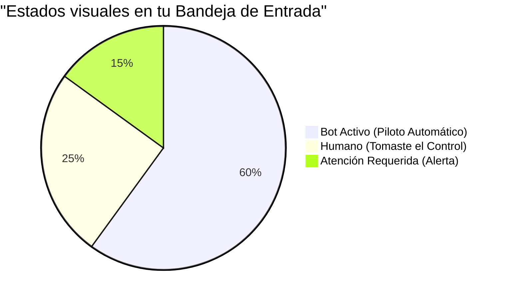

# Guía Práctica de Pruebas - Teseo AI CRM (Comerseg)

¡Bienvenido al panel de control de Teseo! Esta guía está diseñada para que puedas probar las nuevas funciones de inteligencia artificial y la gestión de prospectos (leads) de forma rápida y sencilla.

## 1. El Viaje de un Prospecto (Visión General)

A continuación te explicamos de manera visual qué pasa cuando un cliente les escribe por primera vez:

```mermaid
graph TD
    A([📱 Cliente escribe por WhatsApp/Telegram]) --> B{🤖 Copiloto IA (SDR)}
    B -->|Pregunta dudas| C[Responde preguntas automáticamente]
    B -->|Solicita cotización| D[Agenda Tarea y Alerta al Ejecutivo]
    C --> B
    D --> E([👨‍💼 Humano toma el control en el Inbox])
    
    style A fill:#e1f5fe,stroke:#0288d1,stroke-width:2px
    style B fill:#e8f5e9,stroke:#388e3c,stroke-width:2px
    style C fill:#fff3e0,stroke:#f57c00,stroke-width:2px
    style D fill:#fce4ec,stroke:#c2185b,stroke-width:2px
    style E fill:#ede7f6,stroke:#512da8,stroke-width:2px
```

---

## 2. Batería de Pruebas (¡Manos a la obra!)

Te sugerimos realizar las siguientes 3 pruebas desde distintos dispositivos (tu celular y tu computadora) para comprobar el flujo.

### Prueba 1: Interactuar con la IA desde WhatsApp / Telegram
**Objetivo:** Ver cómo el robot contesta, registra tu número y aparece mágicamente en el panel.

1. Toma tu celular y escribe un mensaje de saludo ("Hola, me interesa información") al número/bot de prueba proporcionado.
2. Continúa la charla simulando ser un prospecto difícil. Pregunta precios o detalles técnicos.
3. Desde tu computadora, entra a **Mission Control > Inbox**.
4. **Verifica:**
   - Que tu conversación aparezca en la lista izquierda.
   - Que si la IA no sabe algo o pides un agente, la conversación cambie a estado **"Atención Requerida"**.

### Prueba 2: Toma de Control Manual (Takeover)
**Objetivo:** Interrumpir al bot y contestar tú mismo como humano.

1. En la computadora, entra a la pestaña **Inbox**.
2. Selecciona la conversación que abriste en la Prueba 1.
3. Haz clic en el botón naranja **"Tomar Control (Usuario)"** en la esquina superior derecha.
4. Escribe un mensaje desde el panel y presiona **Enviar**.
5. **Verifica:**
   - Que tu celular reciba el mensaje que enviaste desde la computadora.
   - Que la etiqueta de la IA desaparezca, evitando que el bot siga interrumpiendo.

### Prueba 3: Crear Registros Manualmente
**Objetivo:** Usar la interfaz para capturar datos fuera del Chat.

1. Ve a la pestaña **Kanban / Pipeline**.
2. Arriba a la derecha encontrarás tres botones clave. Haz la siguiente secuencia:
   - Clic en **Nuevo Contacto** -> Llena un nombre inventado -> Guardar.
   - Clic en **Nueva Tarea** -> Asigna "Revisar cotización" para mañana -> Guardar.
   - Clic en **Nuevo Lead** -> Escribe los datos clave -> Guardar.
3. **Verifica:**
   - Aparece un mensaje verde de éxito (esquina inferior).
   - Los registros se consolidan y puedes empezar a ver la tarjeta del Lead en la primera columna ("New") de tu tablero.

---

## 3. ¿Cómo leer el Inbox?



- **🟢 Bot Activo:** El asistente virtual está conversando. No necesitas intervenir.
- **🔴 Atención Requerida:** La IA detectó una intención de compra fuerte, un reclamo o no supo qué contestar. ¡Es tu momento de entrar!
- **🟠 Humano:** Tú estás al volante. La IA no volverá a intervenir en esta sesión.

*¿Dudas durante la prueba? En la esquina inferior izquierda del panel encontrarás el botón de soporte directo con el equipo de Teseo.*
