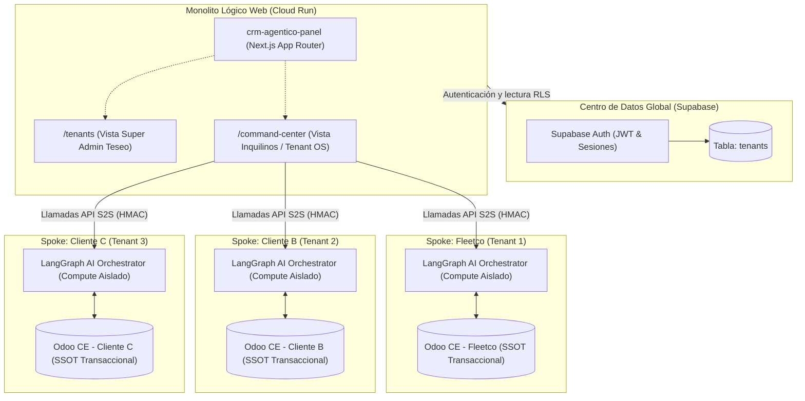
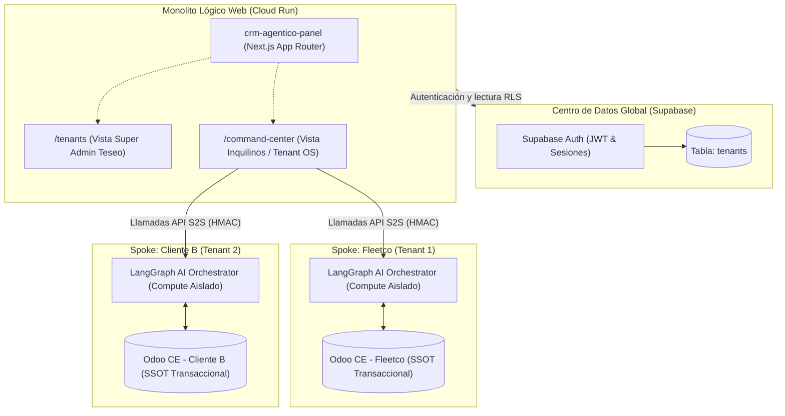
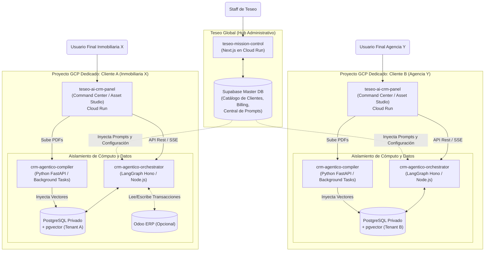

# PRD-001: CRM-Agéntico

## 1. Resumen Ejecutivo y Alcance
El **CRM-Agéntico** es una plataforma comercial autónoma B2B, agnóstica a la industria, orquestada sobre una arquitectura de **LangGraph**. Su propósito es automatizar y optimizar el ciclo de vida completo de ventas corporativas, desde la prospección y enriquecimiento de leads hasta la generación de propuestas dinámicas y el cierre, operando como un equipo comercial multi-agente altamente coordinado.

## 2. Single Source of Truth (SSOT) Comercial
La única fuente de verdad transaccional y de registro maestro es **Odoo CE**. 
- **Integración:** Se realiza de forma estandarizada a través del `odoo-mcp-server` (Model Context Protocol).
- **Directiva:** Ningún nodo mantiene estado transaccional local. Toda creación de lead, actualización de pipeline, cotización o registro de actividad comercial se sincroniza bidireccionalmente hacia Odoo CE.

## 3. Topología de Nodos (Grafo LangGraph)
El sistema opera mediante un enjambre de 7 nodos especializados. Cada nodo tiene responsabilidades aisladas y condiciones de transición (triggers) claras:

1. **Gatekeeper (Enrutador / Triage)**
   - **Responsabilidad:** Clasificar y enrutar todos los inputs de entrada (formularios web, correos inbound, mensajes). Detecta la intención y limpia el contexto inicial.
   - **Triggers:** Inbound webhook (nuevo lead o mensaje).
2. **SDR (Sales Development Representative)**
   - **Responsabilidad:** Calificación inicial del lead, primer contacto, nutrición temprana (nurturing) y programación de reuniones.
   - **Triggers:** Lead clasificado por Gatekeeper; recordatorios de seguimiento en Odoo.
3. **Hunter (Closer / Ejecutiv@ de Cuentas)**
   - **Responsabilidad:** Negociación avanzada, manejo de objeciones de alto nivel, cierre de tratos y re-activación de cuentas clave (Outbound agresivo).
   - **Triggers:** Lead alcanza umbral de calificación (MQL a SQL) o hand-off directo del SDR.
4. **Investigador (Analista de Inteligencia)**
   - **Responsabilidad:** Enriquecimiento profundo del perfil de la empresa objetivo (scraping de reportes, noticias recientes, estructura organizacional, detección de stack tecnológico).
   - **Triggers:** Lead con datos incompletos en SSOT, o solicitud directa bajo demanda del SDR o Hunter.
5. **Content Creator (Generador de Activos)**
   - **Responsabilidad:** Creación de material hiper-personalizado: copys para correos, propuestas ejecutivas, presentaciones y scripts de video.
   - **Triggers:** Solicitud de campaña por el Trafficker, o petición de activos para un lead específico por el SDR/Hunter.
6. **Trafficker (Distribución y Pauta)**
   - **Responsabilidad:** Orquestar campañas de distribución, inyección de audiencias (lookalikes basados en leads cerrados en Odoo), y A/B testing de mensajes.
   - **Triggers:** Nuevos activos aprobados del Content Creator; cronogramas de campañas outbound.
7. **Admin (Orquestador / Human-in-the-Loop)**
   - **Responsabilidad:** Supervisión del grafo, resolución de *deadlocks*, aprobaciones de alto riesgo (descuentos agresivos), y monitoreo de costos de inferencia.
   - **Triggers:** Excepción de agente (incertidumbre > umbral), solicitudes de descuento fuera de política, auditoría periódica.

## 4. Motor de Ingesta Multimodal (CRÍTICO)
El cerebro analítico del sistema depende de un flujo robusto de Retrieval-Augmented Generation (RAG) soportado por `pgvector`. Este motor consolida el conocimiento a partir de tres flujos de datos asíncronos:

### 4.1 Cold Data (Conocimiento Estático y Estructural)
- **Fuente:** Obsidian CMS.
- **Contenido:** Políticas de precios, manuales de producto, playbooks de ventas, plantillas de copy aprobadas, y casos de estudio históricos.
- **Procesamiento:** Chunking semántico estándar y vectorización directa periódica.

### 4.2 Hot Data & Continuous Learning (Feedback en Tiempo Real)
- **Fuente:** Grupos de Staff de Telegram, directivas de Mission Control y Webhooks asíncronos.
- **Pipeline de Destilación (Gemini Flash & Minion Workers):**
  1. **Ingesta raw:** Captura de mensajes directos, notas de voz o instrucciones explícitas (ej. comando `[LEARN]`).
  2. **Encolamiento Asíncrono (pg-boss):** Para no bloquear la respuesta en tiempo real de LangGraph (Gatekeeper), el feedback crudo se delega a la cola `gbrain:learn`.
  3. **Generación Vectorial:** Un Minion Worker aislado procesa el trabajo, consumiendo `text-embedding-004` (768 dimensiones).
  4. **Vectorización:** Inserción en `tenant_memories` (`pgvector`) para que todo el enjambre retenga correcciones sobre tono, objeciones y contexto específico del inquilino a largo plazo (Continuous Learning Layer).

### 4.3 Inteligencia Competitiva Continua
- **Fuente:** Web scraping y monitoreo de URLs de la competencia.
- **Procesamiento:** Cálculo de *diffs* en el DOM (HTML) o cambios semánticos en el contenido (cambios de precios, nuevos features anunciados). Estos diffs se vectorizan como "Alertas de Mercado" accesibles para el Hunter y el Investigador.

## 5. Casos de Uso Principales (Pipelines `pgvector`)

### 5.1 Scoring ICP (Enriquecimiento Vectorial)
- **Flujo:** El Investigador extrae datos no estructurados de un lead. El vector del lead se compara contra el centroide vectorial de los "Mejores Clientes Históricos" (ganados en Odoo) almacenados en `pgvector`.
- **Salida:** Un Score de ICP (Ideal Customer Profile) que dicta si el lead va al SDR (flujo normal) o salta directo al Hunter (alta prioridad).

### 5.2 Inteligencia Competitiva Autónoma
- **Flujo:** Ante una mención de un competidor por parte del cliente, el Hunter consulta a `pgvector`.
- **Salida:** El sistema recupera los últimos cambios detectados (diffs de web) y lecciones aprendidas (hot data de Telegram) sobre cómo batir a ese competidor específico (ej. "El competidor X subió precios un 10% la semana pasada; enfatiza nuestro pricing fijo").

### 5.3 Generación de Contenido Dinámico (Integración Remotion)
- **Flujo:** El Content Creator extrae el dolor específico del cliente (RAG de minutas de reunión).
- **Salida:** Redacción de scripts hiper-personalizados que se envían a un pipeline de renderizado (ej. Remotion) para generar videos sintéticos cortos (pitch dinámico) incrustados en la propuesta, listos para ser distribuidos por el Trafficker.

---

## 7. Estado de Módulos del Tenant OS

| Módulo | Estado | RFC de Referencia | Fecha Última Actualización |
|---|---|---|---|
| **Asset Studio** | ✅ **ESTABLE** — Fases 1–4 completadas (Schema, API/Hooks, UI Editor, Analíticas A/B & Charts) | RFC-015 (Arch), RFC-017 (Fase 4) | 2026-04-20 |
| CRM-Agéntico Core (LangGraph) | 🚧 En desarrollo | PRD-001 | — |
| Motor de Ingesta Multimodal | 🚧 En desarrollo | PRD-001 §4 | — |

> **Nota de Cierre Topológico (2026-04-20):** El módulo Asset Studio alcanzó estabilidad tras completar la Fase 4 (RFC-017): analíticas A/B con gráficos Recharts/Shadcn Chart, endpoints de aggregation y timeseries vía Supabase RPC, dashboard de experimentos, wizard de setup, y polish completo (skeletons, empty states, responsive, toasts). Resolución técnica clave: inyección higienizada del parámetro `timeseries` a Supabase y eliminación total de `any` en TypeScript.

## 8. Arquitectura de Despliegue Multi-Tenant (Hub & Spoke)

Para asegurar escalabilidad en costos, seguridad Zero-Trust de datos (RLS) y aislamiento de procesamiento, el CRM-Agéntico se despliega bajo una topología **Hub & Spoke**:

*   **Hub (Mission Control):** Un único frontend web (Next.js en Cloud Run) y una única base de datos central (Supabase). Este monolito lógico sirve las interfaces tanto para los administradores de Teseo como para los paneles operativos (Tenant OS) de todos los clientes. La seguridad y separación de datos de la interfaz se garantizan mediante Supabase Auth y Row Level Security (RLS).
*   **Spokes (Inquilinos/Tenants):** Los "cerebros" del sistema (Orquestadores LangGraph y BDs transaccionales como Odoo o almacenes vectoriales) están aislados en infraestructuras y proyectos separados (ej. Cloud Run independientes) para garantizar el "Data Isolation" y "Compute Isolation" estricto.

> **Nota Arquitectónica:** Cuando `fleetco@fleetco.mx` entra al Monolito Lógico Web, el RLS en Supabase restringe su vista únicamente a la ruta `/command-center` cargando exclusivamente sus configuraciones, y el Next.js dirige los flujos de IA (vía HMAC) únicamente hacia el Spoke "Fleetco". Si el SuperAdmin de Teseo entra, se rutea a `/tenants` para ver la administración de todos los spokes.

---
*Fin del Documento. Listo para conversión a WBS y RFC por el Ejecutor.*
## 6. Apéndice: Playbook de Adopción Comercial (AI Native)
Este sistema está diseñado arquitectónicamente para cumplir y superar el estándar de equipos de ventas "AI Native", mapeando directamente las mejores prácticas de la industria hacia nuestros nodos:

1. **Construcción de Herramientas Internas y GTM Engineering:** Se rechaza el uso de IAs genéricas. El CRM-Agéntico es un sistema *Knowledge-Grounded* donde los **Minion Workers** (Durable Jobs) inyectan memoria vectorial asíncrona (`tenant_memories`), y la integración con el MCP Server de Odoo elimina las tareas de RevOps tradicional (auditoría de tiempo de llenado de CRM erradicada).
2. **Análisis Sistemático de Conversaciones:** El pipeline de "Hot Data" procesa transcripciones y telemetría de forma asíncrona a través de `pg-boss` (`gbrain:learn`), permitiendo categorización y detección de patrones de éxito sin afectar la latencia del enrutamiento.
3. **Sistematización de la Preparación (Research):** Delegado por completo al nodo **Investigador**. Ningún agente humano entra a una llamada sin un perfilamiento previo que incluya el cálculo de *ICP Score* y una evaluación de inteligencia competitiva basada en diffs web recientes.
4. **Diferenciación mediante Contenido Creativo:** El nodo **Content Creator** asume la responsabilidad del Top of Funnel y Outbound, diseñado para acoplarse a pipelines de renderizado sintético (ej. Remotion) para entregar experiencias hiper-personalizadas (video prospección) a escala.
5. **Ajuste del Modelo de Cierre y la "Objeción Secreta":**
   - **Deals Pequeños/Calificación:** Ciclo automatizado por el nodo **SDR**.
   - **Deals Medianos/Grandes:** El sistema activa el hand-off. El nodo **Gatekeeper** o las reglas de incertidumbre derivan el contexto al **Admin** (Human-in-the-Loop) o directamente al **Hunter** (humano).
   - *Postura filosófica:* El sistema no es un "reemplazo", es un exoesqueleto de ventas. Automatiza el research y la prospección para devolver tiempo de alta calidad al humano en la negociación de alto riesgo.

## 9. Lineamientos de UI (Componentes Abstractos y Composición)
**Directiva de Refs (React.forwardRef):** Todo componente de interfaz base (ej. `Button`, `Badge`, `Card`, etc.) implementado o modificado bajo la arquitectura Shadcn/Radix dentro del Tenant OS (`crm-agentico-panel`), debe envolver su retorno obligatoriamente con `React.forwardRef`. 

**Justificación Arquitectónica:**
- **Prevención de React Warnings:** Garantiza que librerías subyacentes como `@base-ui/react` o `radix-ui` puedan anclar listeners de eventos o manipular el DOM correctamente.
- **Interoperabilidad de Composición (DropdownMenus/Tooltips):** Elementos que sirven como "Trigger" para menús contextuales, popovers o diálogos fallarán catastróficamente o romperán el comportamiento del DOM si no propagan su `ref`.
- **Estandarización Bottom-Up:** Este lineamiento previene regresiones en refactorizaciones masivas y sella la estabilidad de los componentes compartidos para todos los modulos (Kanban, Inbox, Asset Studio).
## 10. Evolución Topológica: De Hub & Spoke a Single-Tenant Polyrepo (ADR-069)

### Arquitectura Original (Hub & Spoke / Multi-Tenant Frontend)
*Topología deprecada en abril de 2026.* Consistía en un monolito lógico web donde el panel administrativo de Teseo (`/tenants`) y el panel del inquilino (`/command-center`) vivían en el mismo Cloud Run. Se usaba RLS de Supabase para aislar las vistas. Se descartó debido a riesgos de "cross-tenant data bleed" y conflictos de compilación en Next.js (Monorepo encubierto).

### Arquitectura Actual (Single-Tenant Polyrepo)
*Topología vigente.* Para asegurar la máxima seguridad (Zero-Trust), escalabilidad sin cuellos de botella y control exacto de FinOps por cliente, el ecosistema **Teseo-AI-CRM** opera bajo un modelo de infraestructura dedicada (Single-Tenant) y repositorios aislados (Polyrepo). 

El código fuente está físicamente dividido en 4 repositorios independientes:
1. **`teseo-mission-control`:** Hub administrativo exclusivo para el staff de Teseo.
2. **`teseo-ai-crm-panel`:** Interfaz web del cliente final (Tenant OS / Command Center).
3. **`crm-agentico-orchestrator`:** Motor de IA conversacional (SDR, Hunter, etc).
4. **`crm-agentico-compiler`:** Microservicio de procesamiento asíncrono y vectorización (RAG).

