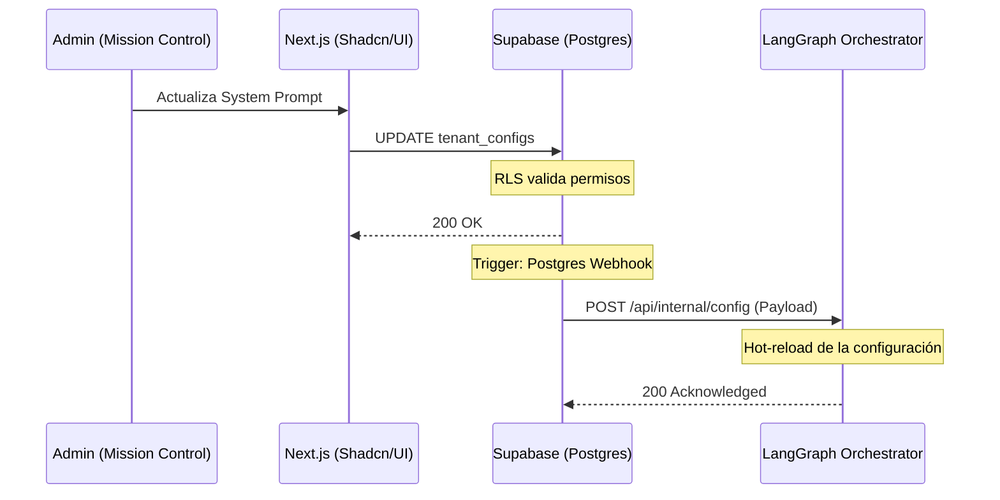

# RFC-011: Master DB (Supabase) y Mission Control B2B

**Autor:** Builder (Arquitecto Staff - Escuadrón Teseo)
**Estado:** Propuesta / En Revisión
**Fecha:** 18 Abril 2026

## 1. Objetivo y Visión General
Diseñar la arquitectura central de datos y control B2B para Teseo AI CRM. El objetivo es centralizar la gestión de inquilinos (Tenants) y sus configuraciones operativas usando Supabase como fuente única de la verdad (SSOT), y exponer una interfaz administrativa ("Mission Control") que actualice de forma dinámica y reactiva la configuración en el orquestador (LangGraph).

## 2. Arquitectura de Datos (Supabase)
El diseño favorece un enfoque Multi-Tenant con bases de datos compartidas y esquemas aislados de forma lógica mediante Row Level Security (RLS).

### 2.1 Esquemas Principales
**Tabla: `tenants`**
Maneja la identidad, estado de suscripción y metadatos básicos de los clientes B2B.
- `id`: UUID (Primary Key)
- `name`: String
- `status`: Enum (`active`, `suspended`, `onboarding`)
- `created_at`: Timestamp

**Tabla: `tenant_configs`**
Almacena los parámetros operacionales que dicta el comportamiento de la IA para cada tenant.
- `id`: UUID (Primary Key)
- `tenant_id`: UUID (Foreign Key -> `tenants.id`)
- `system_prompt`: Text (Instrucciones core para el agente)
- `llm_tier`: String (Ej: `gemini-3.1-pro`, `claude-3-opus`)
- `features`: JSONB (Toggles para features experimentales/específicos)
- `updated_at`: Timestamp

### 2.2 Seguridad Lógica (RLS - Row Level Security)
Para prevenir fugas de información inter-tenant:
- Se activará RLS obligatoriamente en `tenants` y `tenant_configs`.
- Las políticas de lectura/escritura en Mission Control (Frontend) estarán atadas al `auth.uid()` o al rol de administrador.
- El orquestador (LangGraph) consumirá la API usando un *Service Role Key* (bypass de RLS), ya que actúa como backend de confianza, pero filtrando explícitamente por `tenant_id` en cada invocación.

## 3. Integración Fase 3: Ecosistema y Flujo de Datos

### 3.1 Frontend: Mission Control (`src/mission-control`)
- **Stack:** Next.js (App Router), Shadcn/UI, TailwindCSS.
- **Rol:** Panel administrativo de Teseo para hacer *onboarding* de clientes y ajustar prompts o modelos al vuelo.
- **Flujo:** Interactúa directamente con Supabase (vía Supabase JS Client) aprovechando las bondades de validación en el cliente y SSR.

### 3.2 Backend: LangGraph Reverse Webhook
- **Problema:** Si el Mission Control actualiza un prompt, el agente (LangGraph) en ejecución debe enterarse sin recurrir a un *long-polling* ineficiente.
- **Solución (Push):**
  - Supabase Database Webhooks: Se configurará un trigger en PostgreSQL que escuche eventos `UPDATE` o `INSERT` en la tabla `tenant_configs`.
  - Este webhook disparará un payload JSON hacia el orquestador LangGraph al endpoint `POST /api/internal/config`.
  - LangGraph actualizará su memoria caché/estado en caliente (hot-reload) para que la siguiente iteración del agente aplique la nueva configuración instantáneamente.

## 4. Diagrama de Flujo (Topología de Datos)

## 5. Trade-offs y Mitigación de Deuda Técnica

1. **Supabase Webhooks vs Edge Functions:**
   - *Decisión:* Usaremos Database Webhooks nativos por simplicidad.
   - *Riesgo:* Si LangGraph está caído, el webhook falla silenciosamente.
   - *Mitigación:* LangGraph implementará un fallback: si su caché interno en memoria expira (TTL de 5 min), hará un `GET` síncrono a Supabase garantizando eventual consistencia.
2. **Esquema JSONB vs Columnas Rígidas:**
   - *Decisión:* `features` como JSONB, pero `system_prompt` y `llm_tier` como columnas estrictas.
   - *Razón:* Flexibilidad para configuraciones menores, tipado estricto para las directivas core de la IA.

## 6. Work Breakdown Structure (WBS) - Accionable para el Ejecutor

- [ ] **Tarea 1: Setup DB (Supabase)**
  - Crear proyecto en Supabase (o usar CLI local para migraciones).
  - Definir tablas `tenants` y `tenant_configs`.
  - Implementar políticas RLS para lectura/escritura basada en roles admin.
- [ ] **Tarea 2: Database Webhook**
  - Configurar trigger en Supabase `pg_net` o Webhooks nativos para enrutar el payload de `tenant_configs` a la URL del Orquestador.
- [ ] **Tarea 3: Scaffold Mission Control**
  - Inicializar proyecto Next.js en `src/mission-control`.
  - Configurar Shadcn/UI e implementar vistas base de CRUD para Tenants.
- [ ] **Tarea 4: Ingesta en LangGraph**
  - Exponer endpoint `POST /api/internal/config` en el router de LangGraph.
  - Escribir handler para actualizar el estado in-memory / redis de configuración del tenant respectivo.
