# RFC-012: LangGraph Reverse Webhook para Hidratación en Caliente

**Estado:** Redacción / Aprobación Pendiente
**Autor:** Builder (Arquitecto Staff)
**Fecha:** 18 de Abril de 2026
**Contexto de Diseño:** Ley Marcial Documental

## 1. Objetivo
Definir la arquitectura y el flujo de datos para actualizar en caliente (Hot Reload) las configuraciones de los inquilinos (`tenant_configs`, `system_prompt`, `llm_tier`) dentro de las instancias de LangGraph alojadas en Cloud Run. El objetivo es evitar el long-polling o reinicios del contenedor, apostando por un modelo Push directamente desde el Mission Control hacia el orquestador de IA.

## 2. Arquitectura y Seguridad

### 2.1 Endpoint
Se expondrá una ruta privada en la aplicación Hono actual que sirve al orquestador LangGraph:
- **Ruta:** `POST /api/internal/config`
- **Propósito:** Recibir notificaciones push de actualización de configuración de los tenants de forma asíncrona.

### 2.2 Seguridad (Autenticación Server-to-Server)
Para proteger el endpoint contra peticiones externas maliciosas:
- **Mecanismo:** Validación de `INTERNAL_API_KEY` inyectada vía GCP Secret Manager en el orquestador.
- **Implementación:** Middleware en Hono que intercepta la petición y verifica el header `Authorization: Bearer <INTERNAL_API_KEY>`. Solo las peticiones Server-to-Server originadas en Mission Control o el Webhook seguro de Supabase serán procesadas.

### 2.3 Validación de Payload (Zod)
Se aplicará validación estricta de entrada antes de modificar el estado interno.

```typescript
// Esbozo del esquema Zod a implementar por el Ejecutor
const ConfigUpdateSchema = z.object({
  tenant_id: z.string().uuid(),
  timestamp: z.number().int(),
  updates: z.object({
    system_prompt: z.string().optional(),
    llm_tier: z.enum(["base", "pro", "ultra"]).optional(),
    // Extensible a otros parámetros de tenant_configs...
  })
});
```

### 2.4 Hidratación del Estado (Hot Reloading)
Para no interrumpir las sesiones concurrentes activas en LangGraph:
1. **Memoria Global Compartida:** El Hono Webhook actualizará un almacén global en memoria (ej. `TenantConfigCache`, o un Redis si hay dependencia multi-instancia estricta).
2. **Inyección Just-in-Time en GraphState:** Los nodos LangGraph (RAG, SDR) no amarran la configuración de manera inmutable al arrancar el hilo (`thread_id`). En la transición de estado, el nodo base de preparación leerá el estado fresco mediante `TenantConfigCache.get(tenant_id)`.
3. **Efecto en Cascada:** Al despertar el grafo para el siguiente turno del usuario, LangGraph consumirá la última versión del `system_prompt` sin perder el contexto conversacional del hilo activo.

## 3. Diagrama de Flujo (Mermaid)

```mermaid
sequenceDiagram
    autonumber
    participant MC as Mission Control
    participant DB as Supabase (tenant_configs)
    participant Hono as Hono App (POST /api/internal/config)
    participant Cache as Singleton Cache / Redis
    participant LG as LangGraph Nodes

    MC->>DB: Actualiza system_prompt / llm_tier
    DB-->>MC: Confirmación de escritura
    MC->>Hono: POST Update Payload (Auth: Bearer API_KEY)
    
    rect rgb(20, 30, 40)
        Note over Hono: Validación Zod & Autenticación
    end
    
    Hono->>Cache: Upsert(tenant_id, new_config)
    Hono-->>MC: 200 OK (Configuración aceptada)
    
    Note right of LG: En la siguiente ejecución de nodo activo:
    LG->>Cache: get(tenant_id)
    Cache-->>LG: Retorna nueva configuración
    LG->>LG: Actualiza GraphState local
```



## 4. Work Breakdown Structure (WBS) para Ejecutor

1. **[Seguridad] Middleware de Autenticación:** Crear middleware `verifyInternalApiKey` en Hono extrayendo la llave desde las variables de entorno de Cloud Run (conectado a Secret Manager).
2. **[Validación] Definición Zod:** Implementar e importar `ConfigUpdateSchema` para tipar estrictamente el request body.
3. **[Core] Singleton Caché:** Crear el módulo `TenantConfigCache` con persistencia en memoria (métodos `set` y `get`) manejando control de concurrencia básica.
4. **[Hono] Controlador de Rutas:** Integrar la ruta `POST /api/internal/config` adjuntando el middleware de seguridad, la validación Zod y la llamada de escritura al Caché.
5. **[LangGraph] Nodo de Hidratación:** Refactorizar el nodo pre-generación (ej. `hydrate_context_node`) en el LangGraph principal para que consulte el `TenantConfigCache` y actualice el `GraphState` de forma transparente.
6. **[QA] Pruebas Unitarias:** Escribir unit tests simulando una llamada S2S inválida (Auth/Payload) y una exitosa, confirmando que el valor en el Caché muta correctamente.