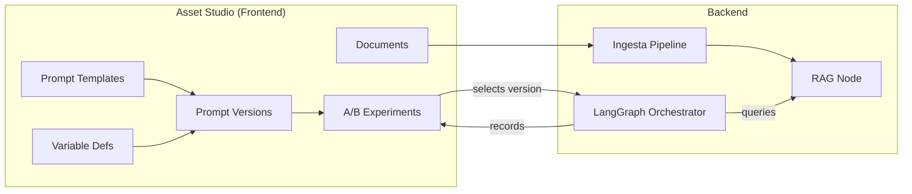

# RFC-015-Asset-Studio: Arquitectura del Módulo Asset Studio

| Campo | Valor |
|---|---|
| **Autor** | Builder (Arquitecto Staff) — Escuadrón Teseo |
| **Fecha** | 2026-04-20 |
| **Estado** | Draft |
| **Componente** | `crm-agentico-panel` → Route Group `(asset-studio)` |
| **Stack** | Next.js 14 (App Router), TypeScript 5, Tailwind CSS 3.4, Shadcn/UI, Supabase (Auth SSR + PostgreSQL + Storage), Zustand 5, TanStack Query 5 |
| **Dependencia** | RFC-015 (Tenant OS Frontend — arquitectura base) |

---

## 1. Resumen Ejecutivo

Este RFC profundiza la arquitectura del módulo **Asset Studio** — el segundo pilar del Tenant OS. Mientras RFC-015 lo definió a nivel de superficie (document-table, upload-dropzone, chunk-viewer, prompt-editor), este documento especifica la arquitectura completa para:

1. **Gestión versionada de Prompt Templates** con historial inmutable y diff entre versiones.
2. **A/B Testing de prompts** — split de tráfico entre variantes, recolección de métricas y selección de ganador.
3. **Panel de Variables** — definición, validación y preview de variables de interpolación por tenant.
4. **Iteración de Assets** — flujo completo de draft → test → promote → archive con governance multi-usuario.
5. **Dashboard de performance** — métricas por versión de prompt (response rate, conversion, sentiment).

El diseño respeta los principios **SOLID**, **DRY** y las convenciones establecidas en RFC-015 (Server Components por defecto, BFF thin-layer, RLS como fuente de verdad, Zustand para estado client-side).

---

## 2. Arquitectura de Datos

### 2.1 Modelo Entidad-Relación

```
┌──────────────────┐       ┌───────────────────────┐
│  prompt_templates │       │  prompt_versions      │
│──────────────────│1    N │───────────────────────│
│  id (PK)         │───────│  id (PK)              │
│  tenant_id (FK)  │       │  template_id (FK)     │
│  role             │       │  version_number       │
│  name             │       │  content (text)       │
│  description      │       │  variables (jsonb)    │
│  active_version_id│       │  changelog (text)     │
│  created_at       │       │  created_by (FK)      │
│  updated_at       │       │  created_at           │
│  archived_at      │       │  status (enum)        │
└──────────────────┘       └───────────────────────┘
                                     │ 1
                                     │
                                     │ N
                           ┌───────────────────────┐
                           │  ab_experiments        │
                           │───────────────────────│
                           │  id (PK)              │
                           │  tenant_id (FK)       │
                           │  template_id (FK)     │
                           │  name                 │
                           │  status (enum)        │
                           │  started_at           │
                           │  ended_at             │
                           │  winner_variant_id    │
                           │  created_by (FK)      │
                           └───────────────────────┘
                                     │ 1
                                     │
                                     │ N
                           ┌───────────────────────┐
                           │  ab_variants          │
                           │───────────────────────│
                           │  id (PK)              │
                           │  experiment_id (FK)   │
                           │  version_id (FK)      │
                           │  traffic_pct (int)    │
                           │  label (A/B/C...)     │
                           └───────────────────────┘
                                     │ 1
                                     │
                                     │ N
                           ┌───────────────────────┐
                           │  ab_impressions       │
                           │───────────────────────│
                           │  id (PK)              │
                           │  variant_id (FK)      │
                           │  thread_id (FK)       │
                           │  lead_id (FK)         │
                           │  outcome (enum)       │
                           │  sentiment_score      │
                           │  response_time_ms     │
                           │  created_at           │
                           └───────────────────────┘

┌──────────────────┐
│  variable_defs   │
│──────────────────│
│  id (PK)         │
│  tenant_id (FK)  │
│  key (text)      │  ← ej: "meeting_link", "pricing_tier"
│  label (text)    │
│  type (enum)     │  ← text | url | number | enum | json
│  default_value   │
│  enum_options    │  ← jsonb (nullable)
│  required (bool) │
│  description     │
│  created_at      │
└──────────────────┘
```

### 2.2 SQL — Migraciones

```sql
-- ═══════════════════════════════════════════════════════
-- Tabla: prompt_templates (cabecera inmutable de template)
-- ═══════════════════════════════════════════════════════
CREATE TABLE prompt_templates (
  id               UUID PRIMARY KEY DEFAULT gen_random_uuid(),
  tenant_id        UUID NOT NULL REFERENCES tenants(id),
  role             TEXT NOT NULL CHECK (role IN ('sdr','gatekeeper','hunter','l1_support')),
  name             TEXT NOT NULL,
  description      TEXT,
  active_version_id UUID,                          -- FK diferida (circular)
  created_at       TIMESTAMPTZ NOT NULL DEFAULT now(),
  updated_at       TIMESTAMPTZ NOT NULL DEFAULT now(),
  archived_at      TIMESTAMPTZ,
  UNIQUE (tenant_id, role, name)
);

-- ═══════════════════════════════════════════════════════
-- Tabla: prompt_versions (cada save = versión inmutable)
-- ═══════════════════════════════════════════════════════
CREATE TYPE prompt_version_status AS ENUM ('draft','active','testing','archived');

CREATE TABLE prompt_versions (
  id               UUID PRIMARY KEY DEFAULT gen_random_uuid(),
  template_id      UUID NOT NULL REFERENCES prompt_templates(id) ON DELETE CASCADE,
  version_number   INT  NOT NULL,
  content          TEXT NOT NULL,
  variables        JSONB NOT NULL DEFAULT '[]',     -- [{key, label, type, required, default}]
  changelog        TEXT,
  status           prompt_version_status NOT NULL DEFAULT 'draft',
  created_by       UUID NOT NULL,                   -- user_id del operador
  created_at       TIMESTAMPTZ NOT NULL DEFAULT now(),
  UNIQUE (template_id, version_number)
);

-- FK diferida para active_version_id
ALTER TABLE prompt_templates
  ADD CONSTRAINT fk_active_version
  FOREIGN KEY (active_version_id) REFERENCES prompt_versions(id)
  DEFERRABLE INITIALLY DEFERRED;

-- ═══════════════════════════════════════════════════════
-- Tabla: ab_experiments
-- ═══════════════════════════════════════════════════════
CREATE TYPE ab_experiment_status AS ENUM ('draft','running','paused','completed','cancelled');

CREATE TABLE ab_experiments (
  id               UUID PRIMARY KEY DEFAULT gen_random_uuid(),
  tenant_id        UUID NOT NULL REFERENCES tenants(id),
  template_id      UUID NOT NULL REFERENCES prompt_templates(id),
  name             TEXT NOT NULL,
  status           ab_experiment_status NOT NULL DEFAULT 'draft',
  min_impressions  INT NOT NULL DEFAULT 100,        -- mínimo para significancia
  confidence_level NUMERIC(3,2) NOT NULL DEFAULT 0.95,
  started_at       TIMESTAMPTZ,
  ended_at         TIMESTAMPTZ,
  winner_variant_id UUID,
  created_by       UUID NOT NULL,
  created_at       TIMESTAMPTZ NOT NULL DEFAULT now()
);

-- ═══════════════════════════════════════════════════════
-- Tabla: ab_variants (brazos del experimento)
-- ═══════════════════════════════════════════════════════
CREATE TABLE ab_variants (
  id               UUID PRIMARY KEY DEFAULT gen_random_uuid(),
  experiment_id    UUID NOT NULL REFERENCES ab_experiments(id) ON DELETE CASCADE,
  version_id       UUID NOT NULL REFERENCES prompt_versions(id),
  traffic_pct      INT NOT NULL CHECK (traffic_pct BETWEEN 0 AND 100),
  label            CHAR(1) NOT NULL,                -- 'A', 'B', 'C'
  UNIQUE (experiment_id, label)
);

-- Constraint: sum(traffic_pct) por experiment = 100
-- Implementado via trigger o check en app-layer

-- ═══════════════════════════════════════════════════════
-- Tabla: ab_impressions (registro por interacción)
-- ═══════════════════════════════════════════════════════
CREATE TYPE ab_outcome AS ENUM (
  'no_response','response','positive_response',
  'meeting_booked','deal_advanced','objection','unsubscribe'
);

CREATE TABLE ab_impressions (
  id               UUID PRIMARY KEY DEFAULT gen_random_uuid(),
  variant_id       UUID NOT NULL REFERENCES ab_variants(id),
  thread_id        UUID NOT NULL,
  lead_id          UUID NOT NULL,
  outcome          ab_outcome,
  sentiment_score  NUMERIC(4,3),                    -- -1.000 a 1.000
  response_time_ms INT,
  created_at       TIMESTAMPTZ NOT NULL DEFAULT now()
);

CREATE INDEX idx_impressions_variant ON ab_impressions(variant_id);
CREATE INDEX idx_impressions_created ON ab_impressions(created_at);

-- ═══════════════════════════════════════════════════════
-- Tabla: variable_defs (catálogo de variables por tenant)
-- ═══════════════════════════════════════════════════════
CREATE TYPE variable_type AS ENUM ('text','url','number','enum','json');

CREATE TABLE variable_defs (
  id               UUID PRIMARY KEY DEFAULT gen_random_uuid(),
  tenant_id        UUID NOT NULL REFERENCES tenants(id),
  key              TEXT NOT NULL,
  label            TEXT NOT NULL,
  type             variable_type NOT NULL DEFAULT 'text',
  default_value    TEXT,
  enum_options     JSONB,                            -- ["option_a","option_b"]
  required         BOOLEAN NOT NULL DEFAULT false,
  description      TEXT,
  created_at       TIMESTAMPTZ NOT NULL DEFAULT now(),
  UNIQUE (tenant_id, key)
);

-- ═══════════════════════════════════════════════════════
-- RLS — Todo filtrado por tenant_id via JWT
-- ═══════════════════════════════════════════════════════
ALTER TABLE prompt_templates   ENABLE ROW LEVEL SECURITY;
ALTER TABLE prompt_versions    ENABLE ROW LEVEL SECURITY;
ALTER TABLE ab_experiments     ENABLE ROW LEVEL SECURITY;
ALTER TABLE ab_variants        ENABLE ROW LEVEL SECURITY;
ALTER TABLE ab_impressions     ENABLE ROW LEVEL SECURITY;
ALTER TABLE variable_defs      ENABLE ROW LEVEL SECURITY;

-- Política ejemplo (replicar para cada tabla):
CREATE POLICY tenant_isolation ON prompt_templates
  FOR ALL USING (tenant_id = (auth.jwt() ->> 'tenant_id')::uuid);

CREATE POLICY tenant_isolation ON prompt_versions
  FOR ALL USING (
    template_id IN (
      SELECT id FROM prompt_templates
      WHERE tenant_id = (auth.jwt() ->> 'tenant_id')::uuid
    )
  );
-- (Análogo para ab_experiments, ab_variants, ab_impressions, variable_defs)
```

### 2.3 Contratos TypeScript

```typescript
// types/prompt.ts
// ═══════════════════════════════════════════════════════

export type AgentRole = 'sdr' | 'gatekeeper' | 'hunter' | 'l1_support';
export type VersionStatus = 'draft' | 'active' | 'testing' | 'archived';

export interface PromptTemplate {
  id: string;
  tenantId: string;
  role: AgentRole;
  name: string;
  description: string | null;
  activeVersionId: string | null;
  createdAt: string;
  updatedAt: string;
  archivedAt: string | null;
}

export interface PromptVersion {
  id: string;
  templateId: string;
  versionNumber: number;
  content: string;
  variables: VariableRef[];          // Variables usadas en esta versión
  changelog: string | null;
  status: VersionStatus;
  createdBy: string;
  createdAt: string;
}

export interface VariableRef {
  key: string;
  label: string;
  type: VariableType;
  required: boolean;
  defaultValue?: string;
}

// types/variable.ts
// ═══════════════════════════════════════════════════════

export type VariableType = 'text' | 'url' | 'number' | 'enum' | 'json';

export interface VariableDef {
  id: string;
  tenantId: string;
  key: string;
  label: string;
  type: VariableType;
  defaultValue: string | null;
  enumOptions: string[] | null;
  required: boolean;
  description: string | null;
  createdAt: string;
}

// types/experiment.ts
// ═══════════════════════════════════════════════════════

export type ExperimentStatus = 'draft' | 'running' | 'paused' | 'completed' | 'cancelled';
export type ABOutcome =
  | 'no_response' | 'response' | 'positive_response'
  | 'meeting_booked' | 'deal_advanced' | 'objection' | 'unsubscribe';

export interface ABExperiment {
  id: string;
  tenantId: string;
  templateId: string;
  name: string;
  status: ExperimentStatus;
  minImpressions: number;
  confidenceLevel: number;           // 0.90 – 0.99
  startedAt: string | null;
  endedAt: string | null;
  winnerVariantId: string | null;
  createdBy: string;
  createdAt: string;
}

export interface ABVariant {
  id: string;
  experimentId: string;
  versionId: string;
  trafficPct: number;
  label: string;                     // 'A' | 'B' | 'C'
  // Denormalizados para UI:
  versionNumber?: number;
  content?: string;
}

export interface ABImpression {
  id: string;
  variantId: string;
  threadId: string;
  leadId: string;
  outcome: ABOutcome | null;
  sentimentScore: number | null;
  responseTimeMs: number | null;
  createdAt: string;
}

// Aggregated stats (calculados en query, no persistidos)
export interface VariantStats {
  variantId: string;
  label: string;
  impressions: number;
  responseRate: number;              // 0-1
  positiveRate: number;
  meetingsBooked: number;
  avgSentiment: number;
  avgResponseTimeMs: number;
  conversionRate: number;            // meetings / impressions
}
```

---

## 3. Árbol de Rutas y Componentes

### 3.1 Estructura de Archivos

```
crm-agentico-panel/
├── app/
│   └── (asset-studio)/
│       ├── layout.tsx                      # Layout con tabs: Prompts | Documents | Variables
│       ├── page.tsx                        # Redirect → /prompts
│       │
│       ├── prompts/
│       │   ├── page.tsx                    # Galería de prompt templates (Server Component)
│       │   └── [templateId]/
│       │       ├── page.tsx               # Editor de prompt + historial de versiones
│       │       └── experiments/
│       │           ├── page.tsx           # Lista de A/B experiments de este template
│       │           └── [experimentId]/
│       │               └── page.tsx       # Dashboard de un experiment específico
│       │
│       ├── documents/
│       │   ├── page.tsx                    # Tabla de documentos ingestados
│       │   └── [docId]/
│       │       └── page.tsx               # Chunk viewer + metadata
│       │
│       └── variables/
│           └── page.tsx                    # CRUD de variable definitions por tenant
│
├── components/
│   └── asset-studio/
│       ├── prompt-gallery.tsx              # Grid de cards por template
│       ├── prompt-card.tsx                 # Card individual (role, name, version, status)
│       ├── prompt-editor.tsx               # Textarea con syntax highlighting de {{vars}}
│       ├── prompt-preview.tsx              # Preview con variables interpoladas
│       ├── prompt-diff-viewer.tsx          # Diff lado-a-lado entre versiones
│       ├── version-timeline.tsx            # Timeline vertical de versiones
│       ├── version-badge.tsx               # Badge de status (draft/active/testing/archived)
│       │
│       ├── variable-panel.tsx              # Panel lateral de variables detectadas
│       ├── variable-form.tsx               # Form para crear/editar una variable_def
│       ├── variable-tag.tsx                # Chip clickeable {{variable}} → insert
│       │
│       ├── experiment-setup-dialog.tsx     # Dialog para crear A/B experiment
│       ├── experiment-dashboard.tsx        # Métricas + chart por variante
│       ├── experiment-stats-card.tsx       # Card con KPIs de una variante
│       ├── traffic-split-slider.tsx        # Slider(s) para asignar % tráfico
│       ├── winner-badge.tsx                # Badge "Winner" / "Loser" / "Running"
│       │
│       ├── document-table.tsx              # TanStack Table de documentos
│       ├── upload-dropzone.tsx             # Drag-and-drop con progress
│       └── chunk-viewer.tsx                # Visualizador de chunks + embedding score
│
├── hooks/
│   ├── queries/
│   │   ├── use-prompt-templates.ts         # List templates (con filtros)
│   │   ├── use-prompt-versions.ts          # List versions de un template
│   │   ├── use-prompt-version-detail.ts    # Single version con content
│   │   ├── use-experiments.ts              # List experiments de un template
│   │   ├── use-experiment-stats.ts         # Stats aggregados de un experiment
│   │   ├── use-variable-defs.ts            # List variable_defs del tenant
│   │   ├── use-documents.ts                # List documents
│   │   └── use-document-chunks.ts          # Chunks de un documento
│   │
│   └── mutations/
│       ├── use-save-version.ts             # Crear nueva versión de prompt
│       ├── use-promote-version.ts          # Promover versión a active
│       ├── use-archive-version.ts          # Archivar versión
│       ├── use-create-experiment.ts        # Crear A/B experiment
│       ├── use-control-experiment.ts       # Start / Pause / End experiment
│       ├── use-declare-winner.ts           # Declarar ganador y promote
│       ├── use-save-variable.ts            # CRUD variable_def
│       └── use-upload-document.ts          # Upload a Supabase Storage
│
├── stores/
│   └── asset-studio-store.ts               # Zustand — estado UI del editor
│
├── lib/
│   └── query-keys.ts                       # (extensión del existente)
│
└── types/
    ├── prompt.ts
    ├── variable.ts
    └── experiment.ts
```

### 3.2 Extensión de Query Keys

```typescript
// lib/query-keys.ts — agregar al existente
export const queryKeys = {
  // ... threads, leads existentes ...

  prompts: {
    all:        ['prompts'] as const,
    detail:     (id: string) => ['prompts', id] as const,
    versions:   (id: string) => ['prompts', id, 'versions'] as const,
    version:    (templateId: string, versionId: string) =>
                  ['prompts', templateId, 'versions', versionId] as const,
  },
  experiments: {
    all:        ['experiments'] as const,
    byTemplate: (templateId: string) => ['experiments', 'template', templateId] as const,
    detail:     (id: string) => ['experiments', id] as const,
    stats:      (id: string) => ['experiments', id, 'stats'] as const,
  },
  variables: {
    all:        ['variables'] as const,
    detail:     (id: string) => ['variables', id] as const,
  },
  documents: {
    all:        ['documents'] as const,
    detail:     (id: string) => ['documents', id] as const,
    chunks:     (id: string) => ['documents', id, 'chunks'] as const,
  },
} as const;
```

---

## 4. Arquitectura de Componentes — Contratos Detallados

### 4.1 Prompt Editor (Core del módulo)

```
┌─────────────────────────────────────────────────────────────────┐
│  Prompt Editor — [templateId] page                              │
│                                                                 │
│  ┌──────────────────────────┐  ┌─────────────────────────────┐ │
│  │  version-timeline        │  │  prompt-editor (textarea)   │ │
│  │  ┌────────────────────┐  │  │                             │ │
│  │  │ v3 (active) ✅     │←─│──│  System prompt:             │ │
│  │  │ v2 (archived) 📦  │  │  │  You are {{agent_name}},    │ │
│  │  │ v1 (archived) 📦  │  │  │  a sales rep for            │ │
│  │  └────────────────────┘  │  │  {{company}}...             │ │
│  │                          │  │                             │ │
│  │  [+ New Version]         │  │  ┌───────────────────────┐ │ │
│  │  [Compare Versions]      │  │  │ variable-panel (side) │ │ │
│  └──────────────────────────┘  │  │ {{lead_name}} ✓       │ │ │
│                                │  │ {{company}} ✓         │ │ │
│                                │  │ {{meeting_link}} ⚠ new│ │ │
│                                │  └───────────────────────┘ │ │
│                                │                             │ │
│                                │  [Save Draft] [Promote] [🧪]│ │
│                                └─────────────────────────────┘ │
│                                                                 │
│  ┌─────────────────────────────────────────────────────────┐   │
│  │  prompt-preview (collapsed by default)                   │   │
│  │  Preview con variables reales interpoladas               │   │
│  └─────────────────────────────────────────────────────────┘   │
│                                                                 │
│  ┌─────────────────────────────────────────────────────────┐   │
│  │  prompt-diff-viewer (modal, on Compare)                  │   │
│  │  LEFT: v2                    RIGHT: v3                   │   │
│  │  - old text                  + new text                  │   │
│  └─────────────────────────────────────────────────────────┘   │
└─────────────────────────────────────────────────────────────────┘
```

#### Componente: `prompt-editor.tsx`

| Prop | Tipo | Descripción |
|---|---|---|
| `version` | `PromptVersion` | Versión actual siendo editada |
| `variables` | `VariableDef[]` | Catálogo de variables del tenant |
| `onSave` | `(content: string, changelog: string) => void` | Callback de save |
| `readOnly` | `boolean` | `true` para versiones no-draft |

**Responsabilidades (SRP):**
- Renderizar textarea con syntax highlighting de `{{variables}}`.
- Detectar variables usadas en el content (`/\{\{(\w+)\}\}/g`).
- Señalizar variables no definidas (new) vs definidas (existing).
- NO manejar persistencia — delega al hook `use-save-version`.

#### Componente: `variable-panel.tsx`

| Prop | Tipo | Descripción |
|---|---|---|
| `detectedVars` | `string[]` | Variables encontradas en el content actual |
| `definedVars` | `VariableDef[]` | Variables definidas en el catálogo del tenant |
| `onInsert` | `(key: string) => void` | Inserta `{{key}}` en cursor del editor |
| `onDefine` | `(key: string) => void` | Abre form para definir variable nueva |

**Estado derivado:**
- `matched`: variable detectada Y definida → ✅ verde
- `undefined`: variable detectada pero NO definida → ⚠️ amarillo (prompt para crear)
- `unused`: variable definida pero NO usada en el prompt actual → gris (informativo)

### 4.2 A/B Experiment Dashboard

```
┌─────────────────────────────────────────────────────────────────┐
│  Experiment: "SDR Opener — Formal vs Casual"    Status: Running │
│                                                                 │
│  ┌──────────────────────┐  ┌──────────────────────┐            │
│  │  Variant A (v3)      │  │  Variant B (v4)      │            │
│  │  Traffic: 50%        │  │  Traffic: 50%        │            │
│  │  ──────────────────  │  │  ──────────────────  │            │
│  │  Impressions: 847    │  │  Impressions: 839    │            │
│  │  Response Rate: 34%  │  │  Response Rate: 41%  │ ← winner  │
│  │  Meetings: 12        │  │  Meetings: 18        │            │
│  │  Avg Sentiment: 0.62 │  │  Avg Sentiment: 0.71 │            │
│  │  Avg Response: 4.2h  │  │  Avg Response: 3.1h  │            │
│  └──────────────────────┘  └──────────────────────┘            │
│                                                                 │
│  ┌─────────────────────────────────────────────────┐           │
│  │  Convergence Chart (line chart over time)        │           │
│  │  X: days | Y: response rate per variant          │           │
│  └─────────────────────────────────────────────────┘           │
│                                                                 │
│  [Pause] [Declare Winner →] [Cancel Experiment]                 │
└─────────────────────────────────────────────────────────────────┘
```

### 4.3 Zustand Store — Asset Studio UI

```typescript
// stores/asset-studio-store.ts

interface AssetStudioState {
  // Editor
  activeTemplateId: string | null;
  activeVersionId: string | null;
  editorContent: string;                // Dirty state del textarea
  isDirty: boolean;
  compareVersionIds: [string, string] | null; // Para diff viewer

  // Variables
  variablePanelOpen: boolean;

  // Actions
  setActiveTemplate: (id: string) => void;
  setActiveVersion: (id: string) => void;
  updateEditorContent: (content: string) => void;
  markClean: () => void;
  openCompare: (v1: string, v2: string) => void;
  closeCompare: () => void;
  toggleVariablePanel: () => void;
  reset: () => void;
}
```

**Principio (Single Responsibility):** Este store solo gestiona estado de UI local del editor. Los datos de negocio (templates, versions, experiments) viven en TanStack Query cache.

---

## 5. API Routes (BFF Thin-Layer)

Siguiendo la convención RFC-015: Route Handlers como proxies delgados, sin lógica de negocio.

### 5.1 Endpoints

```
app/api/
├── prompts/
│   ├── route.ts                    # GET: list templates | POST: create template
│   └── [templateId]/
│       ├── route.ts                # GET: template detail | PATCH: update metadata
│       ├── versions/
│       │   ├── route.ts            # GET: list versions | POST: create version
│       │   └── [versionId]/
│       │       ├── route.ts        # GET: version detail
│       │       └── promote/
│       │           └── route.ts    # POST: promote to active
│       └── experiments/
│           ├── route.ts            # GET: list experiments | POST: create experiment
│           └── [experimentId]/
│               ├── route.ts        # GET: experiment detail + stats
│               ├── start/route.ts  # POST: start experiment
│               ├── pause/route.ts  # POST: pause experiment
│               ├── end/route.ts    # POST: end + declare winner
│               └── cancel/route.ts # POST: cancel experiment
│
├── variables/
│   ├── route.ts                    # GET: list variable_defs | POST: create
│   └── [variableId]/
│       └── route.ts                # GET | PATCH | DELETE
│
└── documents/
    ├── route.ts                    # GET: list documents
    ├── upload/route.ts             # POST: upload to Supabase Storage
    └── [docId]/
        ├── route.ts                # GET: document detail | DELETE
        └── chunks/route.ts         # GET: list chunks
```

### 5.2 Ejemplo de Route Handler (SRP + DRY)

```typescript
// app/api/prompts/[templateId]/versions/route.ts

import { NextRequest, NextResponse } from 'next/server';
import { createClient } from '@/utils/supabase/server';
import { z } from 'zod';

const CreateVersionSchema = z.object({
  content:   z.string().min(1),
  changelog: z.string().optional(),
});

export async function GET(
  _req: NextRequest,
  { params }: { params: { templateId: string } }
) {
  const supabase = createClient();
  const { data, error } = await supabase
    .from('prompt_versions')
    .select('*')
    .eq('template_id', params.templateId)
    .order('version_number', { ascending: false });

  if (error) return NextResponse.json({ error: error.message }, { status: 500 });
  return NextResponse.json(data);
}

export async function POST(
  req: NextRequest,
  { params }: { params: { templateId: string } }
) {
  const supabase = createClient();
  const body = CreateVersionSchema.parse(await req.json());

  // Obtener siguiente version_number
  const { data: latest } = await supabase
    .from('prompt_versions')
    .select('version_number')
    .eq('template_id', params.templateId)
    .order('version_number', { ascending: false })
    .limit(1)
    .single();

  const nextVersion = (latest?.version_number ?? 0) + 1;

  // Extraer variables del content
  const variables = [...body.content.matchAll(/\{\{(\w+)\}\}/g)]
    .map(m => m[1])
    .filter((v, i, a) => a.indexOf(v) === i);

  const { data, error } = await supabase
    .from('prompt_versions')
    .insert({
      template_id:    params.templateId,
      version_number: nextVersion,
      content:        body.content,
      variables:      variables,
      changelog:      body.changelog ?? null,
      status:         'draft',
      created_by:     (await supabase.auth.getUser()).data.user?.id,
    })
    .select()
    .single();

  if (error) return NextResponse.json({ error: error.message }, { status: 500 });
  return NextResponse.json(data, { status: 201 });
}
```

---

## 6. Flujos de Estado

### 6.1 Ciclo de Vida de un Prompt Version

```
         ┌──────────────────────────────────┐
         │                                  │
         ▼                                  │
      ┌──────┐    save    ┌──────┐        │
      │ draft │──────────→│ draft │ (v+1)  │
      └──┬───┘            └──┬───┘        │
         │                   │              │
         │ promote           │ promote      │
         ▼                   ▼              │
      ┌──────┐          ┌──────┐           │
      │active│          │active│ ← current │
      └──┬───┘          └──┬───┘           │
         │                 │                │
         │ new active      │ start A/B      │
         │ replaces        │                │
         ▼                 ▼                │
      ┌────────┐      ┌───────┐            │
      │archived│      │testing│            │
      └────────┘      └───┬───┘            │
                          │ A/B ends        │
                          ├── winner → active ──────┘
                          └── loser  → archived
```

### 6.2 Ciclo de Vida de un A/B Experiment

```
      ┌─────┐   configure    ┌───────┐   start    ┌───────┐
      │draft│───────────────→│draft  │──────────→│running│
      └─────┘   (add vars,   └───────┘            └───┬───┘
                 set traffic)                          │
                                                  ┌────┴────┐
                                               pause     enough
                                                  │     impressions
                                               ┌──▼──┐     │
                                               │paused│    │
                                               └──┬──┘    │
                                              resume       │
                                                  │        │
                                                  └───┬────┘
                                                      │
                                                      ▼
                                                ┌──────────┐
                                                │completed  │
                                                │(winner    │
                                                │ declared) │
                                                └──────────┘
```

---

## 7. Principios de Diseño Aplicados

### 7.1 SOLID

| Principio | Aplicación |
|---|---|
| **S** — Single Responsibility | Cada componente tiene una sola razón para cambiar. `prompt-editor` solo renderiza; `use-save-version` solo persiste; `variable-panel` solo gestiona variables. El store solo gestiona UI state. |
| **O** — Open/Closed | Los roles de agente (`AgentRole`) son un union type extensible. Agregar `'closer'` no requiere tocar componentes existentes. La taxonomía de `ABOutcome` se extiende sin romper queries previas. |
| **L** — Liskov Substitution | Todos los componentes de "card" (`prompt-card`, `experiment-stats-card`) implementan la misma interfaz visual de `Card` de Shadcn. Se pueden componer en grids intercambiables. |
| **I** — Interface Segregation | Los hooks de query (`use-prompt-templates`, `use-prompt-versions`) son granulares. Una página que solo necesita templates no carga versions. Los types se separan en archivos por dominio (`prompt.ts`, `experiment.ts`, `variable.ts`). |
| **D** — Dependency Inversion | Los componentes dependen de tipos abstractos (`PromptVersion`), no de la forma del response de Supabase. La capa API (Route Handlers) transforma datos de DB al contrato TypeScript. |

### 7.2 DRY

| Patrón | Implementación |
|---|---|
| Variable extraction regex | Función utilitaria `extractVariables(content: string): string[]` en `lib/prompt-utils.ts` — usada en editor, API route, y preview. |
| Query key factory | Extensión del patrón `queryKeys` existente — un solo lugar para todas las cache keys. |
| Status badges | `version-badge.tsx` y `winner-badge.tsx` reutilizan el `Badge` de Shadcn con un `variantMap` centralizado. |
| Form validation | Schemas Zod compartidos entre Route Handler (server validation) y react-hook-form (client validation) via `lib/schemas/prompt.ts`. |

---

## 8. WBS — Desglose de Tareas

### Fase 1: Fundaciones (Sprint 1 — ~5 días)

| # | Tarea | Tipo | Dependencia | Estimación |
|---|---|---|---|---|
| 1.1 | Crear migración SQL: `prompt_templates`, `prompt_versions`, RLS policies | DB | — | 3h |
| 1.2 | Crear migración SQL: `variable_defs`, RLS | DB | — | 1h |
| 1.3 | Definir types TypeScript: `prompt.ts`, `variable.ts` | Types | — | 1h |
| 1.4 | Crear `lib/prompt-utils.ts` (extractVariables, interpolate, diff) | Lib | 1.3 | 2h |
| 1.5 | Crear `lib/schemas/prompt.ts` (Zod schemas compartidos) | Lib | 1.3 | 1h |
| 1.6 | Extender `lib/query-keys.ts` con keys de prompts, variables, documents | Lib | — | 30min |
| 1.7 | Layout `(asset-studio)/layout.tsx` con tabs de navegación (Prompts, Documents, Variables) | UI | — | 2h |
| 1.8 | Route Handlers CRUD: `api/prompts/` y `api/prompts/[id]/versions/` | API | 1.1, 1.5 | 4h |
| 1.9 | Route Handlers CRUD: `api/variables/` | API | 1.2, 1.5 | 2h |

### Fase 2: Editor de Prompts (Sprint 1-2 — ~6 días)

| # | Tarea | Tipo | Dependencia | Estimación |
|---|---|---|---|---|
| 2.1 | `prompt-gallery.tsx` + `prompt-card.tsx` — grid de templates | UI | 1.7, 1.8 | 3h |
| 2.2 | `use-prompt-templates` query hook | Hook | 1.6, 1.8 | 1h |
| 2.3 | `prompt-editor.tsx` — textarea con highlighting de `{{vars}}` | UI | 1.4 | 5h |
| 2.4 | `variable-panel.tsx` — panel lateral con estado matched/undefined/unused | UI | 1.4, 2.3 | 3h |
| 2.5 | `variable-tag.tsx` — chips clickeables para insertar variables | UI | 2.4 | 1h |
| 2.6 | `prompt-preview.tsx` — preview con variables interpoladas | UI | 1.4, 2.3 | 2h |
| 2.7 | `use-save-version` mutation hook | Hook | 1.8 | 2h |
| 2.8 | `version-timeline.tsx` — timeline vertical de versiones | UI | 2.2 | 3h |
| 2.9 | `version-badge.tsx` — badge de status reutilizable | UI | — | 30min |
| 2.10 | `use-promote-version` + `use-archive-version` mutation hooks | Hook | 1.8 | 2h |
| 2.11 | `prompt-diff-viewer.tsx` — diff lado-a-lado entre versiones | UI | 1.4 | 4h |
| 2.12 | `asset-studio-store.ts` — Zustand store para UI state del editor | Store | — | 2h |
| 2.13 | Page `/prompts/[templateId]/page.tsx` — composición del editor completo | Page | 2.3–2.12 | 3h |

### Fase 3: A/B Testing (Sprint 2-3 — ~6 días)

| # | Tarea | Tipo | Dependencia | Estimación |
|---|---|---|---|---|
| 3.1 | Crear migración SQL: `ab_experiments`, `ab_variants`, `ab_impressions`, RLS | DB | 1.1 | 3h |
| 3.2 | Definir types: `experiment.ts` | Types | — | 1h |
| 3.3 | Crear `lib/schemas/experiment.ts` (Zod schemas) | Lib | 3.2 | 1h |
| 3.4 | Route Handlers: `api/prompts/[id]/experiments/` (CRUD + control) | API | 3.1, 3.3 | 5h |
| 3.5 | Route Handler: `api/prompts/[id]/experiments/[eid]/` (stats aggregation query) | API | 3.4 | 3h |
| 3.6 | `experiment-setup-dialog.tsx` — dialog con selección de versiones + traffic split | UI | 3.3 | 4h |
| 3.7 | `traffic-split-slider.tsx` — slider dual/triple para asignar % | UI | — | 3h |
| 3.8 | `experiment-dashboard.tsx` — composición del dashboard de métricas | UI | 3.5 | 4h |
| 3.9 | `experiment-stats-card.tsx` — card con KPIs de una variante | UI | 3.2 | 2h |
| 3.10 | `winner-badge.tsx` — badge dinámico Winner/Loser/Running | UI | — | 1h |
| 3.11 | `use-experiments` + `use-experiment-stats` query hooks | Hook | 3.4, 3.5 | 2h |
| 3.12 | `use-create-experiment` + `use-control-experiment` + `use-declare-winner` mutation hooks | Hook | 3.4 | 3h |
| 3.13 | Page `/prompts/[templateId]/experiments/page.tsx` — lista de experiments | Page | 3.11 | 2h |
| 3.14 | Page `/prompts/[templateId]/experiments/[eid]/page.tsx` — dashboard | Page | 3.8 | 2h |

### Fase 4: Variables CRUD (Sprint 2 — ~3 días)

| # | Tarea | Tipo | Dependencia | Estimación |
|---|---|---|---|---|
| 4.1 | `variable-form.tsx` — form con type selector, enum builder, validation | UI | 1.5 | 3h |
| 4.2 | `use-variable-defs` query hook | Hook | 1.9 | 1h |
| 4.3 | `use-save-variable` mutation hook (create + update + delete) | Hook | 1.9 | 2h |
| 4.4 | Page `/variables/page.tsx` — tabla + inline CRUD | Page | 4.1–4.3 | 3h |

### Fase 5: Documents (Sprint 3 — ~4 días)

| # | Tarea | Tipo | Dependencia | Estimación |
|---|---|---|---|---|
| 5.1 | Route Handlers: `api/documents/` (list, upload, detail, chunks) | API | — | 4h |
| 5.2 | `document-table.tsx` — TanStack Table con sorting/filtering | UI | 5.1 | 3h |
| 5.3 | `upload-dropzone.tsx` — drag-and-drop con progress bar | UI | 5.1 | 4h |
| 5.4 | `chunk-viewer.tsx` — visualizador de chunks con embedding score | UI | 5.1 | 3h |
| 5.5 | `use-documents`, `use-document-chunks`, `use-upload-document` hooks | Hook | 5.1 | 3h |
| 5.6 | Pages: `/documents/page.tsx`, `/documents/[docId]/page.tsx` | Page | 5.2–5.5 | 3h |

### Fase 6: Integración y Polish (Sprint 3-4 — ~3 días)

| # | Tarea | Tipo | Dependencia | Estimación |
|---|---|---|---|---|
| 6.1 | Wiring: LangGraph selecciona prompt version basado en ab_experiment activo | Backend | 3.1, Orchestrator | 4h |
| 6.2 | Wiring: Impressions se registran desde el orchestrator al cerrar thread | Backend | 3.1, Orchestrator | 3h |
| 6.3 | E2E test: crear template → save versions → start A/B → declare winner | Test | All | 4h |
| 6.4 | Loading skeletons y empty states para todas las páginas | UI | All | 3h |
| 6.5 | Sidebar link "Asset Studio" en `app-sidebar.tsx` | UI | 1.7 | 30min |

---

## 9. Dependencias entre Módulos



---

## 10. Riesgos y Mitigaciones

| Riesgo | Impacto | Mitigación |
|---|---|---|
| **Significancia estadística prematura** — operador declara ganador antes de tener suficientes datos | Alto — decisión incorrecta | `min_impressions` obligatorio en experiment setup; UI muestra confidence interval y warning si n < umbral |
| **Variables huérfanas** — prompt usa `{{var}}` que no existe en `variable_defs` | Medio — prompt falla en runtime | `variable-panel` detecta y señaliza en tiempo real; API valida al promote (no al draft) |
| **Race condition en version_number** — dos operadores crean versión simultánea | Bajo — constraint UNIQUE previene duplicado | Retry con re-fetch del último `version_number` en caso de conflict (409) |
| **Traffic split inconsistente** — sum ≠ 100% | Medio — sesgo en experimento | Validación en `traffic-split-slider` (UI) + check constraint en API antes de start |
| **Bundle bloat** — Monaco editor para syntax highlighting | Medio — performance | Usar textarea + regex highlighting custom (no Monaco). Evaluar `@uiw/react-textarea-code-editor` como alternativa ligera |

---

## 11. Decisiones Abiertas

| # | Decisión | Opciones | Recomendación |
|---|---|---|---|
| D1 | Editor de prompt: Monaco vs textarea custom | Monaco (rico, pesado) vs textarea + regex (ligero) | **Textarea + regex** — el highlighting solo necesita detectar `{{vars}}`, no syntax de lenguaje completo |
| D2 | Chart library para convergence chart en A/B | Recharts, Nivo, Tremor | **Recharts** — ya es dependencia común en Shadcn ecosistema, bundle razonable |
| D3 | Diff algorithm | `diff-match-patch` (Google) vs `jsdiff` | **jsdiff** — más ligero, API más simple para diff de texto |
| D4 | Scheduling de A/B variant selection | Frontend random vs backend weighted | **Backend** — el Orchestrator (LangGraph) selecciona variant basado en `traffic_pct` al inicio de cada thread. Determinístico por `lead_id` hash para consistency. |

---

## 12. Apéndice: Dependencias Nuevas a Instalar

```bash
# Dentro de crm-agentico-panel/
npm install recharts jsdiff
npm install -D @types/jsdiff
```

No se requieren otras dependencias nuevas. Todo lo demás ya está en `package.json` (TanStack Query, Zustand, Zod, Shadcn, dnd-kit, Supabase SSR).

---

*Builder (Arquitecto Staff) — Escuadrón Teseo | RFC-015-Asset-Studio v1.0 | 2026-04-20*
