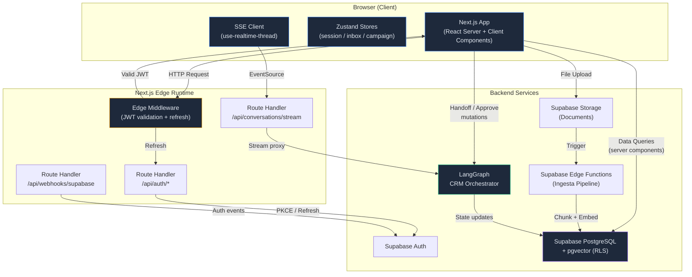

# RFC-015: Arquitectura Frontend — Tenant OS (`crm-agentico-panel`)

| Campo | Valor |
|---|---|
| **Autor** | Builder (Planificador) — Escuadrón Teseo |
| **Fecha** | 2026-04-19 |
| **Estado** | Draft |
| **Componente** | `crm-agentico-panel` |
| **Stack** | Next.js 14 (App Router), TypeScript 5.x, Tailwind CSS 3.4, Shadcn/UI |
| **Backend** | Supabase Auth (SSR), LangGraph CRM Orchestrator, PostgreSQL + pgvector |

---

## 1. Resumen Ejecutivo

Este documento define la arquitectura frontend del **Tenant OS** — el panel de operaciones para tenants del Teseo-AI-CRM. El sistema expone tres módulos core que cubren el ciclo completo de ventas B2B asistidas por agentes autónomos: supervisión omnicanal, gestión de activos de conocimiento, y auditoría humana de campañas outbound.

La arquitectura prioriza:
- **Aislamiento de módulos** vía Route Groups de Next.js App Router.
- **Seguridad SSR-first** con JWT de Supabase validado en Edge Middleware antes de cualquier render.
- **Streaming reactivo** para la bandeja omnicanal (Server-Sent Events desde LangGraph).
- **Zero client-side secrets** — toda autenticación y refresh ocurre server-side.

---

## 2. Árbol de Directorios

```
crm-agentico-panel/
├── public/
│   └── icons/
├── src/
│   ├── app/
│   │   ├── layout.tsx                    # Root layout (ThemeProvider, Toaster, fonts)
│   │   ├── loading.tsx                   # Global loading skeleton
│   │   ├── not-found.tsx
│   │   ├── error.tsx                     # Global error boundary
│   │   │
│   │   ├── (auth)/                       # Route Group — Auth (sin sidebar)
│   │   │   ├── layout.tsx                # Layout centrado, sin nav
│   │   │   ├── login/page.tsx
│   │   │   ├── callback/route.ts         # GET /callback — Supabase PKCE exchange
│   │   │   └── logout/route.ts           # POST /logout — revoke + clear cookies
│   │   │
│   │   ├── (dashboard)/                  # Route Group — App Shell (con sidebar)
│   │   │   ├── layout.tsx                # Sidebar + TopBar + BreadcrumbProvider
│   │   │   ├── page.tsx                  # /  → redirect a /command-center
│   │   │   │
│   │   │   ├── (command-center)/         # Módulo 1 — Supervisión Omnicanal
│   │   │   │   ├── layout.tsx            # Split-pane layout (inbox + detail)
│   │   │   │   ├── page.tsx              # /command-center → Bandeja Inbox
│   │   │   │   ├── inbox/
│   │   │   │   │   └── page.tsx          # Lista de conversaciones omnicanal
│   │   │   │   ├── conversation/
│   │   │   │   │   └── [threadId]/
│   │   │   │   │       └── page.tsx      # Detalle de hilo + handoff controls
│   │   │   │   ├── kanban/
│   │   │   │   │   └── page.tsx          # Kanban visual de leads
│   │   │   │   └── @detail/             # Parallel Route — panel derecho
│   │   │   │       ├── default.tsx
│   │   │   │       └── (..)conversation/
│   │   │   │           └── [threadId]/
│   │   │   │               └── page.tsx  # Intercepting Route → modal/slide-over
│   │   │   │
│   │   │   ├── (asset-studio)/           # Módulo 2 — Knowledge Base & Prompts
│   │   │   │   ├── layout.tsx
│   │   │   │   ├── page.tsx              # /asset-studio → Dashboard de activos
│   │   │   │   ├── documents/
│   │   │   │   │   ├── page.tsx          # Listado de documentos ingestados
│   │   │   │   │   └── [docId]/
│   │   │   │   │       └── page.tsx      # Detalle: chunks, embeddings, status
│   │   │   │   ├── upload/
│   │   │   │   │   └── page.tsx          # Drag-and-drop ingesta documental
│   │   │   │   └── prompts/
│   │   │   │       ├── page.tsx          # Galería de Prompt templates
│   │   │   │       └── [promptId]/
│   │   │   │           └── page.tsx      # Editor de prompt (SDR/Gatekeeper/Hunter)
│   │   │   │
│   │   │   └── (campaign-review)/        # Módulo 3 — HITL Audit Console
│   │   │       ├── layout.tsx
│   │   │       ├── page.tsx              # /campaign-review → Lista de campañas
│   │   │       ├── [campaignId]/
│   │   │       │   ├── page.tsx          # Timeline de secuencia del agente
│   │   │       │   └── approve/
│   │   │       │       └── page.tsx      # UI de aprobación paso-a-paso
│   │   │       └── audit-log/
│   │   │           └── page.tsx          # Log inmutable de decisiones HITL
│   │   │
│   │   └── api/                          # Route Handlers (BFF thin layer)
│   │       ├── auth/
│   │       │   └── refresh/route.ts      # Token refresh silencioso
│   │       ├── conversations/
│   │       │   └── stream/route.ts       # SSE proxy → LangGraph event stream
│   │       └── webhooks/
│   │           └── supabase/route.ts     # Webhook receptor (auth events)
│   │
│   ├── components/
│   │   ├── ui/                           # Shadcn/UI primitives (auto-generated)
│   │   ├── command-center/
│   │   │   ├── inbox-list.tsx
│   │   │   ├── conversation-thread.tsx
│   │   │   ├── handoff-controls.tsx
│   │   │   ├── kanban-board.tsx
│   │   │   └── kanban-card.tsx
│   │   ├── asset-studio/
│   │   │   ├── document-table.tsx
│   │   │   ├── upload-dropzone.tsx
│   │   │   ├── chunk-viewer.tsx
│   │   │   └── prompt-editor.tsx
│   │   ├── campaign-review/
│   │   │   ├── campaign-table.tsx
│   │   │   ├── sequence-timeline.tsx
│   │   │   ├── approval-card.tsx
│   │   │   └── audit-log-table.tsx
│   │   └── shared/
│   │       ├── sidebar.tsx
│   │       ├── topbar.tsx
│   │       ├── breadcrumb-nav.tsx
│   │       ├── data-table.tsx            # Generic TanStack Table wrapper
│   │       ├── empty-state.tsx
│   │       └── loading-skeleton.tsx
│   │
│   ├── lib/
│   │   ├── supabase/
│   │   │   ├── client.ts                 # createBrowserClient (Supabase SSR)
│   │   │   ├── server.ts                 # createServerClient (cookies())
│   │   │   ├── middleware.ts             # updateSession() para Edge Middleware
│   │   │   └── types.ts                  # Database types (supabase gen types)
│   │   ├── langgraph/
│   │   │   ├── client.ts                 # HTTP client → LangGraph API
│   │   │   ├── events.ts                 # SSE parser y tipos de eventos
│   │   │   └── types.ts                  # AgentState, ThreadState, RunStatus
│   │   ├── hooks/
│   │   │   ├── use-realtime-thread.ts    # SSE hook para conversación en vivo
│   │   │   ├── use-session.ts            # Client-side session accessor
│   │   │   └── use-kanban-state.ts       # Optimistic Kanban mutations
│   │   └── utils/
│   │       ├── cn.ts                     # clsx + twMerge
│   │       └── format.ts                 # Date/number formatters
│   │
│   ├── stores/
│   │   ├── session-store.ts              # Zustand — sesión activa y permisos
│   │   ├── inbox-store.ts                # Zustand — estado de bandeja omnicanal
│   │   └── campaign-store.ts             # Zustand — filtros y selección de campañas
│   │
│   ├── types/
│   │   ├── lead.ts
│   │   ├── conversation.ts
│   │   ├── document.ts
│   │   ├── prompt-template.ts
│   │   ├── campaign.ts
│   │   └── agent-action.ts
│   │
│   └── middleware.ts                     # Edge Middleware (entry point)
│
├── tailwind.config.ts
├── next.config.mjs
├── tsconfig.json
├── .env.local.example
└── package.json
```

### 2.1 Estrategia de Enrutamiento

| Patrón | Uso en Tenant OS |
|---|---|
| **Route Groups** `(name)/` | Aislamiento de layouts: `(auth)` sin sidebar, `(dashboard)` con sidebar. Dentro del dashboard, cada módulo es un Route Group para layouts independientes sin contaminar la URL. |
| **Parallel Routes** `@slot/` | `@detail` en Command Center permite renderizar el panel de detalle de conversación en paralelo con la lista de inbox, habilitando split-pane nativo sin estado client-side. |
| **Intercepting Routes** `(..)` | Click en una conversación desde inbox intercepta la ruta y abre un slide-over sin navegación completa. Hard-refresh carga la página completa de conversación. |
| **Dynamic Segments** `[id]/` | `[threadId]`, `[docId]`, `[promptId]`, `[campaignId]` — resolución dinámica estándar. |
| **Route Handlers** `route.ts` | BFF thin-layer: proxy de SSE, token refresh, webhooks. Sin lógica de negocio — delega al backend. |

---

## 3. Contratos de Módulos Core

### 3.1 Command Center — Supervisión Omnicanal

**Propósito:** Vista unificada de todas las conversaciones activas entre agentes autónomos y leads humanos. Permite al operador tomar control (handoff) cuando el agente lo escala o cuando el humano lo requiere.

#### Componentes Clave

| Componente | Responsabilidad | Fuente de Datos |
|---|---|---|
| `inbox-list` | Lista paginada y filtrable de threads activos. Indicador de canal (WhatsApp, Email, LinkedIn, Web Chat). Badge de estado: `agent_active`, `pending_handoff`, `human_active`, `resolved`. | `GET /api/conversations?status=active` → Supabase `conversations` table |
| `conversation-thread` | Renderiza mensajes del hilo con diferenciación visual agent/human/lead. Soporta streaming en tiempo real vía SSE. | SSE `/api/conversations/stream?threadId={id}` → LangGraph event stream |
| `handoff-controls` | Panel de acciones del operador: `Take Over`, `Return to Agent`, `Resolve`, `Escalate`. Cada acción muta el estado del thread en LangGraph. | `POST /api/conversations/{threadId}/handoff` → LangGraph `update_state` |
| `kanban-board` | Tablero visual (columnas: `New` → `Contacted` → `Qualified` → `Proposal` → `Negotiation` → `Closed`). Drag-and-drop con mutaciones optimistas. | `GET /api/leads?view=kanban` → Supabase `leads` table |
| `kanban-card` | Card de lead con avatar, empresa, monto estimado, último contacto, agente asignado. | Inline desde kanban query |

#### Flujo de Datos SSE (Conversación en Vivo)

```
Browser → GET /api/conversations/stream?threadId=X
         (Edge: valida JWT, extrae tenant_id)
                ↓
       Route Handler → LangGraph API /threads/X/stream
                ↓
       TransformStream → parsea eventos, filtra por tenant
                ↓
       Client hook (use-realtime-thread) → actualiza UI reactivamente
```

#### Contrato de Estado del Thread

```typescript
interface ThreadState {
  threadId: string;
  channel: 'whatsapp' | 'email' | 'linkedin' | 'webchat';
  status: 'agent_active' | 'pending_handoff' | 'human_active' | 'resolved';
  leadId: string;
  assignedAgent: 'sdr' | 'gatekeeper' | 'hunter';
  assignedHuman: string | null;        // user_id del operador
  lastMessageAt: string;               // ISO 8601
  unreadCount: number;
  metadata: Record<string, unknown>;
}
```

---

### 3.2 Asset Studio — Knowledge Base & Prompt Management

**Propósito:** Interfaz para que el tenant alimente el RAG del agente con documentos propios (propuestas, catálogos, FAQs) y configure los prompts base que definen la personalidad y estrategia de cada rol de agente.

#### Componentes Clave

| Componente | Responsabilidad | Fuente de Datos |
|---|---|---|
| `document-table` | Listado paginado de documentos ingestados con columnas: nombre, tipo, chunks generados, estado de embedding, fecha de ingesta. Server-side sorting y filtering via TanStack Table. | `GET /api/documents?page={n}` → Supabase `documents` table |
| `upload-dropzone` | Zona de drag-and-drop. Acepta PDF, DOCX, TXT, CSV, MD. Límite: 50MB por archivo, 20 archivos por batch. Muestra progreso con upload a Supabase Storage, seguido de trigger de ingesta. | `POST /api/documents/upload` → Supabase Storage → Edge Function trigger |
| `chunk-viewer` | Visualización de los chunks generados de un documento: texto, embedding score, metadata. Permite eliminar chunks individuales ruidosos. | `GET /api/documents/{docId}/chunks` → Supabase `document_chunks` + pgvector |
| `prompt-editor` | Editor de texto enriquecido (Monaco o Textarea con preview) para templates de prompt. Variables interpolables con sintaxis `{{variable}}`. Validación client-side de variables requeridas. Versionado implícito (cada save = nueva versión). | `GET/PUT /api/prompts/{promptId}` → Supabase `prompt_templates` table |

#### Roles de Prompt (Taxonomía Fija)

| Rol | Descripción | Variables Requeridas |
|---|---|---|
| **SDR** (Sales Development Rep) | Primer contacto, calificación inicial, booking de reuniones. | `{{lead_name}}`, `{{company}}`, `{{pain_point}}`, `{{meeting_link}}` |
| **Gatekeeper** | Manejo de objeciones, filtrado de leads no calificados, redirección. | `{{lead_name}}`, `{{objection_type}}`, `{{qualification_criteria}}` |
| **Hunter** | Cierre de deals, negociación, propuestas de valor personalizadas. | `{{lead_name}}`, `{{company}}`, `{{proposal_summary}}`, `{{pricing_tier}}` |

#### Contrato de Documento

```typescript
interface Document {
  id: string;
  tenantId: string;
  name: string;
  mimeType: string;
  storagePath: string;              // Ruta en Supabase Storage
  status: 'uploading' | 'processing' | 'indexed' | 'failed';
  chunkCount: number;
  embeddingModel: string;           // ej. "text-embedding-3-small"
  createdAt: string;
  updatedAt: string;
}

interface PromptTemplate {
  id: string;
  tenantId: string;
  role: 'sdr' | 'gatekeeper' | 'hunter';
  version: number;
  content: string;                  // Template con {{variables}}
  variables: string[];              // Extraídas automáticamente
  isActive: boolean;                // Solo 1 activo por rol por tenant
  createdAt: string;
  createdBy: string;                // user_id
}
```

---

### 3.3 Campaign Review — Consola HITL

**Propósito:** El humano audita y autoriza las secuencias de outbound generadas por el agente antes de su ejecución. Garantiza compliance, brand safety, y control sobre comunicaciones masivas.

#### Componentes Clave

| Componente | Responsabilidad | Fuente de Datos |
|---|---|---|
| `campaign-table` | Listado de campañas con filtros: estado (`draft`, `pending_review`, `approved`, `executing`, `paused`, `completed`), fecha, agente creador. | `GET /api/campaigns?status={s}` → Supabase `campaigns` table |
| `sequence-timeline` | Visualización vertical tipo timeline de los pasos de la secuencia (Day 1: Email → Day 3: LinkedIn → Day 5: Follow-up). Cada paso muestra el contenido generado por el agente. | `GET /api/campaigns/{id}/sequence` → Supabase `campaign_steps` table |
| `approval-card` | Card por cada paso de la secuencia. Muestra: contenido propuesto, canal, timing. Acciones: `Approve`, `Edit & Approve`, `Reject with Note`. Aprobación granular paso a paso. | `POST /api/campaigns/{id}/steps/{stepId}/review` |
| `audit-log-table` | Registro inmutable de todas las decisiones HITL: quién aprobó/rechazó qué, cuándo, con qué nota. Exportable a CSV. No editable ni eliminable. | `GET /api/campaigns/{id}/audit-log` → Supabase `audit_log` table (append-only) |

#### Flujo de Aprobación

```
Agente genera campaña → status: "draft"
         ↓
Agente solicita revisión → status: "pending_review"
         ↓
Humano revisa cada paso en sequence-timeline:
   ├─ Approve         → step.status = "approved"
   ├─ Edit & Approve  → step.content = edited, step.status = "approved"
   └─ Reject          → step.status = "rejected", step.note = "..."
         ↓
Todos los pasos approved → campaign.status = "approved" → Agente ejecuta
Algún paso rejected → campaign.status = "needs_revision" → Agente regenera
```

#### Contrato de Campaña

```typescript
interface Campaign {
  id: string;
  tenantId: string;
  name: string;
  status: 'draft' | 'pending_review' | 'approved' | 'executing' | 'paused' | 'completed' | 'needs_revision';
  createdByAgent: 'sdr' | 'hunter';
  targetLeadCount: number;
  steps: CampaignStep[];
  createdAt: string;
  reviewedBy: string | null;
  reviewedAt: string | null;
}

interface CampaignStep {
  id: string;
  campaignId: string;
  order: number;
  channel: 'email' | 'linkedin' | 'whatsapp';
  delayDays: number;                // Días desde el paso anterior
  content: string;                  // Contenido generado por agente
  status: 'pending' | 'approved' | 'rejected' | 'edited';
  reviewNote: string | null;
  reviewedBy: string | null;
  reviewedAt: string | null;
}

interface AuditEntry {
  id: string;
  campaignId: string;
  stepId: string | null;
  action: 'approve' | 'reject' | 'edit' | 'pause' | 'resume';
  userId: string;
  note: string | null;
  snapshot: Record<string, unknown>; // Estado al momento de la acción
  createdAt: string;                 // Inmutable
}
```

---

## 4. Contratos de Estado e Identidad

### 4.1 Autenticación — Supabase SSR Flow

La autenticación usa exclusivamente el flujo **SSR con PKCE** de `@supabase/ssr`. No hay tokens expuestos al cliente en localStorage.

#### Flujo de Login

```
1. Usuario → /login → Click "Sign In"
2. Client redirect → Supabase Auth /authorize (PKCE)
3. Supabase → redirect a /callback?code=XXX
4. /callback (Route Handler):
   a. Intercambia code por session (access_token + refresh_token)
   b. Setea cookies HttpOnly, Secure, SameSite=Lax
   c. Redirect → /command-center
5. Toda request subsecuente:
   a. Edge Middleware lee cookies
   b. Llama supabase.auth.getUser() (valida JWT server-side)
   c. Si expirado → refresh silencioso via /api/auth/refresh
   d. Si inválido → redirect a /login
```

#### Cookies

| Cookie | Contenido | Flags |
|---|---|---|
| `sb-access-token` | JWT de acceso (corta vida: 1h) | `HttpOnly`, `Secure`, `SameSite=Lax`, `Path=/` |
| `sb-refresh-token` | Token de refresh (larga vida: 7d) | `HttpOnly`, `Secure`, `SameSite=Lax`, `Path=/` |

### 4.2 Edge Middleware — Protección de Rutas

```
middleware.ts (entry point)
│
├─ Ruta pública? (/login, /callback, /api/webhooks/*) → PASS
├─ Tiene cookies de sesión?
│   ├─ NO → redirect /login
│   └─ SÍ → supabase.auth.getUser()
│       ├─ Válido → inyecta x-tenant-id header, NEXT()
│       ├─ Expirado → intenta refresh
│       │   ├─ Refresh OK → actualiza cookies, NEXT()
│       │   └─ Refresh FAIL → clear cookies, redirect /login
│       └─ Inválido → clear cookies, redirect /login
```

**Matcher config:**
```
export const config = {
  matcher: ['/((?!_next/static|_next/image|favicon.ico|public/).*)']
}
```

### 4.3 Estado Global en el Cliente

Se usa **Zustand** con slices aislados por dominio. Sin Redux. Sin Context API para estado complejo.

| Store | Contenido | Persistencia |
|---|---|---|
| `session-store` | `user`, `tenantId`, `role`, `permissions[]` | No — se hidrata desde Server Component en cada page load |
| `inbox-store` | `threads[]`, `activeThreadId`, `filters`, `unreadCounts` | No — SSE mantiene sincronización en vivo |
| `campaign-store` | `selectedCampaignId`, `filters`, `sortOrder` | `sessionStorage` — sobrevive refresh, no tabs |

#### Hidratación de Sesión

El `(dashboard)/layout.tsx` (Server Component) lee la sesión de Supabase server-side y la pasa como prop al `<SessionHydrator>` client component, que llama `sessionStore.setState()` una vez. Esto evita waterfalls de fetch en el cliente.

```
(dashboard)/layout.tsx [Server]
  → supabase.auth.getUser()
  → supabase.from('tenant_members').select('role, permissions')
  → <SessionHydrator user={user} tenant={tenant} permissions={perms}>
       {children}
     </SessionHydrator>
```

### 4.4 Row-Level Security (RLS) — Complemento Frontend

El frontend **nunca** confía en sí mismo para filtrar datos por tenant. Todo query a Supabase pasa por RLS en PostgreSQL que filtra por `auth.jwt() ->> 'tenant_id'`. El header `x-tenant-id` inyectado por middleware es solo para conveniencia en Route Handlers; la fuente de verdad es el JWT.

---

## 5. Topología de Arquitectura Frontend



---

## 6. Decisiones Arquitectónicas Clave

### 6.1 Server Components por Defecto

Todas las páginas son Server Components a menos que requieran interactividad. Esto minimiza el bundle JS enviado al cliente y permite queries directos a Supabase sin API intermediaria.

**Client Components explícitos:**
- `kanban-board` (drag-and-drop)
- `conversation-thread` (SSE streaming)
- `prompt-editor` (edición interactiva)
- `approval-card` (acciones de mutación)
- Todos los stores Zustand consumers

### 6.2 BFF Thin-Layer (No Fat API)

Los Route Handlers (`/api/*`) son **proxies delgados**, no microservicios. Su única función:
1. Validar JWT (ya hecho por middleware).
2. Transformar/proxy requests hacia Supabase o LangGraph.
3. Manejar SSE streaming.

La lógica de negocio vive en LangGraph (orquestación de agentes) y en Supabase Edge Functions (ingesta documental).

### 6.3 Optimistic Updates en Kanban

El drag-and-drop del Kanban usa mutaciones optimistas:
1. UI mueve la card inmediatamente.
2. `use-kanban-state` dispara `PATCH /api/leads/{id}` en background.
3. Si falla → rollback automático con toast de error.

### 6.4 Sin WebSockets — SSE como Canal Reactivo

Se usa Server-Sent Events en lugar de WebSockets porque:
- LangGraph expone nativamente streams SSE.
- El Edge Runtime de Vercel/Node soporta SSE sin infraestructura adicional.
- Unidireccional (server→client) es suficiente; las mutaciones van por HTTP POST.

---

## 7. Dependencias Principales

| Paquete | Versión Target | Propósito |
|---|---|---|
| `next` | `14.2.x` | Framework (App Router) |
| `react` / `react-dom` | `18.3.x` | Runtime UI |
| `@supabase/ssr` | `0.5.x` | Auth SSR (cookies, middleware) |
| `@supabase/supabase-js` | `2.45.x` | Client SDK |
| `zustand` | `4.5.x` | Estado global client-side |
| `@tanstack/react-table` | `8.x` | Tablas con sorting/filtering/pagination |
| `@dnd-kit/core` | `6.x` | Drag-and-drop para Kanban |
| `tailwindcss` | `3.4.x` | Utility-first CSS |
| `shadcn/ui` | latest | Componentes UI (Button, Dialog, Sheet, Table, etc.) |
| `zod` | `3.x` | Validación de schemas (forms, API responses) |
| `react-hook-form` | `7.x` | Forms (prompt editor, filtros) |
| `lucide-react` | latest | Iconografía |

---

## 8. Variables de Entorno

```env
# Supabase
NEXT_PUBLIC_SUPABASE_URL=https://xxx.supabase.co
NEXT_PUBLIC_SUPABASE_ANON_KEY=eyJ...
SUPABASE_SERVICE_ROLE_KEY=eyJ...        # Solo server-side (Route Handlers)

# LangGraph
LANGGRAPH_API_URL=http://localhost:8123  # o Cloud URL
LANGGRAPH_API_KEY=lsv2_...              # Solo server-side

# App
NEXT_PUBLIC_APP_URL=https://app.tenant.teseo.lat
```

---

## 9. Siguientes Pasos

1. **Ejecutor:** Scaffold del proyecto con `create-next-app` + configuración de Shadcn/UI y Supabase SSR.
2. **Ejecutor:** Implementar Edge Middleware y flujo completo de auth (`(auth)` route group).
3. **Ejecutor:** Módulo `(command-center)` — empezar por inbox-list + SSE streaming.
4. **Tester:** Validar flujo de auth end-to-end y protección de rutas.
5. **Reviewer:** Auditar que no haya client-side token exposure ni bypasses de RLS.

---

*Builder — Escuadrón Teseo | RFC-015 v1.0 | 2026-04-19*
