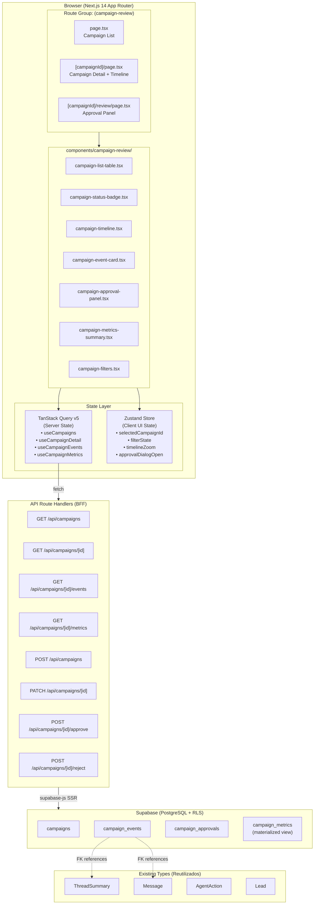
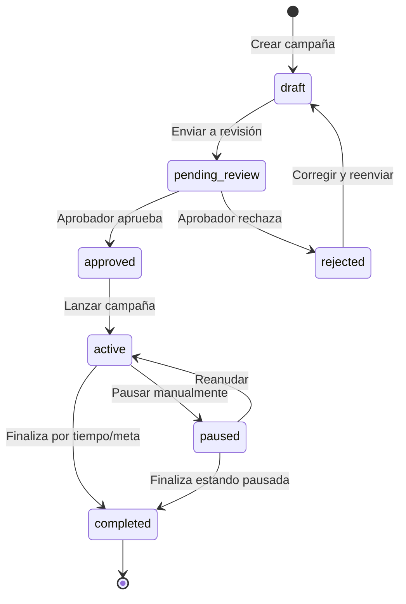
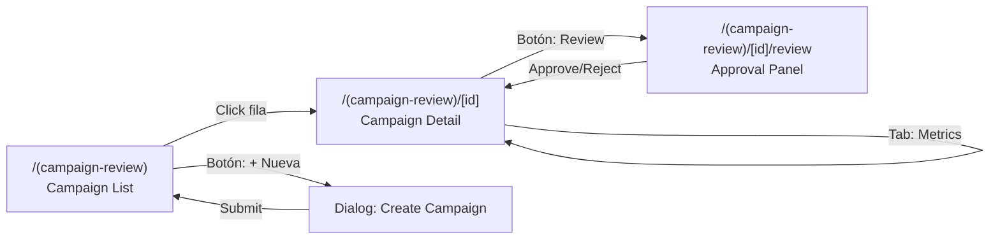

# RFC-018: Campaign Review — Fase 1 (Auditoría de Campañas y Flujo de Aprobación)

| Campo | Valor |
|---|---|
| **Autor** | Builder (Arquitecto Staff) — Escuadrón Teseo |
| **Fecha** | 2026-04-20 |
| **Estado** | 📐 DISEÑO |
| **Componente** | `crm-agentico-panel` → Route Group `(campaign-review)` |
| **Dependencias** | ADR-001 (CRM Agéntico), RFC-011 (Supabase Master DB), ADR-112 (Command Center SSE) |
| **Stack** | Next.js 14 App Router, TypeScript 5, Shadcn/UI, TanStack Query 5, Zustand 5, Supabase |
| **Ubicación RFC** | `docs/` (Bóveda Documental — Ley Marcial) |

---

## 0. Contexto y Motivación

### Problema

El CRM Agéntico opera con múltiples agentes AI (`gatekeeper`, `sdr`, `hunter`, `l1_support`) que ejecutan campañas de outreach y soporte de forma autónoma. Actualmente **no existe** un mecanismo centralizado para:

1. **Auditar** las acciones de los agentes dentro de una campaña (mensajes enviados, tool calls, decisiones de handoff).
2. **Aprobar o rechazar** campañas antes de que entren en producción (pre-launch review).
3. **Revisar post-ejecución** con métricas de desempeño por campaña (tasas de respuesta, conversión, handoffs).
4. **Visualizar la línea temporal** de eventos de una campaña de principio a fin.

### Estado Actual

- Existe un stub vacío en `app/(campaign-review)/timeline/page.tsx` (solo placeholder).
- No hay tablas de `campaigns` ni `campaign_events` en Supabase.
- No hay API routes, hooks, stores ni componentes para este módulo.
- Los tipos `ThreadSummary`, `Message`, `Lead` y `AgentAction` ya existen y serán reutilizados.

### Objetivo de Fase 1

Construir el **módulo completo de Campaign Review** incluyendo:

1. Schema SQL con tablas de campañas, eventos y aprobaciones.
2. API Route Handlers (BFF pattern) para CRUD + flujo de aprobación.
3. TanStack Query hooks (queries + mutations).
4. Zustand store para estado UI del módulo.
5. Componentes UI: lista de campañas, detalle con timeline, panel de aprobación.
6. Páginas integradas en el App Router bajo `(campaign-review)`.

---

## 1. Arquitectura de la Solución

### 1.1 Diagrama de Arquitectura (Mermaid)



### 1.2 Flujo de Estados de una Campaña



---

## 2. Schema de Supabase

### 2.1 Migración: `20260421000000_campaign_review_schema.sql`

```sql
-- ============================================================
-- Tabla: campaigns
-- ============================================================
CREATE TABLE IF NOT EXISTS public.campaigns (
  id            UUID PRIMARY KEY DEFAULT gen_random_uuid(),
  tenant_id     UUID NOT NULL REFERENCES public.tenants(id) ON DELETE CASCADE,
  name          TEXT NOT NULL,
  description   TEXT,
  agent_roles   TEXT[] NOT NULL DEFAULT '{}',        -- ['sdr', 'hunter']
  channel       TEXT NOT NULL CHECK (channel IN ('whatsapp','email','linkedin','webchat')),
  status        TEXT NOT NULL DEFAULT 'draft'
                CHECK (status IN ('draft','pending_review','approved','rejected','active','paused','completed')),
  target_audience JSONB DEFAULT '{}',                -- filtros de leads
  scheduled_start TIMESTAMPTZ,
  scheduled_end   TIMESTAMPTZ,
  created_by    UUID NOT NULL,                       -- auth.uid() del operador
  created_at    TIMESTAMPTZ NOT NULL DEFAULT now(),
  updated_at    TIMESTAMPTZ NOT NULL DEFAULT now()
);

-- Índices
CREATE INDEX idx_campaigns_tenant_status ON public.campaigns(tenant_id, status);
CREATE INDEX idx_campaigns_created_at ON public.campaigns(created_at DESC);

-- RLS
ALTER TABLE public.campaigns ENABLE ROW LEVEL SECURITY;
CREATE POLICY "tenant_isolation_campaigns" ON public.campaigns
  FOR ALL USING (tenant_id = (current_setting('app.tenant_id'))::uuid);

-- ============================================================
-- Tabla: campaign_events (audit log de acciones del agente)
-- ============================================================
CREATE TABLE IF NOT EXISTS public.campaign_events (
  id            UUID PRIMARY KEY DEFAULT gen_random_uuid(),
  campaign_id   UUID NOT NULL REFERENCES public.campaigns(id) ON DELETE CASCADE,
  event_type    TEXT NOT NULL CHECK (event_type IN (
    'message_sent','message_received','tool_call','handoff_request',
    'handoff_completed','lead_qualified','lead_lost','state_change',
    'error','manual_override'
  )),
  agent_role    TEXT,                                 -- 'sdr', 'hunter', etc.
  thread_id     UUID,                                 -- FK lógico a threads
  lead_id       UUID,                                 -- FK lógico a leads
  payload       JSONB NOT NULL DEFAULT '{}',          -- datos del evento
  occurred_at   TIMESTAMPTZ NOT NULL DEFAULT now()
);

-- Índices para timeline queries
CREATE INDEX idx_campaign_events_campaign ON public.campaign_events(campaign_id, occurred_at DESC);
CREATE INDEX idx_campaign_events_type ON public.campaign_events(campaign_id, event_type);

-- RLS (vía join a campaigns)
ALTER TABLE public.campaign_events ENABLE ROW LEVEL SECURITY;
CREATE POLICY "tenant_isolation_campaign_events" ON public.campaign_events
  FOR ALL USING (
    EXISTS (
      SELECT 1 FROM public.campaigns c
      WHERE c.id = campaign_events.campaign_id
      AND c.tenant_id = (current_setting('app.tenant_id'))::uuid
    )
  );

-- ============================================================
-- Tabla: campaign_approvals (registro de decisiones)
-- ============================================================
CREATE TABLE IF NOT EXISTS public.campaign_approvals (
  id            UUID PRIMARY KEY DEFAULT gen_random_uuid(),
  campaign_id   UUID NOT NULL REFERENCES public.campaigns(id) ON DELETE CASCADE,
  reviewer_id   UUID NOT NULL,                       -- auth.uid() del aprobador
  decision      TEXT NOT NULL CHECK (decision IN ('approved','rejected')),
  reason        TEXT,
  decided_at    TIMESTAMPTZ NOT NULL DEFAULT now()
);

CREATE INDEX idx_campaign_approvals_campaign ON public.campaign_approvals(campaign_id, decided_at DESC);

ALTER TABLE public.campaign_approvals ENABLE ROW LEVEL SECURITY;
CREATE POLICY "tenant_isolation_campaign_approvals" ON public.campaign_approvals
  FOR ALL USING (
    EXISTS (
      SELECT 1 FROM public.campaigns c
      WHERE c.id = campaign_approvals.campaign_id
      AND c.tenant_id = (current_setting('app.tenant_id'))::uuid
    )
  );

-- ============================================================
-- Vista materializada: campaign_metrics (agregaciones pre-calculadas)
-- ============================================================
CREATE MATERIALIZED VIEW IF NOT EXISTS public.campaign_metrics AS
SELECT
  ce.campaign_id,
  COUNT(*) FILTER (WHERE ce.event_type = 'message_sent')      AS messages_sent,
  COUNT(*) FILTER (WHERE ce.event_type = 'message_received')   AS messages_received,
  COUNT(*) FILTER (WHERE ce.event_type = 'lead_qualified')     AS leads_qualified,
  COUNT(*) FILTER (WHERE ce.event_type = 'lead_lost')          AS leads_lost,
  COUNT(*) FILTER (WHERE ce.event_type = 'handoff_request')    AS handoffs_requested,
  COUNT(*) FILTER (WHERE ce.event_type = 'handoff_completed')  AS handoffs_completed,
  COUNT(*) FILTER (WHERE ce.event_type = 'error')              AS errors,
  COUNT(DISTINCT ce.thread_id)                                  AS unique_threads,
  COUNT(DISTINCT ce.lead_id)                                    AS unique_leads,
  MIN(ce.occurred_at)                                           AS first_event_at,
  MAX(ce.occurred_at)                                           AS last_event_at
FROM public.campaign_events ce
GROUP BY ce.campaign_id;

CREATE UNIQUE INDEX idx_campaign_metrics_pk ON public.campaign_metrics(campaign_id);

-- Trigger para updated_at en campaigns
CREATE OR REPLACE FUNCTION update_campaigns_updated_at()
RETURNS TRIGGER AS $$
BEGIN
  NEW.updated_at = now();
  RETURN NEW;
END;
$$ LANGUAGE plpgsql;

CREATE TRIGGER trg_campaigns_updated_at
  BEFORE UPDATE ON public.campaigns
  FOR EACH ROW
  EXECUTE FUNCTION update_campaigns_updated_at();
```

---

## 3. Tipos TypeScript

### 3.1 Archivo: `types/campaign.ts`

```typescript
import type { AgentRole, Channel } from './conversation';

// ── Campaign Status Machine ─────────────────────────────────
export type CampaignStatus =
  | 'draft'
  | 'pending_review'
  | 'approved'
  | 'rejected'
  | 'active'
  | 'paused'
  | 'completed';

// ── Campaign Event Types ────────────────────────────────────
export type CampaignEventType =
  | 'message_sent'
  | 'message_received'
  | 'tool_call'
  | 'handoff_request'
  | 'handoff_completed'
  | 'lead_qualified'
  | 'lead_lost'
  | 'state_change'
  | 'error'
  | 'manual_override';

// ── Core Entities ───────────────────────────────────────────
export interface Campaign {
  id: string;
  tenantId: string;
  name: string;
  description: string | null;
  agentRoles: AgentRole[];
  channel: Channel;
  status: CampaignStatus;
  targetAudience: Record<string, unknown>;
  scheduledStart: string | null;    // ISO 8601
  scheduledEnd: string | null;
  createdBy: string;
  createdAt: string;
  updatedAt: string;
}

export interface CampaignEvent {
  id: string;
  campaignId: string;
  eventType: CampaignEventType;
  agentRole: AgentRole | null;
  threadId: string | null;
  leadId: string | null;
  payload: Record<string, unknown>;
  occurredAt: string;              // ISO 8601
}

export interface CampaignApproval {
  id: string;
  campaignId: string;
  reviewerId: string;
  decision: 'approved' | 'rejected';
  reason: string | null;
  decidedAt: string;
}

// ── Metrics (from materialized view) ────────────────────────
export interface CampaignMetrics {
  campaignId: string;
  messagesSent: number;
  messagesReceived: number;
  leadsQualified: number;
  leadsLost: number;
  handoffsRequested: number;
  handoffsCompleted: number;
  errors: number;
  uniqueThreads: number;
  uniqueLeads: number;
  firstEventAt: string | null;
  lastEventAt: string | null;
}

// ── API Payloads ────────────────────────────────────────────
export interface CreateCampaignPayload {
  name: string;
  description?: string;
  agentRoles: AgentRole[];
  channel: Channel;
  targetAudience?: Record<string, unknown>;
  scheduledStart?: string;
  scheduledEnd?: string;
}

export interface UpdateCampaignPayload {
  name?: string;
  description?: string;
  agentRoles?: AgentRole[];
  channel?: Channel;
  status?: CampaignStatus;
  targetAudience?: Record<string, unknown>;
  scheduledStart?: string;
  scheduledEnd?: string;
}

export interface ApprovalPayload {
  decision: 'approved' | 'rejected';
  reason?: string;
}

// ── Filters & Pagination ────────────────────────────────────
export interface CampaignFilters {
  status?: CampaignStatus;
  channel?: Channel;
  agentRole?: AgentRole;
  search?: string;
  dateFrom?: string;
  dateTo?: string;
}

export interface PaginatedCampaigns {
  campaigns: Campaign[];
  nextCursor: string | null;
  totalCount: number;
}

export interface PaginatedEvents {
  events: CampaignEvent[];
  nextCursor: string | null;
  totalCount: number;
}
```

---

## 4. API Route Handlers (BFF)

Todos bajo `app/api/campaigns/`:

| Método | Ruta | Descripción | Request | Response |
|--------|------|-------------|---------|----------|
| `GET` | `/api/campaigns` | Lista paginada + filtros | `?status=&channel=&search=&cursor=&limit=20` | `PaginatedCampaigns` |
| `POST` | `/api/campaigns` | Crear campaña (draft) | `CreateCampaignPayload` | `Campaign` |
| `GET` | `/api/campaigns/[id]` | Detalle de campaña | — | `Campaign` |
| `PATCH` | `/api/campaigns/[id]` | Actualizar campaña | `UpdateCampaignPayload` | `Campaign` |
| `GET` | `/api/campaigns/[id]/events` | Timeline de eventos | `?cursor=&limit=50&type=` | `PaginatedEvents` |
| `GET` | `/api/campaigns/[id]/metrics` | Métricas agregadas | — | `CampaignMetrics` |
| `POST` | `/api/campaigns/[id]/approve` | Aprobar/Rechazar | `ApprovalPayload` | `CampaignApproval` |

### 4.1 Estructura de Archivos API

```
app/api/campaigns/
├── route.ts                          # GET (list) + POST (create)
└── [id]/
    ├── route.ts                      # GET (detail) + PATCH (update)
    ├── events/
    │   └── route.ts                  # GET (timeline events)
    ├── metrics/
    │   └── route.ts                  # GET (aggregated metrics)
    └── approve/
        └── route.ts                  # POST (approve/reject decision)
```

### 4.2 Patrón BFF (Consistente con Asset Studio)

Cada handler:
1. Extrae session vía `createServerClient` (Supabase SSR).
2. Valida auth + extrae `tenant_id`.
3. Ejecuta query con `supabase.from('campaigns')...`.
4. Retorna `NextResponse.json()` con camelCase mapping.

---

## 5. State Management

### 5.1 TanStack Query v5 — Server State

| Hook | Tipo | Query Key | Stale Time | Descripción |
|------|------|-----------|------------|-------------|
| `useCampaigns` | query | `['campaigns', filters]` | 30s | Lista paginada con filtros |
| `useCampaignDetail` | query | `['campaigns', id]` | 60s | Detalle individual |
| `useCampaignEvents` | infiniteQuery | `['campaigns', id, 'events']` | 15s | Timeline con infinite scroll |
| `useCampaignMetrics` | query | `['campaigns', id, 'metrics']` | 60s | Métricas del materialized view |
| `useCreateCampaign` | mutation | invalidates `['campaigns']` | — | Crear nueva campaña |
| `useUpdateCampaign` | mutation | invalidates `['campaigns', id]` | — | Actualizar campaña |
| `useApproveCampaign` | mutation | invalidates `['campaigns', id]` | — | Aprobar/rechazar |

#### Archivos

```
hooks/queries/
├── use-campaigns.ts
├── use-campaign-detail.ts
├── use-campaign-events.ts
└── use-campaign-metrics.ts

hooks/mutations/
├── use-create-campaign.ts
├── use-update-campaign.ts
└── use-approve-campaign.ts
```

### 5.2 Zustand Store — Client UI State

**Archivo:** `stores/campaign-review-store.ts`

```typescript
// Definición conceptual del store
interface CampaignReviewUIState {
  // Filtros activos
  filters: CampaignFilters;
  setFilters: (filters: Partial<CampaignFilters>) => void;
  resetFilters: () => void;

  // Selección
  selectedCampaignId: string | null;
  setSelectedCampaignId: (id: string | null) => void;

  // Timeline UI
  timelineEventTypeFilter: CampaignEventType | null;
  setTimelineEventTypeFilter: (type: CampaignEventType | null) => void;

  // Dialogs
  approvalDialogOpen: boolean;
  setApprovalDialogOpen: (open: boolean) => void;
  createDialogOpen: boolean;
  setCreateDialogOpen: (open: boolean) => void;
}
```

### 5.3 Criterio de Separación TanStack vs Zustand

| Dato | Capa | Razón |
|------|------|-------|
| Lista de campañas, eventos, métricas | TanStack Query | Datos del servidor, cacheable, invalidable |
| Filtros de búsqueda UI, selección activa | Zustand | Estado efímero de UI, no necesita persistencia server |
| Estado de dialogs (open/close) | Zustand | UI puro, sin valor de cache |
| Paginación/cursor | TanStack Query (pageParam) | Gestionado por `useInfiniteQuery` |

---

## 6. Componentes UI

### 6.1 Árbol de Componentes

```
components/campaign-review/
├── campaign-list-table.tsx           # DataTable con columnas: nombre, status, canal, agentes, fecha, acciones
├── campaign-status-badge.tsx         # Badge con color por status (Shadcn Badge variant)
├── campaign-filters.tsx              # Barra de filtros: status, channel, search, date range
├── campaign-detail-header.tsx        # Header con nombre, status badge, botones de acción
├── campaign-timeline.tsx             # Timeline vertical de eventos con infinite scroll
├── campaign-event-card.tsx           # Card individual de evento (icono por tipo, timestamp, payload)
├── campaign-metrics-summary.tsx      # Grid de stat cards (mensajes, leads, handoffs, errores)
├── campaign-approval-panel.tsx       # Panel lateral/dialog para aprobar/rechazar con textarea de razón
├── campaign-create-dialog.tsx        # Dialog de creación: form con nombre, canal, agentes, audiencia, fechas
└── campaign-empty-state.tsx          # Empty state cuando no hay campañas
```

### 6.2 Dependencias Shadcn/UI Requeridas

- `Table` (DataTable pattern)
- `Badge` (status)
- `Button`, `Input`, `Textarea`
- `Select` (filtros)
- `Dialog` (create/approve)
- `Card` (metrics, events)
- `Separator`, `ScrollArea`
- `DropdownMenu` (acciones por fila)
- `Calendar` / `DatePicker` (rango de fechas)
- `Skeleton` (loading states)

---

## 7. Páginas (App Router)

### 7.1 Estructura de Rutas

```
app/(campaign-review)/
├── layout.tsx                        # Layout del módulo (sidebar highlight, breadcrumbs)
├── page.tsx                          # Campaign List (reemplaza el stub actual)
├── [campaignId]/
│   ├── page.tsx                      # Campaign Detail + Timeline
│   └── review/
│       └── page.tsx                  # Approval Panel (full page para reviewers)
└── timeline/
    └── page.tsx                      # [EXISTENTE] → Se redirige a la lista o se depreca
```

### 7.2 Flujo de Navegación



---

## 8. Decisiones Técnicas (Mini-ADRs)

### 8.1 Materialized View vs Query en Vivo para Métricas

**Decisión:** Materialized view `campaign_metrics` con refresh manual (vía API o cron).

**Razón:** Las campañas activas pueden generar miles de eventos. Agregar en cada request es prohibitivo. La vista materializada se refresca al consultar métricas con un `REFRESH MATERIALIZED VIEW CONCURRENTLY` si el último refresh fue hace más de 5 minutos.

### 8.2 Infinite Scroll para Timeline (no paginación clásica)

**Decisión:** `useInfiniteQuery` de TanStack Query con cursor-based pagination.

**Razón:** La timeline puede tener cientos de eventos. Infinite scroll ofrece mejor UX para exploración secuencial de auditoría.

### 8.3 Aprobación como Entidad Separada (no embedded en Campaign)

**Decisión:** Tabla `campaign_approvals` separada.

**Razón:** Permite historial de múltiples ciclos review → reject → fix → review → approve. Un campo `status` en `campaigns` solo registra el estado actual; la tabla de approvals registra el trail completo de auditoría.

---

## 9. WBS — Work Breakdown Structure (Para el Ejecutor)

### Fase 1.1: Fundación (Schema + Tipos)

| # | Tarea | Archivo(s) | Estimado | Dependencias |
|---|-------|------------|----------|--------------|
| 1.1.1 | Crear migración SQL con tablas `campaigns`, `campaign_events`, `campaign_approvals` + materialized view + RLS + índices + trigger | `supabase/migrations/20260421000000_campaign_review_schema.sql` | 1h | Ninguna |
| 1.1.2 | Ejecutar migración: `supabase db push` o `supabase migration up` | — | 10m | 1.1.1 |
| 1.1.3 | Crear tipos TypeScript para el módulo | `types/campaign.ts` | 30m | 1.1.1 |

### Fase 1.2: API Route Handlers (BFF)

| # | Tarea | Archivo(s) | Estimado | Dependencias |
|---|-------|------------|----------|--------------|
| 1.2.1 | `GET /api/campaigns` — Lista paginada con filtros (status, channel, search, cursor) | `app/api/campaigns/route.ts` | 45m | 1.1.3 |
| 1.2.2 | `POST /api/campaigns` — Crear campaña en estado `draft` | `app/api/campaigns/route.ts` (mismo archivo) | 30m | 1.1.3 |
| 1.2.3 | `GET /api/campaigns/[id]` — Detalle de campaña | `app/api/campaigns/[id]/route.ts` | 30m | 1.1.3 |
| 1.2.4 | `PATCH /api/campaigns/[id]` — Actualizar campos + transiciones de estado válidas | `app/api/campaigns/[id]/route.ts` (mismo archivo) | 45m | 1.1.3 |
| 1.2.5 | `GET /api/campaigns/[id]/events` — Timeline paginada con cursor | `app/api/campaigns/[id]/events/route.ts` | 30m | 1.1.3 |
| 1.2.6 | `GET /api/campaigns/[id]/metrics` — Refresh condicional del materialized view + retorno | `app/api/campaigns/[id]/metrics/route.ts` | 30m | 1.1.3 |
| 1.2.7 | `POST /api/campaigns/[id]/approve` — Registrar decisión + actualizar status de campaña (transacción) | `app/api/campaigns/[id]/approve/route.ts` | 45m | 1.1.3 |

### Fase 1.3: State Layer (Hooks + Store)

| # | Tarea | Archivo(s) | Estimado | Dependencias |
|---|-------|------------|----------|--------------|
| 1.3.1 | Hook `useCampaigns` — `useQuery` con filtros como query key | `hooks/queries/use-campaigns.ts` | 20m | 1.2.1 |
| 1.3.2 | Hook `useCampaignDetail` — `useQuery` por ID | `hooks/queries/use-campaign-detail.ts` | 15m | 1.2.3 |
| 1.3.3 | Hook `useCampaignEvents` — `useInfiniteQuery` con cursor | `hooks/queries/use-campaign-events.ts` | 30m | 1.2.5 |
| 1.3.4 | Hook `useCampaignMetrics` — `useQuery` por campaign ID | `hooks/queries/use-campaign-metrics.ts` | 15m | 1.2.6 |
| 1.3.5 | Mutation `useCreateCampaign` — invalidación de `['campaigns']` | `hooks/mutations/use-create-campaign.ts` | 15m | 1.2.2 |
| 1.3.6 | Mutation `useUpdateCampaign` — optimistic update + invalidación | `hooks/mutations/use-update-campaign.ts` | 20m | 1.2.4 |
| 1.3.7 | Mutation `useApproveCampaign` — invalidación de detail + list | `hooks/mutations/use-approve-campaign.ts` | 20m | 1.2.7 |
| 1.3.8 | Zustand store `campaign-review-store.ts` | `stores/campaign-review-store.ts` | 20m | Ninguna |

### Fase 1.4: Componentes UI

| # | Tarea | Archivo(s) | Estimado | Dependencias |
|---|-------|------------|----------|--------------|
| 1.4.1 | `campaign-status-badge.tsx` — Badge con variantes de color por status | `components/campaign-review/campaign-status-badge.tsx` | 15m | 1.1.3 |
| 1.4.2 | `campaign-filters.tsx` — Barra de filtros (Select status, channel, Input search, DatePicker range) | `components/campaign-review/campaign-filters.tsx` | 30m | 1.3.8 |
| 1.4.3 | `campaign-list-table.tsx` — DataTable con columnas, sorting, row click | `components/campaign-review/campaign-list-table.tsx` | 45m | 1.3.1, 1.4.1, 1.4.2 |
| 1.4.4 | `campaign-empty-state.tsx` — Estado vacío con CTA de creación | `components/campaign-review/campaign-empty-state.tsx` | 10m | Ninguna |
| 1.4.5 | `campaign-detail-header.tsx` — Header con nombre, badge, botones (Edit, Review, Activate) | `components/campaign-review/campaign-detail-header.tsx` | 20m | 1.3.2, 1.4.1 |
| 1.4.6 | `campaign-event-card.tsx` — Card de evento: icono por tipo, timestamp, agente, payload colapsable | `components/campaign-review/campaign-event-card.tsx` | 30m | 1.1.3 |
| 1.4.7 | `campaign-timeline.tsx` — Timeline vertical con ScrollArea + infinite scroll trigger | `components/campaign-review/campaign-timeline.tsx` | 45m | 1.3.3, 1.4.6 |
| 1.4.8 | `campaign-metrics-summary.tsx` — Grid 2×2 de stat cards (mensajes, leads, handoffs, errores) | `components/campaign-review/campaign-metrics-summary.tsx` | 30m | 1.3.4 |
| 1.4.9 | `campaign-approval-panel.tsx` — Dialog con decision selector + textarea reason + submit | `components/campaign-review/campaign-approval-panel.tsx` | 30m | 1.3.7 |
| 1.4.10 | `campaign-create-dialog.tsx` — Form dialog: nombre, descripción, canal, agentes[], fechas | `components/campaign-review/campaign-create-dialog.tsx` | 45m | 1.3.5 |

### Fase 1.5: Páginas e Integración

| # | Tarea | Archivo(s) | Estimado | Dependencias |
|---|-------|------------|----------|--------------|
| 1.5.1 | Layout del módulo con breadcrumbs y sidebar active state | `app/(campaign-review)/layout.tsx` | 20m | Ninguna |
| 1.5.2 | Campaign List page — reemplazar stub con tabla + filtros + empty state | `app/(campaign-review)/page.tsx` | 30m | 1.4.3, 1.4.4 |
| 1.5.3 | Campaign Detail page — header + tabs (Timeline, Metrics) | `app/(campaign-review)/[campaignId]/page.tsx` | 30m | 1.4.5, 1.4.7, 1.4.8 |
| 1.5.4 | Campaign Review page — approval panel full page | `app/(campaign-review)/[campaignId]/review/page.tsx` | 20m | 1.4.9 |
| 1.5.5 | Deprecar o redirigir `app/(campaign-review)/timeline/page.tsx` al nuevo listado | `app/(campaign-review)/timeline/page.tsx` | 5m | 1.5.2 |

### Fase 1.6: Testing & QA

| # | Tarea | Estimado | Dependencias |
|---|-------|----------|--------------|
| 1.6.1 | Verificar migración exitosa: tablas, RLS, índices, vista materializada | 15m | 1.1.2 |
| 1.6.2 | Test manual de cada endpoint API (happy path + error cases) | 30m | 1.2.* |
| 1.6.3 | Verificar hooks con DevTools (cache, invalidation, infinite scroll) | 20m | 1.3.* |
| 1.6.4 | Smoke test visual de todas las páginas y componentes | 20m | 1.5.* |
| 1.6.5 | Validar flujo completo: crear → revisar → aprobar → activar → ver timeline | 20m | Todo |

---

## 10. Resumen de Entregables

| Categoría | Cantidad | Archivos |
|-----------|----------|----------|
| Migración SQL | 1 | `supabase/migrations/20260421000000_campaign_review_schema.sql` |
| Tipos TypeScript | 1 | `types/campaign.ts` |
| API Route Handlers | 5 archivos | `app/api/campaigns/**` |
| TanStack Query Hooks | 4 queries + 3 mutations | `hooks/queries/`, `hooks/mutations/` |
| Zustand Store | 1 | `stores/campaign-review-store.ts` |
| Componentes UI | 10 | `components/campaign-review/**` |
| Páginas | 4 (+ 1 deprecación) | `app/(campaign-review)/**` |
| **Total** | **~25 archivos** | — |

---

## 11. Riesgos y Mitigaciones

| Riesgo | Probabilidad | Impacto | Mitigación |
|--------|-------------|---------|------------|
| Materialized view no se refresca lo suficiente → métricas stale | Media | Bajo | Refresh condicional (si > 5 min) en el handler de metrics |
| RLS via subquery en `campaign_events` degrada performance con muchos eventos | Baja | Medio | Índice en `campaign_id`; monitorear `EXPLAIN ANALYZE` post-deploy |
| Tabla `tenants` no existe aún en la DB | Media | Alto | Verificar existencia pre-migración; si no existe, crear FK como `UUID NOT NULL` sin constraint hasta que exista |
| Stub existente en `timeline/page.tsx` referenciado externamente | Baja | Bajo | Redirect 301 o mantener como alias a la lista |

---

*Documento generado por Builder (Escuadrón Teseo) — 2026-04-20. Listo para consumo del Ejecutor.*
