# RFC-033: Puente de Eventos Asíncronos — Supabase → LangGraph (Lead Assignment Bridge)

**Estado:** Propuesta  
**Autor:** Builder (Arquitecto Staff)  
**Fecha:** 21 de Abril de 2026  
**Contexto de Diseño:** Ley Marcial Documental y Topológica  
**Dependencias:** RFC-003, RFC-012, RFC-019, RFC-020, ADR-116

---

## 1. Objetivo

Definir la arquitectura del puente de eventos asíncronos que conecta la inserción de nuevos Leads en Supabase (`assigned_node = 'unassigned'`) con el orquestador agéntico LangGraph (Hono/Cloud Run), para que el sistema inicie automáticamente el flujo de asignación SDR y genere el `thread_id` de la conversación sin intervención humana.

### 1.1 Alcance

| Dirección | Descripción |
|---|---|
| **Forward (Supabase → LangGraph)** | Trigger de base de datos detecta un nuevo Lead sin asignar y dispara un webhook HTTP hacia el orquestador. |
| **Reverse (LangGraph → Supabase)** | El orquestador, tras inicializar el grafo y generar el `thread_id`, invoca un callback al CRM para mutar `assigned_node` y persistir el `thread_id`. |

### 1.2 Fuera de Alcance

- Código final de implementación de webhooks (se entrega únicamente la arquitectura).
- Modificaciones al flujo interno de nodos LangGraph (SDR, Gatekeeper, Hunter).
- UI del Command Center para visualizar asignaciones.

---

## 2. Contexto Arquitectónico

### 2.1 Estado Actual

- La tabla `leads` ya posee las columnas requeridas: `assigned_node ENUM ('gatekeeper','sdr','hunter','admin','unassigned') DEFAULT 'unassigned'` y `thread_id TEXT UNIQUE`.
- **No existen** triggers de red (`pg_net`) ni Database Webhooks configurados actualmente para la tabla `leads`.
- El orquestador Hono ya expone patrones de endpoint interno autenticado (RFC-012: `POST /api/internal/config`).
- Existe un cliente HTTP centralizado para la comunicación LangGraph → CRM con idempotencia y reintentos (RFC-020: `publishCampaignEvent`).

### 2.2 Directivas Previas Vinculantes

| Directiva | Relevancia |
|---|---|
| **RFC-003** | El `thread_id` es la clave primaria del `PostgresCheckpointer`. Debe generarse al iniciar el grafo y persistirse en `leads`. |
| **RFC-012** | Patrón Push S2S con `INTERNAL_API_KEY` via Bearer Auth. Se reutiliza el middleware `verifyInternalApiKey`. |
| **RFC-019** | Idempotencia vía `X-Idempotency-Key` y respuesta HTTP 409 para colisiones. |
| **RFC-020** | Observer centralizado `dispatchEventsFromResult` para webhooks fire-and-forget con reintentos exponenciales. |
| **ADR-116** | Política Fail-Safe: nunca bloquear el flujo crítico; promesas flotantes; enmascaramiento PII. |

---

## 3. Arquitectura

### 3.1 Mecanismo de Trigger: Supabase Database Webhook (pg_net)

**Decisión:** Se utilizará la extensión `pg_net` de PostgreSQL dentro de un trigger `AFTER INSERT` sobre la tabla `leads`, filtrando por `NEW.assigned_node = 'unassigned'`.

**Justificación sobre alternativas:**

| Opción | Pros | Contras | Veredicto |
|---|---|---|---|
| **pg_net (Trigger SQL)** | Baja latencia (~ms), atómico con la transacción, sin infraestructura adicional | Secretos inyectados en BD, retry limitado (3 intentos nativos) | ✅ **Seleccionada** |
| **Supabase Database Webhooks (Dashboard)** | Configuración visual | Caja negra, sin control fino de filtros, no versionable en migraciones | ❌ Rechazada |
| **Supabase Edge Functions + Realtime** | Lógica en TS/Deno | Latencia adicional (~200ms+), dependencia de canal Realtime, complejidad operacional | ❌ Rechazada |

### 3.2 Inyección de Secretos en PostgreSQL

El `INTERNAL_API_KEY` necesario para autenticar contra el orquestador se almacenará como un secreto de Vault de Supabase:

```sql
-- Pseudocódigo de referencia (no código final)
SELECT vault.create_secret('LANGGRAPH_INTERNAL_API_KEY', '<value>', 'API key for LangGraph Event Bridge');
```

El trigger accederá al secreto mediante `vault.decrypted_secrets` en tiempo de ejecución, evitando hardcoding.

### 3.3 Event Payload (Forward: Supabase → LangGraph)

```jsonc
// POST https://<CLOUD_RUN_URL>/api/internal/leads/assign
// Headers:
//   Authorization: Bearer <INTERNAL_API_KEY>
//   Content-Type: application/json
//   X-Idempotency-Key: <lead_id>  (el propio lead_id como clave natural)
{
  "event_type": "lead.created",
  "lead_id": "uuid-del-lead",
  "tenant_id": "uuid-del-tenant",
  "assigned_node": "unassigned",
  "source_channel": "whatsapp",    // opcional, enriquecimiento
  "created_at": "2026-04-21T16:00:00Z",
  "trigger_ts": 1745276400         // timestamp del trigger para ordenamiento
}
```

**Nota sobre `X-Idempotency-Key`:** Se utiliza el `lead_id` como clave de idempotencia natural, ya que un Lead solo debe disparar una única asignación. Esto simplifica el escenario de reintentos de `pg_net`.

### 3.4 Esquema Zod de Validación (Orquestador Hono)

```typescript
// Esbozo de referencia para el Ejecutor
const LeadAssignRequestSchema = z.object({
  event_type: z.literal('lead.created'),
  lead_id: z.string().uuid(),
  tenant_id: z.string().uuid(),
  assigned_node: z.literal('unassigned'),
  source_channel: z.enum(['whatsapp', 'telegram', 'web']).optional(),
  created_at: z.string().datetime(),
  trigger_ts: z.number().int(),
}).strict();
```

### 3.5 Endpoint del Orquestador (Hono)

**Ruta:** `POST /api/internal/leads/assign`  
**Middleware:** `verifyInternalApiKey` (reutilizado de RFC-012)

**Flujo de procesamiento:**

```
Request → verifyInternalApiKey → Zod Validation → Idempotency Check → Invoke Graph → Reverse Callback
```

### 3.6 Escudo de Idempotencia (Orquestador)

Antes de invocar el grafo, el orquestador ejecutará una verificación de doble barrera:

1. **Barrera 1 — Cache en Memoria:** Consultar un `Set<string>` efímero (o LRU Cache con TTL de 5 min) con el `lead_id`. Si existe, retornar HTTP 200 inmediatamente.
2. **Barrera 2 — Consulta a BD:** Si no está en cache, consultar la tabla `leads` en Supabase para verificar que `assigned_node` siga en `'unassigned'` **Y** que `thread_id` sea `NULL`. Si alguna condición falla, retornar HTTP 200 (ya procesado) y añadir al cache.

**Respuestas:**

| Escenario | HTTP | Body |
|---|---|---|
| Lead no asignado, procesamiento exitoso | `202 Accepted` | `{ "success": true, "thread_id": "<uuid>" }` |
| Lead ya asignado (idempotente) | `200 OK` | `{ "success": true, "message": "Lead already assigned", "skipped": true }` |
| Payload inválido | `400 Bad Request` | `{ "success": false, "error": "Validation Error", "issues": [...] }` |
| Auth inválida | `401 Unauthorized` | `{ "success": false, "error": "Unauthorized" }` |
| Error interno | `500 Internal Server Error` | `{ "success": false, "error": "Internal Server Error" }` |

### 3.7 Invocación del Grafo LangGraph

Tras pasar las barreras de idempotencia:

1. **Generar `thread_id`:** `crypto.randomUUID()`.
2. **Construir `GraphState` inicial:**
   ```typescript
   // Esbozo de referencia
   const initialState: Partial<GraphState> = {
     messages: [],
     summary: '',
     intent: 'unknown',
     lead_id: payload.lead_id,
     channel: payload.source_channel ?? 'whatsapp',
     pipeline_status: 'new',
     current_agent: 'gatekeeper',
   };
   ```
3. **Invocar:** `workflowApp.invoke(initialState, { configurable: { thread_id } })`.
4. **Fire-and-forget:** La invocación se ejecuta de manera asíncrona (promesa flotante per ADR-116), y la respuesta HTTP 202 se envía inmediatamente al trigger de Supabase.

### 3.8 Reverse Callback (LangGraph → Supabase)

Una vez que el grafo completa su inicialización y asigna un SDR, el Observer centralizado (RFC-020) ejecutará un callback al CRM:

**Endpoint CRM:** `PATCH /api/internal/leads/[id]/assign-result`  
**Headers:**
- `Authorization: Bearer <M2M_API_KEY>`
- `X-Idempotency-Key: <thread_id>`

**Payload:**
```jsonc
{
  "assigned_node": "sdr",
  "thread_id": "uuid-generado-por-langgraph",
  "assigned_at": "2026-04-21T16:00:01Z"
}
```

**Procesamiento en CRM (Next.js API Route):**
1. Validar Bearer Token (M2M).
2. Validar payload con Zod (`.strict()`).
3. Verificar que el `lead_id` pertenezca al `tenant_id` del token (Zero-Trust, per ADR-116).
4. Ejecutar `UPDATE leads SET assigned_node = 'sdr', thread_id = $1, updated_at = NOW() WHERE id = $2 AND assigned_node = 'unassigned'`.
5. Si `rowCount = 0`, retornar HTTP 409 (ya asignado, idempotente con `success: true`).
6. Si `rowCount = 1`, retornar HTTP 200.

**Resiliencia:** El Observer utilizará el cliente HTTP de RFC-020 con reintentos exponenciales (3 intentos, backoff 500ms → 1s → 2s).

---

## 4. Diagrama de Flujo

```mermaid
sequenceDiagram
    autonumber
    participant App as Fuente (WhatsApp/Telegram/Web)
    participant DB as Supabase (tabla leads)
    participant Trigger as pg_net Trigger
    participant Hono as Hono Orchestrator (Cloud Run)
    participant LG as LangGraph Engine
    participant CRM as CRM API (Next.js)

    App->>DB: INSERT INTO leads (..., assigned_node='unassigned')
    
    rect rgb(40, 50, 60)
        Note over Trigger: AFTER INSERT WHERE assigned_node = 'unassigned'
        DB->>Trigger: Trigger fired
        Trigger->>Hono: POST /api/internal/leads/assign<br/>(Bearer Auth + Payload + X-Idempotency-Key)
    end

    rect rgb(30, 60, 40)
        Note over Hono: Escudo de Idempotencia
        Hono->>Hono: 1. Check LRU Cache (lead_id)
        Hono->>DB: 2. SELECT assigned_node, thread_id FROM leads WHERE id = $1
        Note over Hono: Si ya asignado → 200 OK (skip)
    end

    Hono-->>Trigger: 202 Accepted (async processing)
    
    rect rgb(50, 30, 60)
        Note over LG: Inicialización Asíncrona (fire-and-forget)
        Hono->>LG: invoke(initialState, { thread_id })
        LG->>LG: Gatekeeper → SDR routing
        LG->>LG: Genera thread_id, asigna SDR
    end

    rect rgb(60, 40, 30)
        Note over CRM: Reverse Callback (Observer RFC-020)
        LG->>CRM: PATCH /api/internal/leads/[id]/assign-result<br/>(Bearer M2M + thread_id + assigned_node='sdr')
        CRM->>DB: UPDATE leads SET assigned_node='sdr', thread_id=$1
        CRM-->>LG: 200 OK / 409 Conflict (idempotente)
    end
```



---

## 5. Resiliencia y Manejo de Fallos

### 5.1 Forward Path (Supabase → LangGraph)

| Escenario de Fallo | Mitigación |
|---|---|
| **Cloud Run Cold Start (>10s)** | `pg_net` tiene timeout configurable. Se recomienda 30s. Si falla, `pg_net` reintenta automáticamente (hasta 3 veces). |
| **Cloud Run completamente caído** | Patrón Outbox: se añade una tabla `lead_assignment_outbox` con estado `pending/sent/failed`. Un cron job de Supabase (pg_cron, cada 60s) reintenta los pendientes. |
| **Payload corrupto / versión incompatible** | Validación Zod estricta. Error 400 se loguea pero no se reintenta. |
| **Timeout de `pg_net` agotado** | El lead permanece en `unassigned`. El cron de Outbox lo detecta y reintenta. |

### 5.2 Reverse Path (LangGraph → CRM)

| Escenario de Fallo | Mitigación |
|---|---|
| **CRM API caída** | Reintentos exponenciales (3x) per RFC-020. Si todos fallan, loguear en Cloud Run y alertar vía Cloud Monitoring. |
| **Thread_id duplicado** | Constraint `UNIQUE` en columna `thread_id`. CRM retorna 409, LangGraph lo acepta como éxito. |
| **Race condition (doble asignación)** | La cláusula `WHERE assigned_node = 'unassigned'` en el UPDATE actúa como lock optimista. Solo el primero muta. |

### 5.3 Dead-Letter y Observabilidad

- **Outbox Table (`lead_assignment_outbox`):**
  - Columnas: `id`, `lead_id`, `tenant_id`, `status` (`pending`|`sent`|`failed`|`dead`), `attempts`, `last_error`, `created_at`, `next_retry_at`.
  - Tras 5 intentos fallidos, el registro pasa a `dead` y se emite una alerta.
- **Cloud Monitoring:** Alertas en Cloud Run para HTTP 5xx en `/api/internal/leads/assign`.
- **Logs estructurados:** Todos los payloads logueados con PII enmascarado (per ADR-116).

---

## 6. Seguridad

| Capa | Control |
|---|---|
| **Autenticación (Forward)** | Bearer Token (`INTERNAL_API_KEY`) vía Supabase Vault → `pg_net` header. Middleware `verifyInternalApiKey` en Hono. |
| **Autenticación (Reverse)** | Bearer Token (`M2M_API_KEY`) en header. Validación en API Route de Next.js. |
| **Autorización** | Verificación programática de pertenencia `lead_id ↔ tenant_id` (Zero-Trust bypass de RLS). |
| **Validación** | Zod `.strict()` en ambos extremos. Rechazo de campos desconocidos. |
| **PII** | Enmascaramiento obligatorio de teléfonos y emails en logs (Cloud Run y Supabase). |
| **Red** | Comunicación S2S sobre HTTPS. Cloud Run con ingress `internal-and-cloud-load-balancing` recomendado. |

---

## 7. Work Breakdown Structure (WBS)

### Fase 1: Infraestructura de Base de Datos (Supabase)

| # | Tarea | Artefacto | Prioridad |
|---|---|---|---|
| 1.1 | Crear migración para habilitar extensión `pg_net` (`CREATE EXTENSION IF NOT EXISTS pg_net`) | `supabase/migrations/YYYYMMDD_enable_pg_net.sql` | P0 |
| 1.2 | Crear tabla `lead_assignment_outbox` con columnas de estado, intentos y retry | `supabase/migrations/YYYYMMDD_lead_assignment_outbox.sql` | P0 |
| 1.3 | Almacenar `INTERNAL_API_KEY` en Supabase Vault | Configuración Vault (Dashboard o migración) | P0 |
| 1.4 | Crear función `notify_langgraph_new_lead()` que construya el payload JSON y ejecute `pg_net.http_post(...)` con headers de autenticación y clave de idempotencia | `supabase/migrations/YYYYMMDD_notify_langgraph_function.sql` | P0 |
| 1.5 | Crear trigger `trg_leads_notify_langgraph` → `AFTER INSERT ON leads FOR EACH ROW WHEN (NEW.assigned_node = 'unassigned')` | Misma migración que 1.4 | P0 |
| 1.6 | Crear función `retry_pending_outbox()` y programar con `pg_cron` (cada 60s) para reintentar asignaciones fallidas | `supabase/migrations/YYYYMMDD_outbox_retry_cron.sql` | P1 |

### Fase 2: Endpoint de Recepción (Orquestador Hono / Cloud Run)

| # | Tarea | Artefacto | Prioridad |
|---|---|---|---|
| 2.1 | Definir esquema Zod `LeadAssignRequestSchema` | `src/schemas/lead-assign.ts` | P0 |
| 2.2 | Implementar LRU Cache de idempotencia (TTL 5 min) | `src/services/idempotency-cache.ts` | P0 |
| 2.3 | Crear ruta `POST /api/internal/leads/assign` con middleware `verifyInternalApiKey`, validación Zod y escudo de idempotencia | `src/routes/internal/leads-assign.ts` | P0 |
| 2.4 | Implementar lógica de invocación asíncrona del grafo (fire-and-forget con `thread_id` generado) | Integración en ruta 2.3 | P0 |
| 2.5 | Actualizar variables de entorno en Cloud Run (añadir `TENANT_OS_URL` si no existe) | `.env.example`, Secret Manager | P1 |

### Fase 3: Reverse Callback (LangGraph → CRM)

| # | Tarea | Artefacto | Prioridad |
|---|---|---|---|
| 3.1 | Crear API Route `PATCH /api/internal/leads/[id]/assign-result` en Next.js con validación M2M, Zod y lock optimista | `app/api/internal/leads/[id]/assign-result/route.ts` | P0 |
| 3.2 | Definir esquema Zod `LeadAssignResultSchema` para el payload del callback | `lib/schemas/lead-assign-result.ts` | P0 |
| 3.3 | Extender el Observer/Dispatcher (RFC-020) para emitir evento `lead.assigned` al completar la inicialización del grafo | `src/services/webhook_dispatcher.ts` | P0 |
| 3.4 | Implementar función `publishLeadAssignment(leadId, threadId, assignedNode)` en el cliente Tenant OS | `src/services/tenant_os.ts` | P0 |

### Fase 4: Resiliencia y Observabilidad

| # | Tarea | Artefacto | Prioridad |
|---|---|---|---|
| 4.1 | Implementar lógica de escritura en Outbox cuando `pg_net` falla (dentro de `notify_langgraph_new_lead`) | Migración SQL | P1 |
| 4.2 | Configurar alertas de Cloud Monitoring para errores HTTP 5xx en `/api/internal/leads/assign` | Terraform / Console GCP | P1 |
| 4.3 | Añadir logs estructurados con PII enmascarado en ambos extremos | Código aplicación | P1 |

### Fase 5: Testing y Validación

| # | Tarea | Artefacto | Prioridad |
|---|---|---|---|
| 5.1 | Test unitario: Validar escudo de idempotencia (lead ya asignado → skip) | `src/__tests__/leads-assign.test.ts` | P0 |
| 5.2 | Test unitario: Validar rechazo de auth inválida y payload malformado | `src/__tests__/leads-assign.test.ts` | P0 |
| 5.3 | Test unitario: Validar reverse callback con lock optimista (race condition) | `app/api/internal/leads/[id]/assign-result/__tests__/route.test.ts` | P0 |
| 5.4 | Test de integración: Insertar lead en Supabase local → verificar que trigger dispara → orquestador recibe | Manual / Script E2E | P1 |
| 5.5 | Test de integración: Simular fallo de Cloud Run → verificar que Outbox captura y reintenta | Manual / Script E2E | P2 |

---

## 8. Criterios de Aceptación

1. Un `INSERT INTO leads` con `assigned_node = 'unassigned'` dispara automáticamente una notificación HTTP al orquestador en < 2 segundos.
2. El orquestador genera un `thread_id`, inicializa el grafo y persiste el thread via `PostgresCheckpointer`.
3. El callback reverse muta `leads.assigned_node` a `'sdr'` y persiste el `thread_id` con lock optimista.
4. Inserciones duplicadas (reintentos de `pg_net`) no generan asignaciones duplicadas ni corrompen el checkpointer.
5. Si Cloud Run está inalcanzable, el Outbox captura el evento y lo reintenta dentro de 60 segundos.
6. Todas las comunicaciones S2S están autenticadas con Bearer Token.
7. No se expone PII en logs de ninguno de los dos sistemas.

---

## 9. Riesgos y Mitigaciones

| Riesgo | Probabilidad | Impacto | Mitigación |
|---|---|---|---|
| Cold Start de Cloud Run > timeout de pg_net | Media | Alto | Timeout de 30s en pg_net + Outbox como respaldo |
| Corrupción de Vault secret en Supabase | Baja | Crítico | Secret versionado + alerta en Vault audit log |
| Race condition entre trigger y callback | Media | Medio | Lock optimista (`WHERE assigned_node = 'unassigned'`) + idempotencia |
| pg_net no disponible en plan Supabase | Baja | Alto | Fallback a Edge Function como alternativa documentada |

---

*Documento generado bajo Ley Marcial Documental. Cualquier implementación debe respetar las directivas de RFC-003, RFC-012, RFC-019, RFC-020 y ADR-116.*
