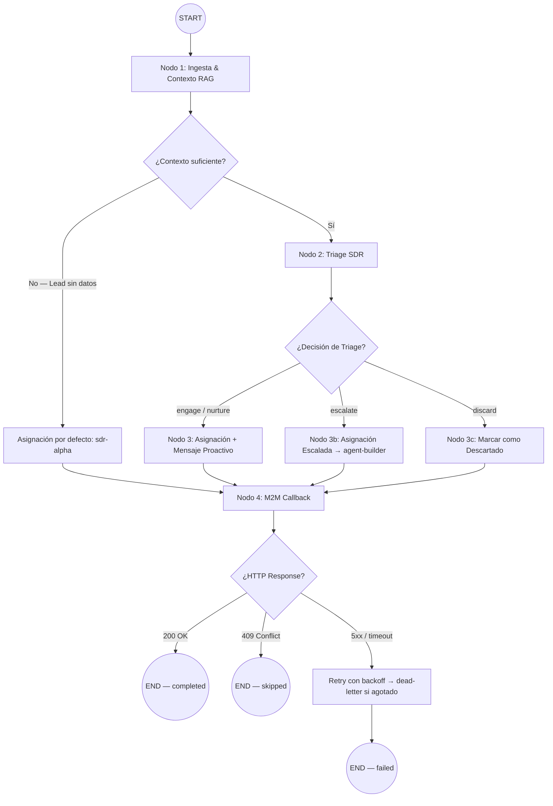
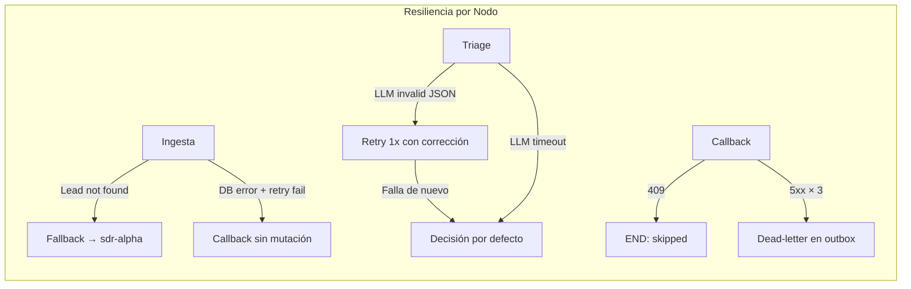

# RFC-035: LangGraph SDR Triage Workflow

**Estado:** Propuesta  
**Autor:** Builder (Arquitecto Staff)  
**Fecha:** 21 de Abril de 2026  
**Contexto de Diseño:** Ley Marcial Documental y Topológica  
**Dependencias:** RFC-003, RFC-004, RFC-033, ADR-126  
**Aprobación Ejecutiva:** Jorge (CEO) — autorización verbal para iniciar diseño

---

## 1. Objetivo

Diseñar el flujo interno del orquestador LangGraph (Motor Agéntico) que, al recibir el evento `lead.created` desde el Puente de Eventos (RFC-033), ejecuta un pipeline de triage autónomo para:

1. Enriquecer el contexto del Lead con datos históricos y Playbook (RAG).
2. Evaluar la viabilidad y complejidad del Lead.
3. Asignar el agente SDR idóneo.
4. Emitir el resultado de vuelta al CRM mediante el Reverse Webhook.

### 1.1 Alcance

| Aspecto | Descripción |
|---|---|
| **Entrada** | Payload `lead.created` recibido por `POST /api/internal/leads/assign` (RFC-033 §3.5) |
| **Salida** | Mutación de `leads.assigned_node` + `leads.thread_id` vía `PATCH /api/internal/leads/[id]/assign-result` (RFC-033 §3.8) |
| **Grafo** | Sub-grafo dedicado `sdr_triage_workflow` compilado como nodo opaco dentro del Grafo Principal (per RFC-003 §6) |

### 1.2 Fuera de Alcance

- Flujo conversacional posterior del SDR con el Lead (cubierto por RFC-004).
- Código de implementación final (solo arquitectura LangGraph).
- Diseño de UI para monitorear asignaciones (futuro RFC de Command Center).

---

## 2. Contexto Arquitectónico

### 2.1 Flujo Previo (RFC-033)

El RFC-033 define el puente Supabase → LangGraph. Su §3.7 invoca el grafo con un `initialState` parcial y un `thread_id` recién generado. **Este RFC toma el control exactamente en ese punto**: define qué sucede _dentro_ del grafo tras esa invocación.

### 2.2 Restricción ADR-126

El grafo opera bajo la restricción de Desacoplamiento Estructural:

- **Zona de Estructura (Read-Only):** Playbooks, System Prompts, Workflows → solo `SELECT`.
- **Zona de Estado (Mutable):** `leads`, `inbox_messages`, `thread_id`, `lead_assignment_outbox` → `SELECT/INSERT/UPDATE`.

Los nodos del grafo de triage pueden **leer** Playbooks para guiar la evaluación, pero **nunca escribirlos**.

### 2.3 Directivas Vinculantes

| Directiva | Aplicación en este RFC |
|---|---|
| **RFC-003** | Estructura de `GraphState`, `PostgresCheckpointer`, sub-grafos modulares |
| **RFC-004** | Extensiones `leadProfile` y `sdrStatus` del SDR Node |
| **RFC-033 §3.7** | `initialState` y `thread_id` como punto de entrada al grafo |
| **RFC-033 §3.8** | Reverse Webhook como punto de salida del grafo |
| **ADR-126** | Fronteras read-only / mutable para acceso a datos |

---

## 3. Estado del Grafo (StateGraph)

### 3.1 Estructura de Estado del Sub-Grafo de Triage

El sub-grafo `sdr_triage_workflow` opera con un `TypedDict` / Zod schema que extiende campos relevantes del `GraphState` principal (RFC-003 §2) y añade campos específicos del triage.

```typescript
// ─── TypeScript (Zod) ───
import { z } from 'zod';
import { Annotation } from '@langchain/langgraph';

// Estado específico del sub-grafo de triage SDR
const SDRTriageState = {
  // === Heredados del GraphState principal (inyectados por RFC-033 §3.7) ===
  lead_id: Annotation<string>({
    reducer: (_, right) => right,
    default: () => '',
  }),
  tenant_id: Annotation<string>({
    reducer: (_, right) => right,
    default: () => '',
  }),
  thread_id: Annotation<string>({
    reducer: (_, right) => right,
    default: () => '',
  }),
  source_channel: Annotation<'whatsapp' | 'telegram' | 'web'>({
    reducer: (_, right) => right,
    default: () => 'whatsapp',
  }),

  // === Contexto enriquecido (poblado por nodo de Ingesta) ===
  lead_context: Annotation<LeadContext | null>({
    reducer: (_, right) => right,
    default: () => null,
  }),
  playbook_rules: Annotation<PlaybookRules | null>({
    reducer: (_, right) => right,
    default: () => null,
  }),
  prior_interactions: Annotation<PriorInteraction[]>({
    reducer: (_, right) => right,
    default: () => [],
  }),

  // === Resultado del triage (poblado por nodo de Triage) ===
  triage_decision: Annotation<TriageDecision | null>({
    reducer: (_, right) => right,
    default: () => null,
  }),
  assigned_agent: Annotation<string>({
    reducer: (_, right) => right,
    default: () => 'unassigned',
  }),
  proactive_message: Annotation<string | null>({
    reducer: (_, right) => right,
    default: () => null,
  }),

  // === Control de flujo ===
  status: Annotation<'ingesting' | 'triaging' | 'assigning' | 'completed' | 'failed' | 'skipped'>({
    reducer: (_, right) => right,
    default: () => 'ingesting',
  }),
  error: Annotation<string | null>({
    reducer: (_, right) => right,
    default: () => null,
  }),
  callback_http_status: Annotation<number | null>({
    reducer: (_, right) => right,
    default: () => null,
  }),
};
```

### 3.2 Tipos Auxiliares

```typescript
// ─── Interfaces de soporte ───

interface LeadContext {
  name: string | null;
  email: string | null;
  phone: string | null;
  company: string | null;
  source: string;               // 'organic', 'referral', 'ad_campaign', etc.
  pipeline_status: string;      // 'new', 'qualified', etc.
  tags: string[];
  custom_fields: Record<string, unknown>;
  created_at: string;
}

interface PlaybookRules {
  playbook_id: string;
  qualification_framework: 'BANT' | 'MEDDIC' | 'custom';
  greeting_template: string | null;
  escalation_criteria: string[];
  max_touches_before_escalation: number;
}

interface PriorInteraction {
  timestamp: string;
  channel: string;
  direction: 'inbound' | 'outbound';
  summary: string;              // Resumen condensado, no mensaje completo (PII-safe)
}

interface TriageDecision {
  is_viable: boolean;
  confidence: number;           // 0.0 – 1.0
  complexity: 'low' | 'medium' | 'high';
  reasoning: string;            // Explicación breve del LLM
  recommended_agent: string;    // 'sdr-alpha', 'sdr-beta', 'agent-builder'
  recommended_action: 'engage' | 'nurture' | 'escalate' | 'discard';
}
```

### 3.3 Esquema Zod de Validación (para TriageDecision del LLM)

```typescript
const TriageDecisionSchema = z.object({
  is_viable: z.boolean(),
  confidence: z.number().min(0).max(1),
  complexity: z.enum(['low', 'medium', 'high']),
  reasoning: z.string().max(500),
  recommended_agent: z.string(),
  recommended_action: z.enum(['engage', 'nurture', 'escalate', 'discard']),
}).strict();
```

---

## 4. Topología del Grafo

### 4.1 Diagrama de Nodos y Aristas



### 4.2 Implementación LangGraph (Pseudocódigo Arquitectónico)

```typescript
import { StateGraph, START, END } from '@langchain/langgraph';

const triageWorkflow = new StateGraph({ channels: sdrTriageStateChannels })

  // ── Nodos ──
  .addNode('ingest',          ingestNode)
  .addNode('triage',          triageNode)
  .addNode('assign_standard', assignStandardNode)
  .addNode('assign_escalate', assignEscalateNode)
  .addNode('assign_discard',  assignDiscardNode)
  .addNode('assign_fallback', assignFallbackNode)
  .addNode('callback',        callbackNode)

  // ── Punto de Entrada ──
  .addEdge(START, 'ingest')

  // ── Arista Condicional: Ingesta → Triage o Fallback ──
  .addConditionalEdges('ingest', routeAfterIngest, {
    triage:   'triage',
    fallback: 'assign_fallback',
  })

  // ── Arista Condicional: Triage → Asignación según decisión ──
  .addConditionalEdges('triage', routeAfterTriage, {
    engage:   'assign_standard',
    nurture:  'assign_standard',
    escalate: 'assign_escalate',
    discard:  'assign_discard',
  })

  // ── Convergencia: Todos los nodos de asignación → Callback ──
  .addEdge('assign_standard', 'callback')
  .addEdge('assign_escalate', 'callback')
  .addEdge('assign_discard',  'callback')
  .addEdge('assign_fallback', 'callback')

  // ── Arista Condicional: Callback → END según respuesta HTTP ──
  .addConditionalEdges('callback', routeAfterCallback, {
    completed: END,
    skipped:   END,
    failed:    END,   // Tras agotar reintentos
  });

const sdrTriageApp = triageWorkflow.compile();
```

---

## 5. Diseño de Nodos

### 5.1 Nodo 1: Ingesta & Contexto RAG (`ingestNode`)

**Responsabilidad:** Hidratar el estado con datos del Lead y reglas del Playbook.

**Flujo interno:**

1. **Consulta a Supabase (Zona de Estado — mutable, SELECT):**
   ```sql
   SELECT name, email, phone, company, source, pipeline_status, tags, custom_fields, created_at
   FROM leads WHERE id = $1 AND tenant_id = $2;
   ```
2. **Consulta de interacciones previas (Zona de Estado — SELECT):**
   ```sql
   SELECT timestamp, channel, direction, summary
   FROM inbox_messages WHERE lead_id = $1
   ORDER BY timestamp DESC LIMIT 10;
   ```
3. **Consulta de Playbook (Zona de Estructura — READ-ONLY per ADR-126):**
   ```sql
   SELECT playbook_id, qualification_framework, greeting_template, 
          escalation_criteria, max_touches_before_escalation
   FROM playbooks WHERE tenant_id = $1 AND is_active = true
   LIMIT 1;
   ```
4. **Poblar estado:** Escribir `lead_context`, `prior_interactions` y `playbook_rules` en el `SDRTriageState`.

**Manejo de errores:**
- Si el Lead no existe en BD (posible race condition con DELETE), establecer `status = 'failed'` y `error = 'Lead not found'`.
- Si no existe Playbook activo, continuar con `playbook_rules = null` (el Triage operará con heurísticas por defecto).

### 5.2 Router Post-Ingesta (`routeAfterIngest`)

```typescript
const routeAfterIngest = (state: SDRTriageState): 'triage' | 'fallback' => {
  // Si no se encontró el lead, ir directamente a fallback
  if (!state.lead_context) return 'fallback';
  // Si hay contexto suficiente, proceder a triage inteligente
  return 'triage';
};
```

### 5.3 Nodo 2: Triage SDR (`triageNode`)

**Responsabilidad:** Evaluar el Lead mediante LLM y decidir la acción óptima.

**Flujo interno:**

1. **Construir prompt de triage:**
   - Inyectar `lead_context`, `prior_interactions` y `playbook_rules` como contexto estructurado.
   - System prompt que instruye al LLM a emitir un JSON conforme a `TriageDecisionSchema`.
   
2. **Invocación LLM (modelo rápido, e.g. `gemini-2.0-flash` o `gpt-4o-mini`):**
   ```
   System: Eres el motor de triage SDR de Teseo AI CRM. Analiza el lead y emite
   tu decisión como JSON estricto conforme al schema proporcionado.
   
   Criterios de evaluación:
   - is_viable: ¿El lead tiene potencial comercial real?
   - complexity: low (formulario simple), medium (requiere calificación BANT),
     high (enterprise, multi-stakeholder, requiere agent-builder)
   - recommended_agent: 
     • "sdr-alpha" para leads low/medium
     • "sdr-beta" para leads medium con historial previo
     • "agent-builder" para leads high-complexity o escalaciones
   - recommended_action:
     • "engage" → Lead viable, iniciar conversación proactiva
     • "nurture" → Lead tibio, programar seguimiento no intrusivo
     • "escalate" → Complejidad alta, requiere agent-builder humano-asistido
     • "discard" → Spam, duplicado, o sin potencial comercial
   
   Contexto del Lead: {lead_context}
   Interacciones previas: {prior_interactions}
   Reglas del Playbook: {playbook_rules}
   ```

3. **Parseo y validación:** Extraer JSON de la respuesta LLM, validar contra `TriageDecisionSchema` con Zod. Si la validación falla, reintentar una vez con prompt de corrección. Si falla de nuevo, usar decisión por defecto: `{ is_viable: true, complexity: 'low', recommended_agent: 'sdr-alpha', recommended_action: 'engage', confidence: 0.5 }`.

4. **Poblar estado:** Escribir `triage_decision` y actualizar `status = 'triaging'`.

### 5.4 Router Post-Triage (`routeAfterTriage`)

```typescript
const routeAfterTriage = (state: SDRTriageState): string => {
  const action = state.triage_decision?.recommended_action;
  if (action === 'engage' || action === 'nurture') return 'engage';
  if (action === 'escalate') return 'escalate';
  if (action === 'discard') return 'discard';
  // Fallback defensivo
  return 'engage';
};
```

### 5.5 Nodo 3: Asignación Estándar (`assignStandardNode`)

**Responsabilidad:** Asignar el SDR recomendado y generar mensaje proactivo si aplica.

```typescript
// Pseudocódigo
const assignStandardNode = async (state: SDRTriageState) => {
  const agent = state.triage_decision!.recommended_agent; // 'sdr-alpha' o 'sdr-beta'
  
  let proactive_message: string | null = null;
  
  if (state.triage_decision!.recommended_action === 'engage') {
    // Generar saludo personalizado usando playbook_rules.greeting_template
    proactive_message = await generateGreeting(state.lead_context, state.playbook_rules);
  }
  // 'nurture' no genera mensaje inmediato, solo asigna
  
  return {
    assigned_agent: agent,
    proactive_message,
    status: 'assigning' as const,
  };
};
```

### 5.6 Nodo 3b: Asignación Escalada (`assignEscalateNode`)

Asigna `agent-builder` para leads de alta complejidad. No genera mensaje proactivo automático — el agent-builder tomará control con contexto humano-asistido.

```typescript
const assignEscalateNode = async (state: SDRTriageState) => ({
  assigned_agent: 'agent-builder',
  proactive_message: null,
  status: 'assigning' as const,
});
```

### 5.7 Nodo 3c: Descarte (`assignDiscardNode`)

Marca el Lead como descartado. El callback escribirá `assigned_node = 'discarded'` en vez de un SDR.

```typescript
const assignDiscardNode = async (state: SDRTriageState) => ({
  assigned_agent: 'discarded',
  proactive_message: null,
  status: 'assigning' as const,
});
```

### 5.8 Nodo 3-fallback: Asignación por Defecto (`assignFallbackNode`)

Se activa cuando la ingesta no encontró el Lead o el contexto es insuficiente. Asigna `sdr-alpha` como SDR por defecto.

```typescript
const assignFallbackNode = async (state: SDRTriageState) => ({
  assigned_agent: 'sdr-alpha',
  proactive_message: null,
  status: 'assigning' as const,
  error: state.error ?? 'Insufficient context for triage; fallback assignment applied',
});
```

### 5.9 Nodo 4: M2M Callback (`callbackNode`)

**Responsabilidad:** Consumir el Reverse Webhook de RFC-033 §3.8 para persistir el resultado en el CRM.

**Flujo interno:**

1. **Construir payload:**
   ```typescript
   const payload = {
     assigned_node: mapAgentToNode(state.assigned_agent),
     thread_id: state.thread_id,
     assigned_at: new Date().toISOString(),
     // Extensiones opcionales para observabilidad
     triage_confidence: state.triage_decision?.confidence ?? null,
     proactive_message: state.proactive_message,
   };
   ```

2. **Invocar `PATCH /api/internal/leads/{lead_id}/assign-result`:**
   - Headers: `Authorization: Bearer <M2M_API_KEY>`, `X-Idempotency-Key: <thread_id>`.
   - Utilizar el cliente HTTP de RFC-020 con reintentos exponenciales (3 intentos, backoff 500ms → 1s → 2s).

3. **Interpretar respuesta y poblar estado:**

   | HTTP Status | Acción | Estado Final |
   |---|---|---|
   | **200 OK** | Asignación exitosa. Log de confirmación. | `status = 'completed'`, `callback_http_status = 200` |
   | **409 Conflict** | Lead ya fue asignado por otro proceso (race condition resuelta por lock optimista en CRM). Aceptar como éxito idempotente. | `status = 'skipped'`, `callback_http_status = 409` |
   | **4xx (otro)** | Error de cliente. No reintentar. Log de error. | `status = 'failed'`, `callback_http_status = 4xx` |
   | **5xx** | Error de servidor. Reintentar con backoff. Si todos los reintentos fallan, marcar como fallido. | `status = 'failed'`, `callback_http_status = 5xx` |
   | **Timeout** | Red inalcanzable. Misma lógica que 5xx. | `status = 'failed'`, `error = 'Callback timeout'` |

### 5.10 Router Post-Callback (`routeAfterCallback`)

```typescript
const routeAfterCallback = (state: SDRTriageState): 'completed' | 'skipped' | 'failed' => {
  return state.status as 'completed' | 'skipped' | 'failed';
};
```

---

## 6. Manejo de Fallos (Edges Condicionales)

### 6.1 HTTP 409 — Lead Ya Asignado (`skipped`)

**Escenario:** El Reverse Webhook retorna `409 Conflict` porque otro proceso (o un reintento de `pg_net`) ya asignó el Lead.

**Comportamiento:**

1. El `callbackNode` registra `callback_http_status = 409` y `status = 'skipped'`.
2. El grafo termina normalmente (no es un error).
3. El `PostgresCheckpointer` persiste el estado final con `status = 'skipped'` para auditoría.
4. **No se emite mensaje proactivo** — el Lead ya tiene un agente asignado por el proceso ganador.
5. Log estructurado: `{ level: 'info', event: 'triage.skipped', lead_id, thread_id, reason: 'conflict_409' }`.

### 6.2 Fallo en Nodo de Ingesta

| Fallo | Tratamiento |
|---|---|
| Lead no encontrado en BD | `lead_context = null` → router envía a `assign_fallback` |
| Error de conexión a Supabase | Reintentar 1 vez. Si persiste, `status = 'failed'`, `error = 'DB connection error'` → router envía a `callback` con `assigned_agent = 'unassigned'` (no muta nada) |
| Playbook no encontrado | Continuar sin Playbook — triage operará con heurísticas por defecto |

### 6.3 Fallo en Nodo de Triage

| Fallo | Tratamiento |
|---|---|
| LLM retorna JSON inválido | Reintentar con prompt de corrección (1 vez). Si falla, usar `TriageDecision` por defecto |
| LLM timeout | Usar `TriageDecision` por defecto: `{ is_viable: true, complexity: 'low', recommended_agent: 'sdr-alpha', recommended_action: 'engage', confidence: 0.5 }` |
| LLM completamente caído | Misma lógica que timeout — el sistema nunca debe bloquearse por fallo de LLM |

### 6.4 Fallo en Nodo de Callback

| Fallo | Tratamiento |
|---|---|
| CRM completamente caído (3 reintentos agotados) | `status = 'failed'`. El Outbox de RFC-033 §5.3 no aplica directamente aquí (es para el forward path), pero se propone extender la tabla `lead_assignment_outbox` con un campo `direction = 'reverse'` para capturar callbacks fallidos. Un `pg_cron` reintentará. |
| Token M2M expirado / inválido | `status = 'failed'`, `error = 'Auth rejected'`. Alerta inmediata en Cloud Monitoring. |

### 6.5 Diagrama de Flujo de Fallos



---

## 7. Integración con el Grafo Principal

### 7.1 Montaje como Sub-Grafo (per RFC-003 §6)

El `sdr_triage_workflow` se compila como nodo opaco dentro del Grafo Principal:

```typescript
// Compilar sub-grafo
const sdrTriageApp = triageWorkflow.compile();

// Montar en Grafo Principal
const mainWorkflow = new StateGraph({ channels: graphStateChannels })
  .addNode('gatekeeper', gatekeeperNode)
  .addNode('sdr_triage', sdrTriageApp)   // Sub-grafo opaco
  .addNode('pipeline_ventas', salesNode)
  .addNode('pipeline_inteligencia', intelligenceNode);

// El endpoint de RFC-033 invoca directamente el sub-grafo de triage
// sin pasar por el Gatekeeper (es un flujo M2M, no conversacional)
```

### 7.2 Invocación Directa vs. Vía Gatekeeper

**Decisión:** El flujo de triage SDR se invoca **directamente** desde el endpoint `POST /api/internal/leads/assign`, **sin pasar por el Gatekeeper**.

**Justificación:**
- El Gatekeeper (RFC-003 §3) es un router conversacional diseñado para clasificar mensajes humanos (`intent: commercial:hot`, `support:l1`, etc.).
- El evento `lead.created` es una señal M2M (Machine-to-Machine), no un mensaje conversacional.
- Enrutar un evento de sistema por el Gatekeeper añadiría latencia innecesaria y contaminaría la lógica de clasificación de intenciones.

```typescript
// En el handler de POST /api/internal/leads/assign (RFC-033 §3.5)
const thread_id = crypto.randomUUID();

const initialState: Partial<SDRTriageState> = {
  lead_id: payload.lead_id,
  tenant_id: payload.tenant_id,
  thread_id,
  source_channel: payload.source_channel ?? 'whatsapp',
  status: 'ingesting',
};

// Invocación fire-and-forget (per ADR-116, promesa flotante)
sdrTriageApp.invoke(initialState, {
  configurable: { thread_id },
}).catch(err => {
  logger.error({ event: 'triage.unhandled_error', lead_id: payload.lead_id, err });
});
```

---

## 8. Mapeo de Agentes

### 8.1 Tabla de Agentes SDR

| Agent ID | Perfil | Cuándo se Asigna |
|---|---|---|
| `sdr-alpha` | SDR generalista. Maneja leads de baja y media complejidad. | Default, `complexity: low/medium`, fallback |
| `sdr-beta` | SDR con contexto histórico. Para leads con interacciones previas. | `complexity: medium` + `prior_interactions.length > 0` |
| `agent-builder` | Agente humano-asistido para casos complejos. | `complexity: high`, `recommended_action: escalate` |
| `discarded` | Pseudo-agente: marca el lead como descartado. | `recommended_action: discard` |

### 8.2 Función de Mapeo Agent → Node

```typescript
const mapAgentToNode = (agent: string): string => {
  const mapping: Record<string, string> = {
    'sdr-alpha':     'sdr',
    'sdr-beta':      'sdr',
    'agent-builder': 'admin',    // Escalado a nodo administrativo
    'discarded':     'discarded',
  };
  return mapping[agent] ?? 'sdr'; // Fallback defensivo
};
```

---

## 9. Observabilidad

### 9.1 Logs Estructurados

Cada nodo emite logs con PII enmascarado (per ADR-116):

```jsonc
// Ejemplo: Triage completado
{
  "level": "info",
  "event": "triage.completed",
  "lead_id": "uuid-***",
  "thread_id": "uuid-***",
  "triage": {
    "is_viable": true,
    "complexity": "medium",
    "confidence": 0.87,
    "recommended_agent": "sdr-alpha",
    "recommended_action": "engage"
  },
  "duration_ms": 342,
  "timestamp": "2026-04-21T17:45:00Z"
}
```

### 9.2 Métricas Clave

| Métrica | Fuente |
|---|---|
| `triage.latency_ms` | Tiempo total START → END del sub-grafo |
| `triage.decisions.{action}` | Counter por tipo de decisión (`engage`, `nurture`, `escalate`, `discard`) |
| `triage.confidence_avg` | Promedio de `confidence` del LLM en ventana de 1h |
| `triage.callback.{status}` | Counter por status del callback (`200`, `409`, `5xx`) |
| `triage.fallback_rate` | Porcentaje de leads que llegan a `assign_fallback` |

---

## 10. Seguridad

| Capa | Control |
|---|---|
| **Acceso a BD (Ingesta)** | Rol de Supabase con permisos granulares per ADR-126: `SELECT` en `playbooks`, `SELECT/UPDATE` en `leads` y `inbox_messages` |
| **Invocación LLM** | Contexto PII-safe: nombres y emails se enmascaran antes de inyectar en prompt de triage |
| **Callback M2M** | Bearer Token (`M2M_API_KEY`) + validación `tenant_id ↔ lead_id` (Zero-Trust) |
| **Estado persistido** | `PostgresCheckpointer` en BD dedicada (RFC-003 §5), separada de datos de negocio |

---

## 11. Criterios de Aceptación

1. El sub-grafo `sdr_triage_workflow` recibe un `lead_id` y produce una asignación de agente SDR en < 5 segundos (incluyendo consulta LLM).
2. El nodo de Ingesta consulta la BD respetando ADR-126 (solo `SELECT` en zona de estructura).
3. El nodo de Triage emite una `TriageDecision` validada por Zod en ≥ 95% de los casos (restante 5% → decisión por defecto).
4. El callback reverse invoca `PATCH /api/internal/leads/[id]/assign-result` con Bearer Auth y recibe 200 o 409.
5. Un HTTP 409 en el callback resulta en `status = 'skipped'` (no error) y no emite mensaje proactivo.
6. Si el LLM falla completamente, el sistema asigna `sdr-alpha` por defecto (degradación graceful).
7. Todos los logs emitidos tienen PII enmascarado.
8. El sub-grafo se monta como nodo opaco en el Grafo Principal sin acoplamiento directo al Gatekeeper.

---

## 12. Riesgos y Mitigaciones

| Riesgo | Probabilidad | Impacto | Mitigación |
|---|---|---|---|
| LLM genera decisiones inconsistentes entre invocaciones | Media | Medio | Temperatura 0, Zod validation, decisión por defecto como safety net |
| Race condition: dos triggers para el mismo lead | Baja | Alto | Escudo de idempotencia RFC-033 §3.6 + lock optimista en CRM `WHERE assigned_node = 'unassigned'` |
| Latencia excesiva del LLM (>10s) | Baja | Medio | Timeout de 8s en invocación LLM + fallback a decisión por defecto |
| Playbook corrupto o vacío | Baja | Bajo | Triage opera con heurísticas si `playbook_rules = null` |
| Callback reverse agota reintentos | Baja | Alto | Dead-letter en `lead_assignment_outbox` con `direction = 'reverse'` + `pg_cron` retry |

---

## 13. Relación con RFC/ADR Existentes

| Documento | Relación |
|---|---|
| **RFC-003** | Define el `GraphState` base, sub-grafos modulares y `PostgresCheckpointer`. Este RFC extiende ese marco para el triage. |
| **RFC-004** | Define el SDR Node conversacional. Este RFC es el paso _previo_: decide qué SDR se activa antes de que RFC-004 tome el control de la conversación. |
| **RFC-033** | Define el puente de eventos. Este RFC toma el control donde RFC-033 §3.7 termina (la invocación del grafo). |
| **ADR-126** | Restricción de zonas read-only vs. mutable. Este RFC la respeta estrictamente en el nodo de Ingesta. |

---

*Documento generado bajo Ley Marcial Documental. Cualquier implementación debe respetar las directivas de RFC-003, RFC-004, RFC-033 y ADR-126.*
