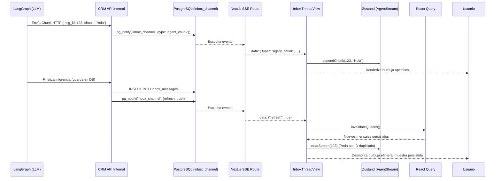

# RFC-036: Renderizado en Tiempo Real de Intervención Agéntica (HITL Proactive SSE)

**Estado:** Propuesta
**Autor:** Builder (Arquitecto Staff)
**Fecha:** 21 de Abril de 2026
**Dependencias:** ADR-117, RFC-022, RFC-027

---

## 1. Objetivo
Definir la arquitectura para transmitir, almacenar y renderizar en tiempo real el `proactive_message` (los mensajes generados por el Agente Autónomo/SDR) en la interfaz `inbox-thread-view.tsx` del CRM, consumiendo la infraestructura SSE existente sin generar condiciones de carrera contra el estado de React Query.

## 2. Contexto
- Actualmente, la ruta `/api/leads/[id]/messages/stream` escucha notificaciones de PostgreSQL (`inbox_channel`) y emite un evento de `{ refresh: true }` que invalida el caché de React Query.
- Para lograr Human-in-the-Loop (HITL), los operadores necesitan ver lo que el agente está "escribiendo" en tiempo real antes de que se envíe o confirme el mensaje, o al menos ver el flujo de la inferencia (streaming tokens).
- El motor de LangGraph será capaz de emitir eventos de progreso (chunks) hacia el CRM.

## 3. Arquitectura del Flujo Real-Time

### 3.1 Backend: Eventos de Streaming en Postgres
Se extenderá el uso del canal `inbox_channel` para soportar dos tipos de payloads mediante `pg_notify`:
1. **Refresh Event (Existente):** `{ "lead_id": "<uuid>", "refresh": true }` -> Indica que un mensaje completo se ha guardado en la BD.
2. **Chunk Event (Nuevo):** `{ "lead_id": "<uuid>", "type": "agent_chunk", "message_id": "<uuid_temporal>", "chunk": " Hola," }` -> Indica una fracción de texto proveniente de la inferencia del LLM.

*Nota de Idempotencia:* Los chunks son pequeños (decenas de bytes), lo que evita golpear el límite de 8KB por payload de `pg_notify`.

### 3.2 Frontend: Zustand Ephemeral Store
Para evitar condiciones de carrera (React Query invalidándose mientras el estado local intenta mutar el array de mensajes), se aislará el estado del streaming en un store de Zustand completamente separado del caché servidor.

**Esquema `useAgentStreamStore`:**
```typescript
interface AgentStreamState {
  // Mapa de message_id -> texto acumulado
  activeStreams: Record<string, string>;
  appendChunk: (messageId: string, chunk: string) => void;
  clearStream: (messageId: string) => void;
}
```

### 3.3 Consumo SSE en el Hook (`use-lead-sse.ts`)
El hook actual interceptará el tipo de evento:
- Si es `refresh`: Llama a `queryClient.invalidateQueries(...)`.
- Si es `agent_chunk`: Llama a `useAgentStreamStore.getState().appendChunk(data.message_id, data.chunk)`.

### 3.4 Renderizado Híbrido (`inbox-thread-view.tsx`)
El componente de vista de hilo leerá dos fuentes de verdad:
1. `messages`: Desde TanStack Query (Estado persistido del servidor).
2. `activeStreams`: Desde Zustand (Estado efímero de inferencia).

Se renderizarán iterando primero los persistidos y, al final, una burbuja "fantasma" (`MessageBubble`) por cada `activeStream` correspondiente al hilo, aplicando una animación visual de "Agente Escribiendo".

### 3.5 Mitigación de Condiciones de Carrera (Race Conditions)
El riesgo principal es que el mensaje completo se guarde en la BD, TanStack Query lo descargue, y Zustand aún mantenga el texto efímero, causando que el mensaje se renderice dos veces (duplicado visual).

**Solución (Doble Barrera):**
1. **Sincronización por ID:** El `message_id` generado por LangGraph al iniciar el stream DEBE ser el mismo UUID que se insertará en la base de datos como llave primaria del mensaje final.
2. **Efecto de Poda (Pruning Hook):** Se añadirá un `useEffect` en `inbox-thread-view.tsx` que escuche los `messages` de React Query. Si la lista persistida contiene un ID que también existe en `activeStreams`, el store ejecutará inmediatamente `clearStream(messageId)`.

## 4. Diagrama de Flujo



## 5. Work Breakdown Structure (WBS)

1. **Zustand Store:** Crear `stores/agent-stream-store.ts` con la lógica de concatenación.
2. **SSE Hook:** Modificar `use-lead-sse.ts` para parsear los tipos de evento y rutear a Zustand o React Query según corresponda.
3. **UI Rendering:** Actualizar `inbox-thread-view.tsx` para inyectar y renderizar los `activeStreams` como burbujas de chat provisionales al fondo de la lista, con la lógica de auto-poda al sincronizar IDs persistidos.

## 6. Trade-Offs Evaluados
- **Redis Pub/Sub vs Postgres Notify:** `pg_notify` se elige por simplicidad de infraestructura (Zero-Config), alineado con ADR-117. El costo es un ligero incremento de la CPU de Postgres, asumible para el volumen proyectado, ya que solo se transmiten deltas de texto (chunks).

