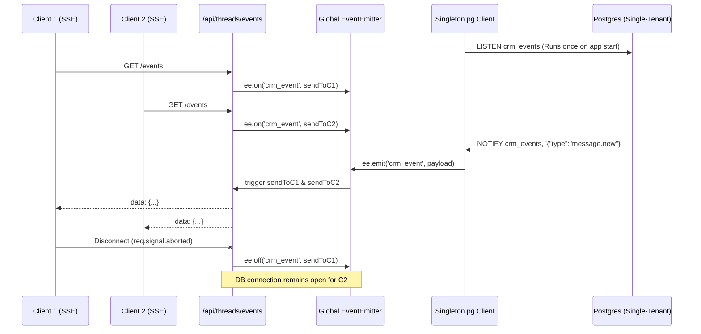

# RFC: Command Center API Routes (Teseo-AI-CRM) v2

## 1. Metadata
- **Status:** Approved (Post-Audit Redesign)
- **Author:** Builder (Arquitecto Staff)
- **Target Project:** Teseo-AI-CRM (`crm-agentico-panel`)
- **Tech Stack:** Next.js 14 App Router (Node.js runtime on Cloud Run), PostgreSQL Single-Tenant (via `pg` or `postgres.js`), Zod, TanStack Query v5, Zustand, SSE (Server-Sent Events) via Global EventEmitter.

## 2. Objective
Design and structure the API routes required to power the Command Center of the Teseo-AI-CRM, directly addressing the critical AppSec and architecture flaws identified in the April 2026 Audit (deadlocks, timeout antipatterns, missing validation). The Command Center allows operators to monitor AI conversations and seamlessly take over (handoff) from the AI. 

## 3. Architecture & Domain Rules
**CRITICAL RULE:** `crm-agentico-panel` interacts with a **Single-Tenant PostgreSQL database**. 
- **NO SUPABASE REALTIME.** Supabase is strictly reserved for Auth/Multi-tenant orchestration in the Mission Control layer. 
- Real-time updates **must** rely on native PostgreSQL `LISTEN/NOTIFY`.
- Strict input validation via `Zod` to prevent NoSQL/Postgres injection, `NaN` panics, and resource exhaustion (OWASP A03/A04).
- Deployed as a Dockerized Next.js server on **GCP Cloud Run**, allowing long-lived SSE connections without the typical 60s serverless limits of Vercel, provided we implement a Singleton pattern to avoid DB connection exhaustion.

## 4. API Routes Specification & Validation (Defense in Depth)

### 4.1 `/api/threads`
**GET:**
- **Purpose:** List all active and archived conversations.
- **Validation (Zod Schema):**
  ```typescript
  const GetThreadsQuerySchema = z.object({
    status: z.enum(['active', 'archived']).optional(),
    limit: z.coerce.number().int().min(1).max(100).default(20),
    offset: z.coerce.number().int().min(0).default(0)
  });
  ```
- **Security:** Token verification via Middleware. Explicit business-logic filters (e.g., `.where('user_id', '=', user.id)`) are applied in the SQL layer as Defense in Depth. No raw `parseInt` without Zod validation.

**POST:**
- **Purpose:** Create a new conversation thread.
- **Validation (Zod Schema):**
  ```typescript
  const CreateThreadSchema = z.object({
    customer_id: z.string().uuid(),
    channel: z.enum(['whatsapp', 'telegram', 'web']),
    initial_message: z.string().min(1).max(2000)
  });
  ```

### 4.2 `/api/threads/[id]/handoff`
**POST:**
- **Purpose:** Execute a "handoff" from the AI to a human operator.
- **Validation (Zod Schema):**
  ```typescript
  const HandoffSchema = z.object({
    operator_id: z.string().uuid(),
    reason: z.string().max(500).optional()
  });
  ```
- **Security:** Verify operator ID from the authenticated token.

### 4.3 `/api/threads/events` (The SSE Pattern Redesign)
**GET:**
- **Purpose:** Establish a Server-Sent Events (SSE) connection to push real-time updates to the Command Center client.
- **Anti-Pattern Resolved:** Previously using Supabase Realtime per-request, leading to timeouts and connection leaks.
- **New Architecture: PostgreSQL `LISTEN/NOTIFY` + Singleton EventEmitter**
  - The Next.js server runs in a long-lived Node.js environment (Docker on Cloud Run).
  - We instantiate a **single global `pg.Client`** dedicated solely to `LISTEN crm_events`.
  - When the DB triggers a `NOTIFY crm_events, payload`, the singleton client receives it and emits a Node.js `EventEmitter` event.
  - The `/api/threads/events` route creates a Next.js `ReadableStream`. It does **not** open a new DB connection; it simply attaches a listener (`ee.on()`) to the global `EventEmitter`.
  - **Graceful Teardown:** When the client disconnects (`req.signal.aborted`), the event listener is removed from the `EventEmitter`. The underlying DB connection remains intact for other users.
- **Fallback:** If the SSE stream drops, the client (TanStack Query) will gracefully fallback to polling (or simply reconnect) without causing DB stress.

## 5. Diagrams

### 5.1 Architecture: Global EventEmitter & LISTEN/NOTIFY (Mermaid)



## 6. Granular WBS (Work Breakdown Structure)

- **1. Core Validation & Security**
  - [ ] 1.1 Implement strict Zod schemas for all inputs (`limit`, `offset` in GET, payloads in POST).
  - [ ] 1.2 Eliminate all `any` types in `catch` blocks. Replace with `catch (error: unknown)` and proper type-guards.
  - [ ] 1.3 Add explicit tenant/user boundaries in DB queries as Defense in Depth.

- **2. SSE & PostgreSQL Realtime Infrastructure**
  - [ ] 2.1 Create a singleton module `lib/db/listener.ts` that initializes a dedicated `pg.Client` and runs `LISTEN crm_events`.
  - [ ] 2.2 Wire the `pg.Client` `on('notification')` event to a global standard Node.js `EventEmitter`.
  - [ ] 2.3 Implement exponential backoff reconnection logic for the singleton `pg.Client` in case of DB restarts.

- **3. Route Handlers**
  - [ ] 3.1 Refactor `GET /api/threads/events/route.ts` to attach to the `EventEmitter` and stream events via `ReadableStream`.
  - [ ] 3.2 Ensure `req.signal.addEventListener('abort', ...)` correctly unbinds the listener to prevent memory leaks.
  - [ ] 3.3 Rewrite `POST /api/threads` and `POST /api/threads/[id]/handoff` to use `zod` and execute `pg.query()` directly without Supabase client.

- **4. Client-Side Integration**
  - [ ] 4.1 Update the frontend `EventSource` logic to consume the new generic SSE payload structure.
  - [ ] 4.2 Configure TanStack Query background polling fallback in case the SSE stream is interrupted.