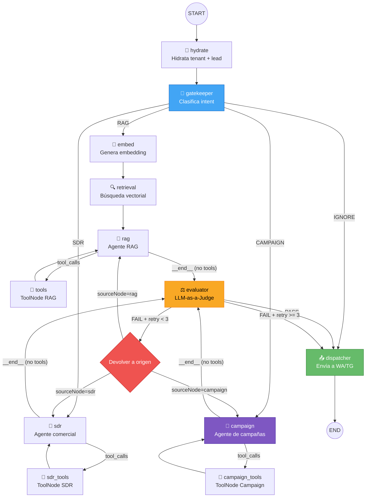

# RFC-BLOQUE-15: Campañas y Evaluador (LLM-as-a-Judge)

> **Documento de Diseño Arquitectónico**  
> Proyecto: CRM-Agéntico (Teseo-AI-CRM)  
> Autor: Builder (Arquitecto)  
> Estatus: Draft  
> Fecha: 2026-04-23  
> Bloque: 15  

---

## 1. Objetivo

Extender el orquestador LangGraph existente con dos capacidades:

1. **Nodo de Campaña** — Un agente operativo que genera contenido de campaña (emails masivos, secuencias outbound, copy para ads) basándose en el perfil del lead y la configuración del tenant.
2. **Nodo Evaluador (LLM-as-a-Judge)** — Una compuerta de calidad inyectada ANTES del dispatcher que valida la salida de cualquier nodo operativo (SDR, RAG, Campaign) y emite un veredicto PASS/FAIL con feedback estructurado.

### Principio rector

El Evaluador NO genera contenido. Juzga. Si falla, devuelve al agente operativo con feedback concreto. Si pasa, libera al dispatcher. Un `retry_count` con techo evita bucles infinitos.

---

## 2. Análisis del Estado Actual

### Grafo existente (graph.ts)

```
START → hydrate → gatekeeper → ┬─ "RAG"    → embed → retrieval → rag ──→ dispatcher → END
                                ├─ "SDR"    → sdr ────────────────────→ dispatcher → END
                                └─ "IGNORE" ──────────────────────────→ dispatcher → END
```

### Estado actual (state.ts) — Campos relevantes

| Campo              | Tipo                    | Uso                              |
|--------------------|-------------------------|----------------------------------|
| `messages`         | `BaseMessage[]`         | Historial (ventana 20 msgs)      |
| `routeDestination` | `string \| null`        | Salida del gatekeeper            |
| `currentRoute`     | `string \| null`        | Ruta activa                      |
| `sdrStatus`        | `string`                | Estado del SDR                   |
| `ragStatus`        | `string`                | Estado del RAG                   |
| `leadProfile`      | `Record<string, any>`   | BANT profile acumulativo         |
| `tenantConfig`     | `Record<string, any>`   | Config en caliente del tenant    |

### Nodos existentes

| Nodo          | Archivo                      | Responsabilidad                        |
|---------------|------------------------------|----------------------------------------|
| `hydrate`     | `nodes/hydrate_context.ts`   | Hidrata tenant, lead, contexto         |
| `gatekeeper`  | `nodes/gatekeeper.ts`        | Clasifica intent → RAG/SDR/IGNORE      |
| `sdr`         | `nodes/sdr.ts`               | Agente comercial con tool calling      |
| `rag`         | `nodes/rag.ts`               | Agente RAG con contexto vectorial      |
| `dispatcher`  | `nodes/dispatcher.ts`        | Side-effect: envía a WA/Telegram       |

---

## 3. Diseño de la Nueva Arquitectura

### 3.1 Nuevos Campos en `state.ts`

```typescript
// ─── Campos de Campaña ───────────────────────────────────
campaignId: Annotation<string | null>({
  reducer: (_l, r) => r !== undefined ? r : _l,
  default: () => null,
}),

campaignStatus: Annotation<"drafting" | "review" | "approved" | "sent" | "failed">({
  reducer: (_l, r) => r || _l,
  default: () => "drafting",
}),

campaignType: Annotation<"email_sequence" | "ad_copy" | "blast" | null>({
  reducer: (_l, r) => r !== undefined ? r : _l,
  default: () => null,
}),

// ─── Campos del Evaluador ────────────────────────────────
evaluatorVerdict: Annotation<"PASS" | "FAIL" | null>({
  reducer: (_l, r) => r !== undefined ? r : _l,
  default: () => null,
}),

evaluatorFeedback: Annotation<string | null>({
  reducer: (_l, r) => r !== undefined ? r : _l,
  default: () => null,
}),

evaluatorRetryCount: Annotation<number>({
  reducer: (_l, r) => r !== undefined ? r : _l,
  default: () => 0,
}),

/**
 * Nodo origen que produjo la última salida a evaluar.
 * El evaluador usa esto para saber a quién devolver en caso de FAIL.
 */
sourceNode: Annotation<"sdr" | "rag" | "campaign" | null>({
  reducer: (_l, r) => r !== undefined ? r : _l,
  default: () => null,
}),
```

### 3.2 Cambios en el Gatekeeper

El gatekeeper agrega `"CAMPAIGN"` como cuarta ruta posible:

```typescript
// Nuevo prompt del Gatekeeper (extracto)
const systemPrompt = `
Clasifica la intención del usuario. Responde EXCLUSIVAMENTE una de:
- RAG: Preguntas sobre memoria, datos, información general.
- SDR: Ventas, agenda, calificación de leads.
- CAMPAIGN: El usuario solicita crear, lanzar, revisar o modificar una campaña de marketing/outbound.
- IGNORE: Mensajes basura, despedidas sin intención.
`;

// Nuevo mapa de rutas condicionales
.addConditionalEdges("gatekeeper", (state) => state.routeDestination as string, {
  "RAG": "embed",
  "SDR": "sdr",
  "CAMPAIGN": "campaign",
  "IGNORE": "dispatcher",  // IGNORE salta evaluador (no hay contenido que juzgar)
})
```

### 3.3 Nuevo Nodo: `campaign` (`nodes/campaign.ts`)

**Responsabilidad:** Generar contenido de campaña (email sequences, ad copy, blast messages) usando el perfil del lead, la base de conocimiento del tenant y las instrucciones del usuario.

**Diseño:**
```typescript
async function campaignNode(state: GraphStateType): Promise<Partial<GraphStateType>> {
  const tierMap = { base: 1, pro: 2, ultra: 3 };
  const tier = tierMap[state.tenantConfig?.llm_tier] || 2;
  const model = getLLM({ tier, temperature: 0.4 }).bindTools(campaignTools);

  const systemPrompt = new SystemMessage(`
    Eres un estratega de campañas de marketing y outbound.
    Genera contenido de campaña según las instrucciones del usuario.
    Perfil del lead: ${JSON.stringify(state.leadProfile)}
    Tipo de campaña solicitada: ${state.campaignType || "a determinar"}
    ${state.evaluatorFeedback 
      ? `⚠️ FEEDBACK DEL EVALUADOR (corrige estos puntos): ${state.evaluatorFeedback}` 
      : ""}
  `);

  const response = await model.invoke([systemPrompt, ...state.messages]);

  return {
    messages: [response],
    campaignStatus: "review",
    sourceNode: "campaign",
  };
}
```

**Tools del Campaign Node:**
- `saveCampaignDraft` — Persiste el borrador en Supabase (`campaigns` table).
- `getCampaignHistory` — Lee campañas previas del tenant para no repetir.
- `escalateToHuman` — Escala a operador humano si la solicitud es ambigua.

### 3.4 Nuevo Nodo: `evaluator` (`nodes/evaluator.ts`)

**Responsabilidad:** Juzgar la calidad de la última respuesta del agente operativo ANTES de que llegue al dispatcher.

**Diseño:**
```typescript
async function evaluatorNode(state: GraphStateType): Promise<Partial<GraphStateType>> {
  const MAX_RETRIES = 3;
  const currentRetry = state.evaluatorRetryCount || 0;

  // Safety valve: si ya superamos retries, PASS forzado con warning
  if (currentRetry >= MAX_RETRIES) {
    console.warn(`[Evaluator] Max retries (${MAX_RETRIES}) reached. Forcing PASS.`);
    return {
      evaluatorVerdict: "PASS",
      evaluatorFeedback: `[AUTO-PASS] Se alcanzó el máximo de reintentos (${MAX_RETRIES}). Revisar manualmente.`,
      evaluatorRetryCount: currentRetry,
    };
  }

  // Extraer la última respuesta AI del historial
  const lastAiMessage = state.messages
    .filter(m => m._getType() === "ai")
    .at(-1);

  if (!lastAiMessage || !lastAiMessage.content) {
    return { evaluatorVerdict: "PASS", evaluatorFeedback: null };
  }

  const contentToEvaluate = typeof lastAiMessage.content === "string"
    ? lastAiMessage.content
    : JSON.stringify(lastAiMessage.content);

  // Modelo rápido tier-3 (flash) para evaluación — FinOps friendly
  const judge = getLLM({ tier: 3, temperature: 0 });

  const systemPrompt = new SystemMessage(`
Eres un evaluador de calidad (LLM-as-a-Judge). 
Tu trabajo es juzgar si la respuesta de un agente CRM es apta para enviar al cliente final.

Criterios de evaluación:
1. PRECISIÓN: ¿La respuesta es factualmente correcta y no inventa datos?
2. TONO: ¿Es profesional, empático y adecuado al canal (WhatsApp/Telegram)?
3. COMPLETITUD: ¿Responde la pregunta/solicitud del usuario de forma suficiente?
4. SEGURIDAD: ¿No contiene datos sensibles filtrados, prompts internos o instrucciones del sistema?
5. FORMATO: ¿Es legible en mensajería instantánea (no demasiado largo, no markdown pesado)?

Responde ESTRICTAMENTE en JSON:
{
  "verdict": "PASS" | "FAIL",
  "score": <number 1-10>,
  "reasons": ["razón 1", "razón 2"],
  "feedback": "instrucciones concretas para mejorar la respuesta" | null
}
  `);

  const evaluationPrompt = new HumanMessage(`
Agente origen: ${state.sourceNode || "unknown"}
Contexto del lead: ${JSON.stringify(state.leadProfile)}
Tipo de campaña (si aplica): ${state.campaignType || "N/A"}

--- RESPUESTA A EVALUAR ---
${contentToEvaluate}
---------------------------
  `);

  try {
    const result = await judge.invoke([systemPrompt, evaluationPrompt]);
    const parsed = JSON.parse(result.content.toString());

    return {
      evaluatorVerdict: parsed.verdict === "PASS" ? "PASS" : "FAIL",
      evaluatorFeedback: parsed.feedback || null,
      evaluatorRetryCount: parsed.verdict === "PASS" ? 0 : currentRetry + 1,
    };
  } catch (error) {
    console.error("[Evaluator] Parse error, forcing PASS:", error);
    return {
      evaluatorVerdict: "PASS",
      evaluatorFeedback: "[PARSE-ERROR] El evaluador no pudo parsear. Revisar logs.",
    };
  }
}
```

**Decisión clave:** Modelo tier-3 (flash/barato) con `temperature: 0` y respuesta JSON estructurada. El costo por evaluación es ~10x menor que el agente operativo.

### 3.5 Función de Enrutamiento Post-Evaluador

```typescript
function routeAfterEvaluator(state: GraphStateType): string {
  if (state.evaluatorVerdict === "PASS") {
    return "dispatcher";
  }

  // FAIL → devolver al nodo origen para corrección
  const source = state.sourceNode;
  if (source === "sdr") return "sdr";
  if (source === "rag") return "rag";      // rag recibe feedback via state
  if (source === "campaign") return "campaign";

  // Fallback: si no hay sourceNode, forzar dispatcher
  return "dispatcher";
}
```

### 3.6 Modificaciones a SDR y RAG (inyección de feedback)

Ambos nodos deben leer `state.evaluatorFeedback` cuando `evaluatorRetryCount > 0` e inyectarlo en su prompt:

```typescript
// Fragmento a agregar en sdr.ts y rag.ts
const feedbackBlock = state.evaluatorFeedback && state.evaluatorRetryCount > 0
  ? `\n⚠️ FEEDBACK DEL EVALUADOR — Tu respuesta anterior fue rechazada. Corrige: ${state.evaluatorFeedback}`
  : "";

const systemPrompt = new SystemMessage(`${baseSystemPrompt}${feedbackBlock}`);
```

---

## 4. Diagrama Mermaid — Flujo Completo



---

## 5. Máquina de Estados — Transiciones Formales

```
States:
  HYDRATE → GATEKEEPER → {RAG_PIPELINE, SDR, CAMPAIGN, IGNORE}
  RAG_PIPELINE = EMBED → RETRIEVAL → RAG_AGENT
  SDR = SDR_AGENT ⇄ SDR_TOOLS
  CAMPAIGN = CAMPAIGN_AGENT ⇄ CAMPAIGN_TOOLS
  
  {RAG_AGENT, SDR_AGENT, CAMPAIGN_AGENT} → EVALUATOR
  EVALUATOR → DISPATCHER (if PASS or retry >= MAX)
  EVALUATOR → {RAG_AGENT, SDR_AGENT, CAMPAIGN_AGENT} (if FAIL and retry < MAX)
  
  IGNORE → DISPATCHER (bypass evaluator)
  DISPATCHER → END

Invariants:
  - evaluatorRetryCount ∈ [0, MAX_RETRIES]
  - MAX_RETRIES = 3
  - evaluatorRetryCount se resetea a 0 en PASS
  - sourceNode siempre se setea por el nodo operativo antes de llegar al evaluador
```

---

## 6. Nuevo graph.ts Completo (Pseudo-código)

```typescript
const workflow = new StateGraph(GraphState)
  // Nodos existentes
  .addNode("hydrate", hydrateContextNode)
  .addNode("gatekeeper", gatekeeperNode)
  .addNode("sdr", sdrNode)
  .addNode("embed", embedNode)
  .addNode("retrieval", retrievalNode)
  .addNode("rag", ragNode)
  .addNode("tools", ragToolsNode)
  .addNode("sdr_tools", sdrToolsNode)
  .addNode("dispatcher", dispatcherNode)

  // ── Nuevos nodos ──
  .addNode("campaign", campaignNode)
  .addNode("campaign_tools", campaignToolsNode)
  .addNode("evaluator", evaluatorNode)

  // ── Ejes de entrada ──
  .addEdge(START, "hydrate")
  .addEdge("hydrate", "gatekeeper")

  // ── Gatekeeper → rutas (AHORA con CAMPAIGN) ──
  .addConditionalEdges("gatekeeper", (state) => state.routeDestination as string, {
    "RAG": "embed",
    "SDR": "sdr",
    "CAMPAIGN": "campaign",
    "IGNORE": "dispatcher",   // IGNORE salta evaluador
  })

  // ── Pipeline RAG (sin cambios) ──
  .addEdge("embed", "retrieval")
  .addEdge("retrieval", "rag")

  // ── SDR tool loop (sin cambios) ──
  .addConditionalEdges("sdr", toolsCondition, {
    tools: "sdr_tools",
    __end__: "evaluator",     // CAMBIO: antes iba a dispatcher, ahora a evaluator
  })
  .addEdge("sdr_tools", "sdr")

  // ── RAG tool loop (sin cambios en el loop, pero salida cambia) ──
  .addConditionalEdges("rag", toolsCondition, {
    tools: "tools",
    __end__: "evaluator",     // CAMBIO: antes iba a dispatcher, ahora a evaluator
  })
  .addEdge("tools", "rag")

  // ── Campaign tool loop (NUEVO) ──
  .addConditionalEdges("campaign", toolsCondition, {
    tools: "campaign_tools",
    __end__: "evaluator",
  })
  .addEdge("campaign_tools", "campaign")

  // ── Evaluador → enrutamiento condicional ──
  .addConditionalEdges("evaluator", routeAfterEvaluator, {
    "dispatcher": "dispatcher",
    "sdr": "sdr",
    "rag": "rag",
    "campaign": "campaign",
  })

  // ── Dispatcher → fin ──
  .addEdge("dispatcher", END);

const app = workflow.compile({
  checkpointer,
  interruptBefore: ["dispatcher"],
});
```

---

## 7. Consideraciones FinOps y Performance

| Aspecto | Decisión | Justificación |
|---------|----------|---------------|
| Modelo del Evaluador | Tier-3 (Flash/Gemini-2.0-Flash) | Evaluación = tarea rápida y estructurada. No necesita un modelo pro. |
| Respuesta del Evaluador | JSON estricto | Parseo determinista, sin regex frágiles. |
| MAX_RETRIES | 3 | Balance entre calidad y costo. 3 retries = máximo ~4 invocaciones LLM por turno. |
| Auto-PASS en error de parseo | Sí | Preferimos entregar (con log/alerta) a bloquear al usuario. |
| Auto-PASS en max retries | Sí, con tag `[AUTO-PASS]` | Observable vía logs. Se puede crear alerta en FinOps. |
| Evaluador para IGNORE | No | No hay contenido generado. Sería desperdicio de tokens. |
| Temperature del evaluador | 0 | Evaluación determinista y reproducible. |

### Estimación de costo incremental por turno

```
Caso feliz (PASS en 1er intento):
  Agente operativo:     ~1 invocación tier-2    ≈ $0.003
  Evaluador:            ~1 invocación tier-3    ≈ $0.0003
  Total incremental:                            ≈ +$0.0003 (+10%)

Caso peor (FAIL × 3 + auto-PASS):
  Agente operativo:     ~4 invocaciones tier-2  ≈ $0.012
  Evaluador:            ~3 invocaciones tier-3  ≈ $0.0009
  Total incremental:                            ≈ +$0.0099 (+330%)
  NOTA: Caso raro. Si ocurre frecuentemente, indica problema en el prompt del agente.
```

---

## 8. Mitigación de Riesgos

| Riesgo | Mitigación |
|--------|------------|
| **Bucle infinito evaluador ↔ agente** | `MAX_RETRIES = 3` con auto-PASS. `evaluatorRetryCount` es persistido en state. |
| **Evaluador demasiado estricto** | Score threshold configurable en `tenantConfig.evaluator_min_score` (default: 6). |
| **Evaluador demasiado permisivo** | Criterios explícitos en prompt + scoring 1-10 observable en logs. |
| **Latencia adicional** | Tier-3 Flash tiene p95 < 500ms. Imperceptible vs el agente operativo (~2-5s). |
| **Fallo del evaluador** | `try/catch` con auto-PASS + log de error. El usuario nunca se queda colgado. |
| **sourceNode null** | Fallback a `dispatcher` en `routeAfterEvaluator`. Log de warning. |
| **Costo en campañas largas** | Las campañas se evalúan como un solo bloque, no por cada email de la secuencia. |

---

## 9. WBS — Work Breakdown Structure

### Fase 1: Estado y Fundamentos (Estimado: 2h)

| ID | Tarea | Archivo | Dependencia |
|----|-------|---------|-------------|
| 1.1 | Agregar campos `campaignId`, `campaignStatus`, `campaignType` a `state.ts` | `src/orchestrator/src/state.ts` | — |
| 1.2 | Agregar campos `evaluatorVerdict`, `evaluatorFeedback`, `evaluatorRetryCount`, `sourceNode` a `state.ts` | `src/orchestrator/src/state.ts` | — |
| 1.3 | Exportar tipo `GraphStateType` actualizado y verificar que compila | `src/orchestrator/src/state.ts` | 1.1, 1.2 |

### Fase 2: Nodo Evaluador (Estimado: 3h)

| ID | Tarea | Archivo | Dependencia |
|----|-------|---------|-------------|
| 2.1 | Crear `nodes/evaluator.ts` con lógica de LLM-as-a-Judge | `src/orchestrator/src/nodes/evaluator.ts` | 1.2 |
| 2.2 | Implementar schema Zod para validar JSON de respuesta del evaluador | `src/orchestrator/src/nodes/evaluator.ts` | 2.1 |
| 2.3 | Implementar `routeAfterEvaluator()` como función exportada | `src/orchestrator/src/nodes/evaluator.ts` | 2.1 |
| 2.4 | Escribir tests unitarios del evaluador (mock LLM, PASS/FAIL/parse-error) | `src/orchestrator/src/__tests__/evaluator.test.ts` | 2.1 |

### Fase 3: Nodo Campaña (Estimado: 4h)

| ID | Tarea | Archivo | Dependencia |
|----|-------|---------|-------------|
| 3.1 | Crear `tools/campaign.ts` con `saveCampaignDraft`, `getCampaignHistory`, `escalateToHuman` | `src/orchestrator/src/tools/campaign.ts` | 1.1 |
| 3.2 | Crear `nodes/campaign.ts` con prompt de estratega de campañas | `src/orchestrator/src/nodes/campaign.ts` | 3.1, 1.1 |
| 3.3 | Crear tabla `campaigns` en Supabase (migration SQL) | `supabase/migrations/XXXXXXX_campaigns.sql` | — |
| 3.4 | Inyectar `evaluatorFeedback` en prompt del campaign node cuando `retryCount > 0` | `src/orchestrator/src/nodes/campaign.ts` | 3.2, 2.1 |
| 3.5 | Escribir tests unitarios del campaign node | `src/orchestrator/src/__tests__/campaign.test.ts` | 3.2 |

### Fase 4: Integración en el Grafo (Estimado: 2h)

| ID | Tarea | Archivo | Dependencia |
|----|-------|---------|-------------|
| 4.1 | Actualizar `gatekeeper.ts`: agregar intent `CAMPAIGN` al prompt y al return | `src/orchestrator/src/nodes/gatekeeper.ts` | 1.1 |
| 4.2 | Actualizar `sdr.ts`: inyectar feedback del evaluador + setear `sourceNode: "sdr"` | `src/orchestrator/src/nodes/sdr.ts` | 2.1 |
| 4.3 | Actualizar `rag.ts`: inyectar feedback del evaluador + setear `sourceNode: "rag"` | `src/orchestrator/src/nodes/rag.ts` | 2.1 |
| 4.4 | Reescribir `graph.ts`: agregar nodos `campaign`, `campaign_tools`, `evaluator`; rewire edges según §6 | `src/orchestrator/src/graph.ts` | 2.1, 3.2, 4.1-4.3 |
| 4.5 | Verificar compilación del grafo (`tsc --noEmit`) | — | 4.4 |

### Fase 5: Testing de Integración (Estimado: 3h)

| ID | Tarea | Archivo | Dependencia |
|----|-------|---------|-------------|
| 5.1 | Test e2e: mensaje SDR → evaluador PASS → dispatcher | `src/orchestrator/src/__tests__/graph-e2e.test.ts` | 4.4 |
| 5.2 | Test e2e: mensaje SDR → evaluador FAIL → retry → PASS → dispatcher | mismo | 4.4 |
| 5.3 | Test e2e: mensaje SDR → evaluador FAIL × 3 → auto-PASS → dispatcher | mismo | 4.4 |
| 5.4 | Test e2e: intent CAMPAIGN → campaign → evaluador → dispatcher | mismo | 4.4 |
| 5.5 | Test e2e: intent IGNORE → dispatcher (sin evaluador) | mismo | 4.4 |
| 5.6 | Test: `evaluatorRetryCount` se resetea correctamente en PASS | mismo | 4.4 |

### Fase 6: Observabilidad (Estimado: 1h)

| ID | Tarea | Archivo | Dependencia |
|----|-------|---------|-------------|
| 6.1 | Agregar logs estructurados al evaluador (`[Evaluator] verdict=PASS score=8`) | `src/orchestrator/src/nodes/evaluator.ts` | 2.1 |
| 6.2 | Emitir callback FinOps desde el evaluador (para tracking de costo incremental) | `src/orchestrator/src/nodes/evaluator.ts` | 2.1 |
| 6.3 | Agregar tag `[AUTO-PASS]` en los logs cuando se fuerza aprobación | `src/orchestrator/src/nodes/evaluator.ts` | 2.1 |

---

## 10. Orden de Implementación Recomendado

```
Fase 1 (Estado) → Fase 2 (Evaluador) → Fase 3 (Campaña) → Fase 4 (Grafo) → Fase 5 (Tests) → Fase 6 (Obs)
```

Las fases 2 y 3 pueden paralelizarse si dos ejecutores trabajan simultáneamente. La fase 4 depende de ambas.

---

## 11. Decisiones Arquitectónicas Clave

### D1: Evaluador como nodo separado (no middleware)

**Decidido:** Nodo explícito en el grafo LangGraph.  
**Alternativa rechazada:** Middleware/callback en cada nodo.  
**Razón:** Un nodo explícito es observable en el checkpointer, visible en LangSmith, y permite `interruptBefore` para HITL si se necesita aprobar evaluaciones en el futuro.

### D2: IGNORE salta el evaluador

**Decidido:** La ruta IGNORE va directo a dispatcher.  
**Razón:** No hay contenido generado por un agente operativo. Evaluar un mensaje vacío o de bypass sería desperdicio de tokens.

### D3: Auto-PASS en fallo de parseo

**Decidido:** Si el evaluador no puede parsear su propia respuesta, se fuerza PASS.  
**Razón:** Preferimos entregar un mensaje potencialmente imperfecto a dejar al usuario sin respuesta. El log queda para auditoría.

### D4: Feedback como inyección en prompt (no como tool)

**Decidido:** El feedback del evaluador se inyecta directamente en el system prompt del agente operativo.  
**Alternativa rechazada:** Crear un `HumanMessage` ficticio con el feedback.  
**Razón:** Un HumanMessage ficticio corrompe el historial para Gemini (regla de turnos estricta). El system prompt es el canal limpio para instrucciones internas.

### D5: `sourceNode` como campo de estado

**Decidido:** Cada agente operativo escribe su identidad en `state.sourceNode` antes de emitir.  
**Alternativa rechazada:** Inferir el nodo origen del historial de ejecución.  
**Razón:** El historial de ejecución de LangGraph no está trivialmente disponible dentro de un nodo. Un campo explícito es simple y determinista.

---

## 12. Schema de la tabla `campaigns` (Supabase)

```sql
CREATE TABLE campaigns (
  id            UUID PRIMARY KEY DEFAULT gen_random_uuid(),
  tenant_id     UUID NOT NULL REFERENCES tenants(id),
  lead_id       UUID REFERENCES leads(id),
  type          TEXT NOT NULL CHECK (type IN ('email_sequence', 'ad_copy', 'blast')),
  status        TEXT NOT NULL DEFAULT 'draft' CHECK (status IN ('draft', 'review', 'approved', 'sent', 'failed')),
  content       JSONB NOT NULL DEFAULT '{}',
  evaluator_score INTEGER,
  evaluator_feedback TEXT,
  created_at    TIMESTAMPTZ NOT NULL DEFAULT now(),
  updated_at    TIMESTAMPTZ NOT NULL DEFAULT now()
);

-- RLS
ALTER TABLE campaigns ENABLE ROW LEVEL SECURITY;
CREATE POLICY "tenant_isolation" ON campaigns
  USING (tenant_id = current_setting('app.tenant_id')::UUID);

-- Index
CREATE INDEX idx_campaigns_tenant ON campaigns(tenant_id);
CREATE INDEX idx_campaigns_status ON campaigns(tenant_id, status);
```

---

## 13. Checklist de Aceptación

- [ ] `state.ts` compila con los 7 nuevos campos
- [ ] `gatekeeper.ts` enruta `CAMPAIGN` correctamente
- [ ] `evaluator.ts` emite PASS/FAIL en JSON parseable
- [ ] `campaign.ts` genera contenido y setea `sourceNode`
- [ ] `sdr.ts` y `rag.ts` setean `sourceNode` e inyectan feedback
- [ ] `graph.ts` conecta evaluador entre agentes operativos y dispatcher
- [ ] IGNORE salta evaluador
- [ ] Auto-PASS funciona en retry >= 3
- [ ] Auto-PASS funciona en error de parseo
- [ ] Tests e2e pasan para los 5 escenarios de §9 Fase 5
- [ ] Tabla `campaigns` existe en Supabase con RLS
- [ ] Logs estructurados visibles en stdout

---

*Fin del RFC. Este documento es la fuente de verdad para la implementación del Bloque 15.*
