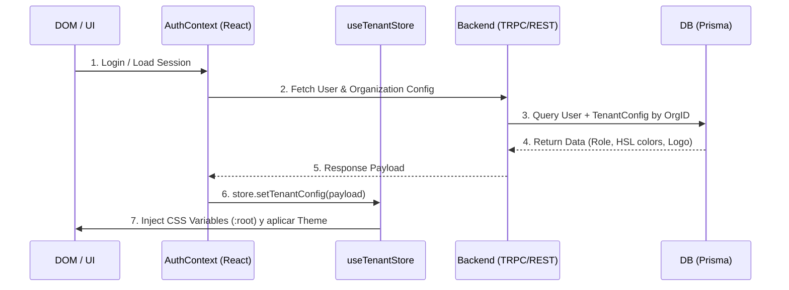

# RFC: Migración de Branding, Usuarios y Permisos (Fleetco+ a Teseo-AI-CRM)

## 1. Introducción
Este documento detalla la arquitectura para el Paso 2 de la migración de funcionalidades de configuración de interfaz (Branding) y gestión de Usuarios desde Fleetco+ hacia Teseo-AI-CRM.

### Problema y Deuda Técnica
Actualmente, Fleetco+ inyecta de forma insegura y "sucia" el CSS a través de `AuthContext.tsx` basado en el dominio del correo (ADR-016). Este enfoque debe ser completamente erradicado en Teseo-AI-CRM. Se debe centralizar y estandarizar la inyección de estilos utilizando el store de Zustand y cargando configuraciones seguras asociadas al `tenant` o la `organization`.

---

## 2. Esquema de Base de Datos Objetivo (Prisma)
Se migrarán y adaptarán los modelos `TenantConfig` y `User` para que la configuración de UI esté estrictamente vinculada a la organización (Tenant) y no al dominio del correo electrónico.

```prisma
// Esquema Prisma Propuesto

model Organization {
  id             String         @id @default(uuid())
  name           String
  domain         String?        @unique // Opcional, solo para validación, NO para inyección de UI
  branding       TenantConfig?
  users          User[]
  createdAt      DateTime       @default(now())
  updatedAt      DateTime       @updatedAt
}

model TenantConfig {
  id             String       @id @default(uuid())
  organizationId String       @unique
  organization   Organization @relation(fields: [organizationId], references: [id], onDelete: Cascade)
  
  // Variables de branding (HSL)
  primaryColor   String       @default("222.2 47.4% 11.2%")
  accentColor    String       @default("210 40% 98%")
  logoUrl        String?
  themeMode      ThemeMode    @default(SYSTEM) // SYSTEM, LIGHT, DARK
  
  createdAt      DateTime     @default(now())
  updatedAt      DateTime     @updatedAt
}

model User {
  id             String       @id @default(uuid())
  email          String       @unique
  name           String?
  role           UserRole     @default(MEMBER) // ADMIN, MEMBER, VIEWER
  organizationId String
  organization   Organization @relation(fields: [organizationId], references: [id], onDelete: Cascade)
  
  createdAt      DateTime     @default(now())
  updatedAt      DateTime     @updatedAt
}

enum ThemeMode {
  LIGHT
  DARK
  SYSTEM
}

enum UserRole {
  OWNER
  ADMIN
  MEMBER
  VIEWER
}
```

---

## 3. Flujo de Inyección de Estado (State Injection Flow)

El nuevo flujo garantizará que el Branding se cargue de forma segura en el Backend y se despache de forma asíncrona hacia Zustand, inyectando luego las variables CSS HSL limpias en el Root del DOM.



### Reglas del Flujo:
1. **Eliminación de ADR-016:** `AuthContext.tsx` ya no infiere estilos ni realiza inyecciones al DOM basándose en `email.split('@')[1]`. 
2. El `AuthContext` solo es responsable de validar la sesión y pasar el objeto de la Organización al store.
3. El archivo `useTenantStore.ts` será el único punto de inyección de estilos (`document.documentElement.style.setProperty('--primary', color)`).

---

## 4. Componentes a Migrar y Refactorizar

Los siguientes componentes ubicados en `src/features/settings` serán refactorizados para desvincularse de los antipatrones de Fleetco+:

| Componente | Acción | Refactorización Requerida |
|------------|--------|---------------------------|
| `Layout.tsx` | Migrar | Adaptar para consumir el Sidebar de shadcn/ui y leer `logoUrl` e UI details desde `useTenantStore`. |
| `WorkspaceView.tsx` | Migrar | Desacoplar la lógica basada en el dominio del correo. Debe gestionar la entidad `Organization` (Prisma). |
| `AppearanceView.tsx`| Migrar | Modificar para que los selectores de color despachen actualizaciones al backend y actualicen el Zustand de forma optimista. |
| `UserProfileView.tsx`| Migrar | Adaptar el selector de Rol (`UserRole`) y verificar permisos para restringir la edición de Branding solo a usuarios `ADMIN` u `OWNER`. |

---

## 5. Work Breakdown Structure (WBS) - Tareas para el Ejecutor

Lista de tareas granulares listas para el agente Ejecutor:

- [ ] **Tarea 1: Actualización de Base de Datos.**
  - Modificar el `schema.prisma` incorporando los modelos `Organization`, `TenantConfig`, y `User` según el diagrama de este RFC.
  - Ejecutar la migración de Prisma correspondiente (`npx prisma migrate dev`).

- [ ] **Tarea 2: Saneamiento del AuthContext.**
  - Eliminar todo el código de inyección CSS basado en dominios dentro de `AuthContext.tsx` (remoción de la deuda técnica ADR-016).
  - Asegurar que la sesión devuelva correctamente el `organizationId`.

- [ ] **Tarea 3: Implementación del Store de Zustand.**
  - Refactorizar o crear `useTenantStore.ts` en Teseo-AI-CRM.
  - Implementar la función `applyThemeVariables` que itere sobre los colores HSL del `tenantConfig` e inyecte los estilos globales en el document root (`:root`).

- [ ] **Tarea 4: Migración de Endpoints (Backend).**
  - Crear o actualizar los endpoints/rutas (tRPC o API REST) para obtener y actualizar el modelo `TenantConfig` validando que la mutación provenga de un Admin.

- [ ] **Tarea 5: Refactorización de Vistas de Configuración.**
  - Migrar `Layout.tsx` para sincronizar los cambios de branding y logo vía Zustand.
  - Migrar `WorkspaceView.tsx` y `AppearanceView.tsx` conectándolos a los nuevos endpoints.
  - Refactorizar `UserProfileView.tsx` incluyendo el manejo de `UserRole` para la gestión segura de permisos.
