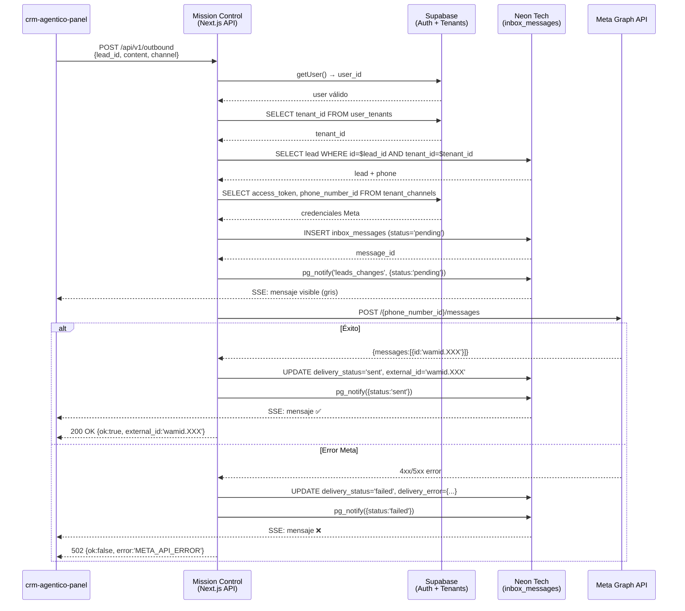

# ADR-114: Outbound de Mensajes vía Meta Graph API

| Campo        | Valor                                           |
|--------------|-------------------------------------------------|
| **ID**       | ADR-114                                         |
| **Título**   | Outbound de Mensajes Humanos vía Meta Graph API |
| **Estado**   | Propuesto                                       |
| **Fecha**    | 2026-05-04                                      |
| **Autor**    | Builder (Agente Planificador — Escuadrón Teseo) |
| **Revisores**| Teseo (Gerente), Reviewer (Auditor)             |
| **Repositorios afectados** | `crm-agentico-orchestrator` (Mission Control Next.js), `teseo-ai-crm-panel` (Frontend) |

---

## 1. Contexto y Motivación

### 1.1 Estado Actual del Sistema

El Inbox del CRM ya recibe mensajes **inbound** de forma funcional (Sprint 3 Mayo 2026):

```
Meta (WhatsApp) → POST /api/webhooks/[channel]
                  → resolveTenant() [Supabase RPC]
                  → INSERT inbox_messages (sender='customer') [Neon]
                  → pg_notify('leads_changes') 
                  → SSE → Frontend (crm-agentico-panel)
```

La caja de texto del Chat en `crm-agentico-panel` existe pero **no tiene backend conectado**. El agente humano (vendedor) puede leer el historial pero no puede enviar respuestas desde la UI hacia el lead en WhatsApp/Facebook. Este es el gap que cubre el presente ADR.

### 1.2 Exploración de la Estructura de Rutas Actual

> **Nota del Builder:** La exploración directa de archivos vía shell encontró restricciones de runtime. El análisis se realizó cruzando los siguientes artefactos de memoria: `ADR-113`, `ADR-114` (wiki), `bloque-29.md`, `RFC-012`, y los sprints de mayo 2026 registrados en `MEMORY.md`.

**Rutas identificadas en `crm-agentico-orchestrator` (Mission Control — Next.js App Router):**

```text
app/
└── api/
    ├── webhooks/
    │   └── [channel]/
    │       └── route.ts          # POST: Inbound de Meta/Telegram → resolveTenant → LangGraph
    ├── inbox/
    │   └── route.ts              # GET: SSE stream sobre Neon LISTEN/pg_notify
    ├── leads/
    │   └── [id]/
    │       └── route.ts          # GET/PATCH: CRUD de lead
    └── (auth routes via Supabase SSR middleware)

lib/
├── tenant-resolver.ts            # Módulo de caché + RPC resolve_tenant_by_channel
├── neon.ts                       # Cliente Neon http (@neondatabase/serverless)
└── supabase/
    └── server.ts                 # Cliente Supabase con cookies SSR
```

**Tablas en Supabase (Auth + Tenants):**

```sql
-- Tabla maestra de tenants
tenants (id UUID PK, name TEXT, ...)

-- Canales registrados por tenant (Bloque 29)
tenant_channels (
  id          UUID PK,
  tenant_id   UUID REFERENCES tenants,
  channel_type  TEXT,               -- 'whatsapp' | 'telegram' | 'facebook'
  channel_identifier TEXT UNIQUE,   -- phone_number_id / bot_id / page_id
  access_token  TEXT,               -- Meta Graph API token (cifrado en tránsito)
  waba_id       TEXT,               -- WhatsApp Business Account ID (Meta)
  created_at    TIMESTAMPTZ
)
```

**Tabla en Neon Tech (Data Lake Interactivo):**

```sql
-- Historial de interacciones por lead
inbox_messages (
  id          UUID PK DEFAULT gen_random_uuid(),
  lead_id     UUID NOT NULL REFERENCES leads(id),
  tenant_id   UUID NOT NULL,
  sender      message_sender NOT NULL, -- ENUM: 'customer'|'ai_agent'|'human_admin'
  channel     message_channel NOT NULL, -- ENUM: 'whatsapp'|'telegram'|'web'|'facebook'
  content     TEXT NOT NULL,
  metadata    JSONB DEFAULT '{}',
  external_id TEXT,                   -- wamid de Meta (para trazabilidad)
  created_at  TIMESTAMPTZ DEFAULT now()
)
```

---

## 2. Decisión Técnica

### 2.1 Principio Arquitectónico

El mensaje outbound **humano** (de vendedor a lead) **no pasa por LangGraph**. Es un bypass directo al canal del lead:

```
crm-agentico-panel
    └─ POST /api/v1/outbound
           ↓ (Mission Control API Route)
       Validar sesión Supabase JWT
           ↓
       Recuperar credenciales Meta del tenant (tenant_channels)
           ↓
       INSERT inbox_messages (sender='human_admin', status='pending')
           ↓
       pg_notify → SSE → Panel (actualización optimista inmediata)
           ↓
       fetch → Meta Graph API /messages
           ↓
      ┌────┴────┐
    200 OK    Error
      ↓          ↓
  UPDATE      UPDATE
  status='sent' status='failed'
  external_id=wamid  metadata.error=...
      ↓          ↓
  pg_notify    pg_notify
```

### 2.2 Nuevos Endpoints

#### A. `POST /api/v1/outbound` — Envío de mensaje humano outbound

**Ubicación en código:** `app/api/v1/outbound/route.ts` (Next.js App Router, en Mission Control)

**Método:** `POST`  
**Autenticación:** Supabase JWT (cookie `sb-access-token` via middleware SSR — ya existente)

**Request Body (Zod schema — solo referencia para Ejecutor):**

```typescript
// Schema conceptual — NO implementar aquí, solo documentar
{
  lead_id:  string   // UUID del lead en Neon
  content:  string   // Texto del mensaje (max 4096 chars para WhatsApp)
  channel:  "whatsapp" | "facebook" | "telegram"  // Canal de entrega
  // Futuro: type: "text" | "image" | "template"
}
```

**Response (éxito):**

```json
{
  "ok": true,
  "message_id": "<uuid del inbox_message insertado>",
  "external_id": "<wamid de Meta>"
}
```

**Response (error de validación):**

```json
{
  "ok": false,
  "error": "TENANT_NOT_FOUND | CHANNEL_NOT_CONFIGURED | META_API_ERROR | VALIDATION_ERROR",
  "detail": "<mensaje legible>"
}
```

**Códigos HTTP:**

| Código | Significado |
|--------|-------------|
| 200    | Mensaje entregado a Meta (wamid recibido) |
| 202    | Insertado en Neon, llamada a Meta pendiente (async fallback) |
| 400    | Payload inválido (Zod) |
| 401    | Sin sesión activa de Supabase |
| 403    | El usuario no pertenece al tenant del lead |
| 422    | Tenant sin canal configurado para ese canal |
| 502    | Meta Graph API rechazó el mensaje |

---

## 3. Flujo Detallado del Controlador

### Paso 1 — Autenticación y Extracción del Tenant

```
1.1. Leer la cookie de sesión Supabase via createServerClient() [lib/supabase/server.ts]
1.2. supabase.auth.getUser() → si error o null → return 401
1.3. Extraer user.id (UUID del usuario Supabase)
1.4. Consultar en Supabase: SELECT tenant_id FROM user_tenants WHERE user_id = $1
     → si no existe → return 403
1.5. Guardar tenant_id en contexto del controlador
```

### Paso 2 — Validación del Lead y Canal

```
2.1. Parsear body con Zod → si error → return 400
2.2. Consultar en Neon: SELECT lead_id, channel FROM leads WHERE id = $lead_id AND tenant_id = $tenant_id
     → si no existe o tenant no coincide → return 403
2.3. Consultar en Supabase: 
     SELECT access_token, channel_identifier, waba_id 
     FROM tenant_channels 
     WHERE tenant_id = $tenant_id AND channel_type = $channel
     → si no existe → return 422 (canal no configurado)
2.4. Guardar { access_token, phone_number_id, waba_id } para uso en Paso 4
```

### Paso 3 — Inserción Optimista en Neon

```sql
-- Insertar el mensaje con status 'pending' en metadata
INSERT INTO inbox_messages (
  id, lead_id, tenant_id, sender, channel, content, metadata, created_at
) VALUES (
  gen_random_uuid(),
  $lead_id,
  $tenant_id,
  'human_admin',
  $channel,
  $content,
  '{"delivery_status": "pending"}'::jsonb,
  NOW()
)
RETURNING id;
-- Guardar message_id para actualización posterior
```

```sql
-- Disparar notificación SSE inmediata (el panel ve el mensaje al instante)
SELECT pg_notify(
  'leads_changes',
  json_build_object(
    'event',      'message_sent',
    'lead_id',    $lead_id,
    'tenant_id',  $tenant_id,
    'message_id', $new_message_id,
    'sender',     'human_admin',
    'status',     'pending'
  )::text
);
```

### Paso 4 — Llamada a la Meta Graph API

**Endpoint Meta (WhatsApp):**

```
POST https://graph.facebook.com/v19.0/{phone_number_id}/messages
Authorization: Bearer {access_token}
Content-Type: application/json

{
  "messaging_product": "whatsapp",
  "recipient_type": "individual",
  "to": "{lead_whatsapp_number}",
  "type": "text",
  "text": {
    "preview_url": false,
    "body": "{content}"
  }
}
```

**Endpoint Meta (Facebook Messenger):**

```
POST https://graph.facebook.com/v19.0/me/messages
Authorization: Bearer {access_token (Page Token)}
Content-Type: application/json

{
  "recipient": { "id": "{lead_psid}" },
  "message": { "text": "{content}" }
}
```

**Recuperación del número del lead:**

```
El número de WhatsApp del lead se obtiene de:
  SELECT phone FROM leads WHERE id = $lead_id
  (ya disponible desde el Paso 2.2 — agregar a la query)
```

### Paso 5 — Manejo de Respuesta de Meta y Actualización de Estado

**Rama Éxito (HTTP 200 de Meta):**

```
Meta responde: { "messages": [{ "id": "wamid.XXXX..." }] }

UPDATE inbox_messages
SET 
  external_id = 'wamid.XXXX...',
  metadata    = jsonb_set(metadata, '{delivery_status}', '"sent"')
WHERE id = $message_id;

SELECT pg_notify('leads_changes', json_build_object(
  'event',       'message_delivered',
  'lead_id',     $lead_id,
  'message_id',  $message_id,
  'external_id', 'wamid.XXXX...',
  'status',      'sent'
)::text);

→ Response al Frontend: { "ok": true, "message_id": "...", "external_id": "wamid.XXXX" }
```

**Rama Fallo (Error HTTP de Meta):**

```
Meta responde: 4xx/5xx

UPDATE inbox_messages
SET 
  metadata = jsonb_set(
    jsonb_set(metadata, '{delivery_status}', '"failed"'),
    '{meta_error}', $meta_error_body::jsonb
  )
WHERE id = $message_id;

SELECT pg_notify('leads_changes', json_build_object(
  'event',      'message_failed',
  'lead_id',    $lead_id,
  'message_id', $message_id,
  'status',     'failed'
)::text);

→ Response al Frontend: { "ok": false, "error": "META_API_ERROR", "detail": "..." }
  HTTP Status: 502
```

---

## 4. Manejo de Estado — Diagrama de Ciclo de Vida del Mensaje

```
                  ┌─────────────────┐
                  │   FRONTEND      │
                  │ (crm-agentico-  │
                  │   panel)        │
                  └────────┬────────┘
                           │ POST /api/v1/outbound
                           ▼
                  ┌─────────────────┐
                  │  MISSION CTL    │◄── Validar JWT Supabase
                  │  (API Route)    │◄── Validar tenant + canal
                  └────────┬────────┘
                           │
                  ┌────────▼────────┐
                  │  NEON POSTGRES  │
                  │                 │
                  │  inbox_messages │──── delivery_status: 'pending'
                  │  + pg_notify    │
                  └────────┬────────┘
                           │ SSE → Panel
                           │ (mensaje aparece griseado)
                           ▼
                  ┌─────────────────┐
                  │  META GRAPH API │
                  └────────┬────────┘
                     ┌─────┴──────┐
                   200 OK       Error
                     │            │
              ┌──────▼──────┐  ┌──▼──────────────┐
              │ UPDATE Neon │  │  UPDATE Neon     │
              │ status='sent'│  │  status='failed' │
              │ external_id= │  │  metadata.error  │
              │   wamid      │  │                  │
              └──────┬──────┘  └──┬───────────────┘
                     │            │
              pg_notify ──────── pg_notify
                     │            │
              ┌──────▼────────────▼──────┐
              │   SSE → Frontend         │
              │  (✅ verde) / (❌ rojo)   │
              └──────────────────────────┘
```

### Estados posibles de `metadata.delivery_status` en `inbox_messages`:

| Estado    | Significado                                              |
|-----------|----------------------------------------------------------|
| `pending` | Insertado en Neon, esperando respuesta de Meta           |
| `sent`    | Meta confirmó entrega a su red (wamid recibido)          |
| `failed`  | Meta rechazó el envío (error guardado en metadata.error) |
| `read`    | Futuro: Meta notificó via webhook de lectura (inbound)   |

---

## 5. Migración de Base de Datos Requerida

### 5.1 Columnas nuevas en `inbox_messages` (Neon)

```sql
-- Migración: 2026-05-04_add_outbound_tracking.sql
-- ATENCIÓN: Ejecutar en Neon Tech (no en Supabase)

ALTER TABLE inbox_messages
  ADD COLUMN IF NOT EXISTS external_id    TEXT,
  ADD COLUMN IF NOT EXISTS delivery_error JSONB DEFAULT NULL;

-- Mover delivery_status de metadata a columna nativa para query performance
ALTER TABLE inbox_messages
  ADD COLUMN IF NOT EXISTS delivery_status TEXT 
    CHECK (delivery_status IN ('pending','sent','failed','read'))
    DEFAULT NULL;

-- Índice para lookup por wamid (de-duplication en webhooks de estado de Meta)
CREATE INDEX IF NOT EXISTS idx_inbox_messages_external_id 
  ON inbox_messages(external_id) 
  WHERE external_id IS NOT NULL;

-- Índice para monitoreo de mensajes fallidos
CREATE INDEX IF NOT EXISTS idx_inbox_messages_delivery_status 
  ON inbox_messages(tenant_id, delivery_status) 
  WHERE delivery_status = 'failed';
```

### 5.2 Columna `phone` en `leads` (Neon) — Verificar existencia

```sql
-- Verificar que el campo exista (probable que ya esté)
-- Si no existe, agregar:
ALTER TABLE leads
  ADD COLUMN IF NOT EXISTS phone TEXT;

-- Para Facebook: guardar PSID
ALTER TABLE leads
  ADD COLUMN IF NOT EXISTS fb_psid TEXT;
```

### 5.3 Columna `access_token` en `tenant_channels` (Supabase)

```sql
-- En Supabase SQL Editor
-- Verificar que tenant_channels tenga access_token y channel_identifier
-- Si la tabla no existe (fue planificada en Bloque 29 pero pendiente de confirmar):

CREATE TABLE IF NOT EXISTS tenant_channels (
  id                  UUID PRIMARY KEY DEFAULT gen_random_uuid(),
  tenant_id           UUID NOT NULL REFERENCES tenants(id) ON DELETE CASCADE,
  channel_type        TEXT NOT NULL CHECK (channel_type IN ('whatsapp','telegram','facebook')),
  channel_identifier  TEXT NOT NULL,   -- phone_number_id (WA) / bot_id (TG) / page_id (FB)
  access_token        TEXT NOT NULL,   -- Cifrar en reposo (Vault o secret manager)
  waba_id             TEXT,            -- WhatsApp Business Account ID
  created_at          TIMESTAMPTZ DEFAULT now(),
  updated_at          TIMESTAMPTZ DEFAULT now(),
  UNIQUE(channel_type, channel_identifier)
);

-- RLS: solo service_role puede escribir, usuarios solo pueden leer sus propios registros
ALTER TABLE tenant_channels ENABLE ROW LEVEL SECURITY;

CREATE POLICY "tenant_channels_service_write" ON tenant_channels
  FOR ALL TO service_role USING (true);

CREATE POLICY "tenant_channels_user_read" ON tenant_channels
  FOR SELECT TO authenticated
  USING (
    tenant_id IN (
      SELECT tenant_id FROM user_tenants WHERE user_id = auth.uid()
    )
  );
```

---

## 6. Contrato Frontend (`crm-agentico-panel`)

El Ejecutor del frontend deberá implementar en el componente `ChatComposer` (o equivalente):

### 6.1 Petición al backend

```typescript
// Contrato conceptual — referencia para Ejecutor Frontend
async function sendOutbound(leadId: string, content: string, channel: string) {
  const response = await fetch('/api/v1/outbound', {
    method: 'POST',
    headers: { 'Content-Type': 'application/json' },
    credentials: 'include',           // incluir cookie Supabase
    body: JSON.stringify({ lead_id: leadId, content, channel })
  })
  return response.json()
}
```

### 6.2 Patrón UI recomendado (Optimistic Update)

```
1. Usuario escribe mensaje y presiona Enter / botón Enviar.
2. El mensaje aparece INMEDIATAMENTE en el hilo de chat con un indicador 
   de "enviando" (spinner o color gris).
3. El componente hace `fetch POST /api/v1/outbound`.
4. El SSE (`/api/inbox`) ya recibirá los pg_notify de status y actualizará 
   el indicador del mensaje (✅ sent / ❌ failed).
5. Si la respuesta HTTP es 4xx/5xx, mostrar el error al usuario y 
   marcar el mensaje como fallido en la UI.
```

### 6.3 Indicadores de estado en el mensaje

| `delivery_status` | UI sugerida                                     |
|-------------------|-------------------------------------------------|
| `pending`         | Ícono de reloj / mensaje gris                   |
| `sent`            | ✅ Una palomita / texto normal                   |
| `failed`          | ❌ Rojo + botón "Reintentar"                    |
| `read`            | ✅✅ Dos palomitas azules (futuro — webhook Meta)|

---

## 7. Consideraciones de Seguridad

### 7.1 Protección del `access_token` de Meta

- **En reposo:** El `access_token` en `tenant_channels` debe ser cifrado usando **Supabase Vault** (`vault.create_secret()`) o Google Secret Manager. El controlador debe obtener el valor descifrado en tiempo de ejecución.
- **En tránsito:** Solo se transmite del servidor al servidor (Mission Control → Meta). Nunca sale al cliente.
- **Rotación:** El WABA Token de Meta expira o puede ser revocado. Implementar manejo de error `190` (token expirado) para alertar al admin del tenant.

### 7.2 Rate Limiting y Quotas de Meta

- Meta Graph API tiene límites por tier (messaging_limit). Implementar rate limiting en el controlador (ej. `upstash/ratelimit` sobre Redis) para evitar suspensión de la cuenta.
- Un usuario bloqueado (que marcó como spam) devolverá error `131047` de Meta — capturar y marcar el lead con flag `is_blocked=true`.

### 7.3 Autorización Multi-Tenant (Zero-Trust)

- **Regla crítica:** El `lead_id` debe validarse pertenece al `tenant_id` extraído del JWT del usuario. Un agente de Tenant A **NUNCA** debe poder enviar mensajes a leads del Tenant B.
- La validación `WHERE tenant_id = $tenant_id AND id = $lead_id` en Neon es la barrera de seguridad.

### 7.4 Prevención de Message Flooding

- El controlador debe validar que el lead no esté marcado como `do_not_contact` antes de enviar.
- Throttle configurable por tenant: máximo N mensajes por lead en X minutos.

---

## 8. Dependencias y Librerías

| Dependencia              | Versión | Uso |
|--------------------------|---------|-----|
| `@supabase/ssr`          | existente | Auth JWT + tenant_channels lookup |
| `@neondatabase/serverless` | existente | INSERT/UPDATE inbox_messages + pg_notify |
| `zod`                    | existente | Validación del request body |
| `node-fetch` / native `fetch` | runtime | Llamada a Meta Graph API |

No se requieren nuevas librerías para el MVP.

---

## 9. Flujo de Prueba E2E para el Tester

```
Precondición:
  - Tenant "FleetCo" configurado con WhatsApp Business número 5610800923
  - tenant_channels tiene access_token válido y phone_number_id de prueba
  - Lead "María Torres" con phone="5214424503713" en Neon

Caso 1 — Envío exitoso:
  1. Iniciar sesión como agente de FleetCo en crm-agentico-panel
  2. Abrir conversación con "María Torres"
  3. Escribir "Hola María, ¿seguimos en contacto?" y presionar Enviar
  4. Verificar: mensaje aparece con status 'pending' en UI
  5. Verificar: registro en inbox_messages con sender='human_admin' y delivery_status='pending'
  6. Verificar (en ~2s): status cambia a 'sent' en UI y en DB
  7. Verificar: María Torres recibe el mensaje en su WhatsApp

Caso 2 — Token expirado:
  1. Modificar temporalmente access_token en tenant_channels a valor inválido
  2. Intentar enviar mensaje
  3. Verificar: HTTP 502 retornado, delivery_status='failed' en DB, UI muestra ❌

Caso 3 — Acceso cross-tenant:
  1. Iniciar sesión como agente de Tenant B
  2. Intentar POST /api/v1/outbound con lead_id de Tenant A
  3. Verificar: HTTP 403 retornado, ningún registro creado en inbox_messages
```

---

## 10. Consecuencias y Decisiones Diferidas

### Consecuencias Inmediatas
- El vendedor humano puede responder conversaciones desde el panel sin salir de la UI.
- El historial unificado (inbound del lead + outbound del agente) queda persistido en Neon.
- El SSE existente se reutiliza sin cambios — costo de implementación mínimo.

### Decisiones Diferidas (Futuras ADRs)
- **Mensajes de Plantilla (Template Messages):** WhatsApp requiere templates aprobados para iniciar conversaciones (ventana de 24h). Diseño en ADR futuro.
- **Notificación de Lectura (Read Receipt):** Cuando Meta notifique via webhook que el mensaje fue leído, actualizar `delivery_status='read'`. Requiere suscribir el campo `message_status` en el Webhook de Meta.
- **Adjuntos (Imágenes/PDF):** La API de Meta requiere primero subir el archivo al Media endpoint y obtener un `media_id`. Diseño en ADR futuro.
- **Cifrado en Reposo de Tokens (Vault):** Prioridad alta para producción. Si no se implementa Supabase Vault antes del Go-Live, usar Google Secret Manager como alternativa.
- **Outbound vía Telegram:** El flujo es análogo pero usa `sendMessage` de la Bot API. Mismo endpoint, `switch(channel)` diferente.

---

## 11. Diagrama de Secuencia Completo



---

## 12. Checklist de Implementación (para el Ejecutor)

### Backend (Mission Control — Next.js)
- [ ] Crear `app/api/v1/outbound/route.ts`
- [ ] Implementar Zod schema de validación del body
- [ ] Implementar validación JWT Supabase (reutilizar patrón de `app/api/inbox/route.ts`)
- [ ] Implementar query de tenant + canal en Supabase
- [ ] Implementar query del lead en Neon (con tenant check)
- [ ] Implementar INSERT en `inbox_messages` con status `pending`
- [ ] Implementar `pg_notify` post-insert
- [ ] Implementar llamada a Meta Graph API (WhatsApp primero, Facebook después)
- [ ] Implementar UPDATE de status post-Meta (sent/failed)
- [ ] Implementar `pg_notify` post-Meta
- [ ] Agregar manejo de errores específicos de Meta (190=token expirado, 131047=bloqueado)

### Base de Datos
- [ ] Ejecutar migración `2026-05-04_add_outbound_tracking.sql` en Neon
- [ ] Verificar/crear tabla `tenant_channels` en Supabase con RLS
- [ ] Verificar columna `phone` en `leads` (Neon)
- [ ] Poblar `tenant_channels` con credenciales reales de FleetCo (phone_number_id + token)

### Frontend (crm-agentico-panel)
- [ ] Conectar el botón/Enter del `ChatComposer` al `POST /api/v1/outbound`
- [ ] Implementar optimistic update (mensaje visible antes de respuesta del servidor)
- [ ] Conectar SSE events (`message_sent`, `message_delivered`, `message_failed`) a los indicadores visuales
- [ ] Implementar botón "Reintentar" en mensajes con `delivery_status='failed'`

### QA (Tester)
- [ ] Ejecutar los 3 casos E2E documentados en §9
- [ ] Verificar que el cross-tenant check retorna 403
- [ ] Verificar que el SSE propaga el status change sin recargar la página

---

*Este documento es el artefacto de diseño del Agente Builder. El Ejecutor debe usarlo como especificación para implementar, sin agregar funcionalidades no documentadas. Cualquier desviación arquitectónica debe ser escalada a Teseo para actualización del ADR antes de proceder.*
