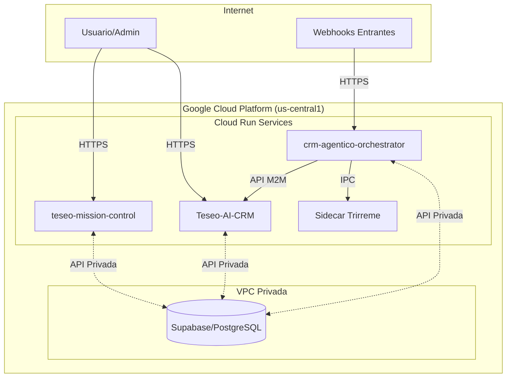

# ADR-202: Arquitectura Base y Pipeline Zero Trust

**Date:** 20 Mayo 2026
**Status:** PROPOSED

## Contexto

Este documento formaliza y expande la arquitectura existente del ecosistema Teseo AI CRM, detallada previamente en `MASTER_ARCHITECTURE.md`. El objetivo es establecer una base sólida para el desarrollo futuro, incorporando un pipeline de CI/CD "Zero Trust" y principios de FinOps desde el inicio, siguiendo un enfoque bottom-up.

## Decisión

Se adopta y ratifica la siguiente arquitectura de sistema, basada en un modelo "Hub & Spoke" desplegado en Google Cloud Platform (GCP).

### 1. Componentes del Ecosistema

El sistema se compone de los siguientes servicios principales, cada uno en su propio repositorio (polyrepo):

*   **`teseo-mission-control`**: Panel de Administración Global (Frontend).
    *   **Tecnología**: Next.js / React.
    *   **Responsabilidad**: Gestión de tenants, configuraciones globales, supervisión de alto nivel.
*   **`Teseo-AI-CRM`**: Panel de Comandos del Inquilino (Frontend).
    *   **Tecnología**: Next.js / React.
    *   **Responsabilidad**: Interfaz principal para que los clientes gestionen sus agentes, campañas y datos.
*   **`crm-agentico-orchestrator`**: Orquestador de Agentes (Backend).
    *   **Tecnología**: Node.js, Hono, LangGraph.
    *   **Sidecar `Trirreme`**: Componente en Rust para tareas intensivas (ej. scraping).
    *   **Responsabilidad**: Procesamiento de webhooks, ejecución de lógica de agentes, comunicación con servicios de IA y la base de datos.
*   **`Supabase`**: Plataforma de Datos (Data Plane).
    *   **Tecnología**: PostgreSQL gestionado.
    *   **Responsabilidad**: Autenticación, almacenamiento de datos, aislamiento de tenants (RLS), configuraciones (JSONB), y embeddings vectoriales para RAG.

### 2. Diagrama de Arquitectura de Alto Nivel

### 3. Pipeline de CI/CD "Zero Trust"

Todo Pull Request a cualquier repositorio deberá pasar obligatoriamente por las siguientes verificaciones en GitHub Actions antes de poder ser fusionado:

1.  **Linting y Formateo**: Ejecución de `eslint` y `prettier`.
2.  **Pruebas Unitarias/Integración**: Ejecución de `jest`/`vitest`. Se requerirá un mínimo de 80% de cobertura de código.
3.  **Análisis de Dependencias (SCA)**: Escaneo con `Trivy` para detectar vulnerabilidades en librerías de terceros.
4.  **Análisis de Código Estático (SAST)**: Escaneo con `Semgrep` para detectar patrones de código inseguros.
5.  **Análisis de Costos de Infraestructura (FinOps)**: (Para repositorios con IaC) Ejecución de `infracost` para comentar en el PR el impacto económico de los cambios.
6.  **Build de la Imagen Docker**: Verificación de que el servicio puede ser empaquetado correctamente.

### 4. Entorno de Desarrollo Local

Se utilizará un único archivo `docker-compose.yml` en la raíz del proyecto `Teseo_AI` para orquestar todos los servicios de forma local, garantizando un entorno consistente para todos los desarrolladores.

## Consecuencias

*   **Claridad**: Todos los miembros del equipo tienen una visión unificada de la arquitectura y las reglas del juego.
*   **Seguridad**: El pipeline automatizado previene la introducción de vulnerabilidades y código de baja calidad.
*   **Eficiencia**: La estandarización del entorno local y del despliegue acelera el onboarding y el desarrollo.
*   **Control de Costos**: La visibilidad del impacto financiero en cada PR fomenta una cultura de responsabilidad económica.

Este ADR servirá como la "Constitución" para todas las decisiones técnicas futuras.
